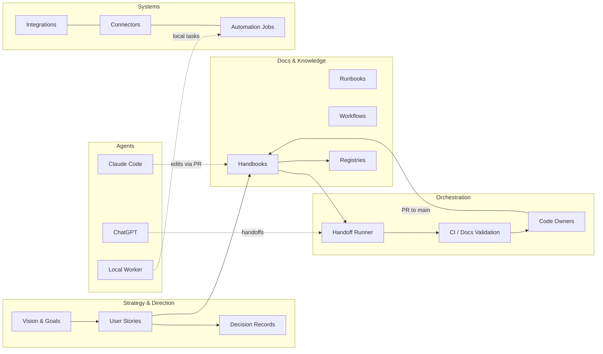

```mermaid
%% source: docs/diagrams/capability-map.mmd
%% Title: Capability Map — kg-automation
flowchart LR
  subgraph Strategy[Strategy & Direction]
    A[Vision & Goals]
    B[User Stories]
    C[Decision Records]
  end
  subgraph Content[Docs & Knowledge]
    D[Handbooks]
    E[Runbooks]
    F[Workflows]
    G[Registries]
  end
  subgraph Orchestration[Orchestration]
    H[Handoff Runner]
    I[CI / Docs Validation]
    J[Code Owners]
  end
  subgraph Agents[Agents]
    K[Claude Code]
    L[ChatGPT]
    M[Local Worker]
  end
  subgraph Systems[Systems]
    N[Integrations]
    O[Connectors]
    P[Automation Jobs]
  end

  A --> B --> C
  B --> D
  D --> H
  H --> I --> J -->|PR to main| D
  D --> G
  K -. edits via PR .-> D
  L -. handoffs .-> H
  M -. local tasks .-> P
  N --- O --- P
```
