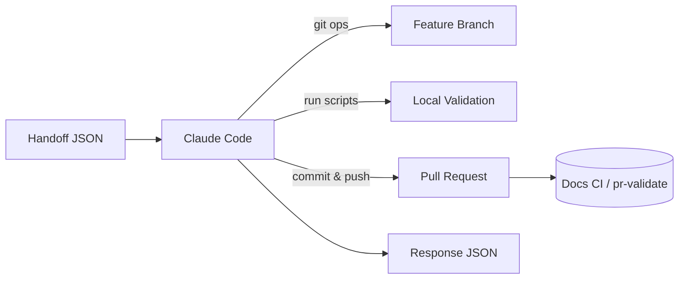

```mermaid
%% source: docs/diagrams/claude-code-execution.mmd
%% Title: Claude Code Execution — kg-automation
flowchart LR
  H[Handoff JSON] --> CC[Claude Code]
  CC -->|git ops| BR[Feature Branch]
  CC -->|run scripts| VAL[Local Validation]
  CC -->|commit & push| PR[Pull Request]
  PR --> CI[(Docs CI / pr-validate)]
  CC --> RESP[Response JSON]
```
