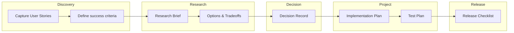

```mermaid
%% source: docs/diagrams/lifecycle-swimlane.mmd
%% Title: Lifecycle Swimlane — Discovery to Release
flowchart LR
  subgraph Discovery
    D1[Capture User Stories]
    D2[Define success criteria]
  end
  subgraph Research
    R1[Research Brief]
    R2[Options & Tradeoffs]
  end
  subgraph Decision
    C1[Decision Record]
  end
  subgraph Project
    P1[Implementation Plan]
    P2[Test Plan]
  end
  subgraph Release
    L1[Release Checklist]
  end

  D1 --> D2 --> R1 --> R2 --> C1 --> P1 --> P2 --> L1
```
