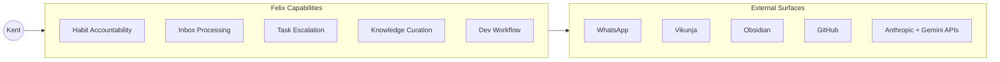
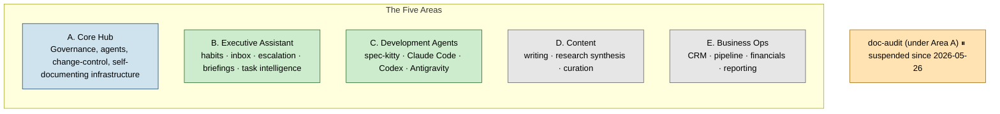
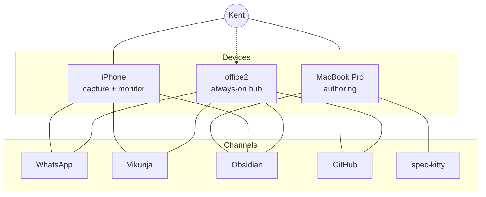
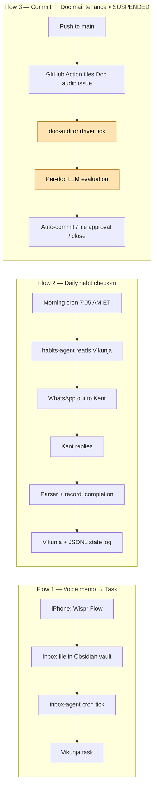
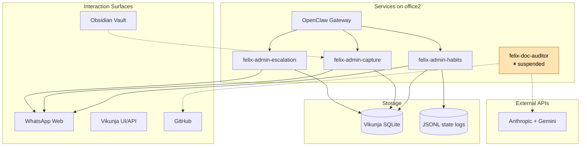

# Felix — System Overview

> Day-1 orientation for new developers, agents, and contributors. Read this first
> before drilling into the detailed architecture, runbooks, or governance docs.

## What Felix is

**Felix is Kent's personal digital operating system that helps him leverage his time and expand his capabilities through automation, AI, and other tooling so that he may realize extraordinary life and business outcomes.**

Felix is not a task manager and not a general-purpose chatbot. It is a *specific* system built around a *specific* user: Kent has declared who he intends to become and what he intends to build, and Felix holds those declarations in trust. Felix surfaces them persistently, and ensures the gap between intention and action is never comfortable to ignore.

Felix runs continuously on `office2` (a Linux server at Kent's home, reachable from anywhere via Tailscale), with mobile and desktop interaction surfaces and a small set of always-on agents. It is *operational*, not aspirational — it acts on Kent's behalf within governed boundaries every day.

## What it does for Kent

Felix's capabilities are organized into five **Areas**, each evolving on its own arc. The current state of each:

| Area | Purpose | Current state |
|---|---|---|
| **A. Core Hub** | The substrate — governance, agents, change-control, self-documenting infrastructure | Established; ongoing infrastructure work |
| **B. Executive Assistant** | Day-to-day operations: habits, inbox, escalation, briefings, task intelligence | Active focus area; most agents live; doc-audit currently suspended |
| **C. Development Agents** | Coding-assistant orchestration (spec-kitty, codex, antigravity) | In use for Felix's own development; pattern emerging |
| **D. Content** | Long-form writing, research synthesis, knowledge curation | Early/planned |
| **E. Business Ops** | Business-as-a-system: CRM, deal pipeline, financials, reporting | Early/planned |

See `felix-capability-roadmap.md` for the living capability status, feature sequence, and design principles.

**What's working today** (a non-exhaustive list of operational capabilities):

- **Daily habit check-ins** via WhatsApp with completion recording in Vikunja
- **Inbox processing** of voice memos (Wispr Flow → text → routing) and document captures into tasks
- **Overdue task escalation** with daily summary delivery via WhatsApp
- **Cross-device sync** of the Obsidian vault (notes, journal, system knowledge)
- **Spec-driven development** of new Felix capabilities via the spec-kitty workflow
- **GitHub-tracked work** for all dev tasks, including this system's own self-documenting audit trail

**What's currently paused:**

- **Documentation audit** (`felix-doc-auditor`) — fully implemented and tested but suspended indefinitely since 2026-05-26 pending cost-control work (#137). The audit's role was to keep architecture documentation in sync with code changes; that responsibility now rests on the human operator until reactivation.

## How Kent interacts with it

Felix runs in three places and talks through several channels.

**Devices**:

- **MacBook Pro** — primary authoring surface. Editing code, drafting specs, running spec-kitty workflows, reviewing diffs. Most of the system's *changes* originate here.
- **office2 server** — always-on hub. Hosts Vikunja, the OpenClaw gateway, all scheduled agents (habits, inbox, escalation, observation digest), and the doc-audit driver (currently suspended). Most of the system's *actions* happen here.
- **iPhone** — mobile capture and monitoring. Wispr Flow for voice memos; Vikunja web UI for task state; WhatsApp for agent conversations.

**Channels**:

- **WhatsApp** — primary agent-to-Kent surface. Morning habit check-ins, escalation summaries, completion confirmations, ad-hoc queries (e.g., "skip strength training today").
- **Vikunja** — task state of record. Habits, project tasks, escalation queue, completion history.
- **Obsidian** — knowledge surface. The vault under `~/second-brain/` syncs across all devices (Mac, iPhone, office2). Agent activity logs, journal entries, and system documentation that lives outside this repo all flow through here.
- **GitHub** — version control and audit trail. The kg-automation repo holds the system's code, architecture docs, and the public dev-work issue queue.
- **Spec-kitty** — the development workflow itself. Missions, work packages, review cycles, and merge discipline all run through it.

## Highest-level information flows

Three worked examples capture how data moves through Felix in the operational steady state.

**Flow 1: Voice memo → task**
Kent captures a thought via Wispr Flow on iPhone → text lands in the inbox file on the Obsidian-synced vault → office2's inbox-agent runs on the next cron tick → routes the item to a Vikunja task (or appropriate destination) → Kent sees the task in Vikunja UI on next check.

**Flow 2: Daily habit check-in**
Morning cron (7:05 AM ET) on office2 fires → habits-agent queries Vikunja for today's active habits → composes the check-in message → delivered via WhatsApp → Kent replies → reply parser maps positions/states to task IDs → records completion in Vikunja AND the JSONL state log → confirmation message back to Kent.

**Flow 3: Commit → doc maintenance** (currently suspended)
Push to main → GitHub Actions file `Doc audit:` issue for affected domains → office2's doc-auditor (when active) picks up the issue → evaluates each in-scope doc → either auto-commits high-confidence edits, files a pending-approval issue for Kent's review, or closes if no change needed. *Suspended since 2026-05-26; manual operator handles this responsibility.*

## System components

The components are documented in detail in `architecture/`. At the highest level:

- **Hardware**: Mac, office2 (Ubuntu 24.04 LTS server, Dell XPS 8700, GPU-equipped as of 2026-05-08), iPhone
- **Network**: Tailscale tailnet (`kentgale@gmail.com`) connecting all three; office2 reachable from anywhere
- **Services on office2**: Vikunja (task DB), OpenClaw gateway (agent orchestrator), per-agent workspaces (felix-admin-habits, felix-admin-capture / inbox-agent, felix-admin-escalation, felix-admin-tasker), felix-doc-auditor driver (suspended), felix-core-digest, security-monitor, restic-backup
- **Storage**: Vikunja SQLite (task state); JSONL state logs (`habits-history.jsonl`, drift-events-ledger, audit-events-ledger); the Obsidian vault; the `/data/` partition (2.7TB) for persistent service state
- **Identities**: `kgale` (Kent's human account on office2), `claude` (the agent account on office2), `kg-felix-bot` (the GitHub identity for agent-attributed commits and issue actions)
- **External APIs**: Anthropic (claude-haiku-4-5 for narrow LLM judgment; claude-sonnet-4-6 for development), Gemini (intentional.biz GCP project), WhatsApp Web (via OpenClaw gateway), GitHub REST + GraphQL

> For the comprehensive low-level service dependency graph (every service, every port, every IPC path), see [`architecture/service-dependencies.view.md`](<./architecture/service-dependencies.view.md>).

## Architectural principles

Six principles shape every design decision in Felix. New work is expected to be coherent with them.

1. **Governance via the Felix Constitution.** Every agent operates under the Constitution (`constitution/FELIX-CONSTITUTION.md`). Agents have registered scopes, autonomy levels, and operating boundaries. The Agent Registry (`constitution/AGENT-REGISTRY.md`) is the canonical record of who is authorized to do what.

2. **Tiered autonomy: Assisted → Supervised → Trusted.** New agents start at *Assisted* (Kent reviews every action). They graduate to *Supervised* (Kent reviews summaries) only after a clean operating window, and to *Trusted* (Kent only sees exceptions) only after extended demonstration. Promotions are explicit governance decisions, not automatic.

3. **Five-tier risk taxonomy.** Every change — code, config, infrastructure, identity, data — is classified into one of five tiers (Tier 0: hard-lock host operations; Tier 1: connectivity; Tier 2: application state; Tier 3: logic/workflow; Tier 4: schema/metadata). Each tier has explicit pre-flight and post-change protocols. See `architecture/data/change-risk-taxonomy.json`.

4. **Scripts-first determinism + narrow LLM judgment.** Deterministic work (parsing, filtering, formatting, recording state) is implemented in Python helper scripts. LLM judgment is reserved for classification, interpretation, and disambiguation — narrow, prompt-scoped, and bounded by helper-imposed guardrails. This makes behavior auditable and dramatically reduces API cost. See Constitution Directive 6.

5. **Machine-readable JSON as the authoritative record.** For operational data (service inventory, hardware, network topology, data flows, credentials), the JSON files under `architecture/data/` are the source of truth. Narrative markdown documents are *views* of that data, not parallel records. When narrative and JSON conflict, JSON wins. See Constitution Directive 5.

6. **Self-documenting system.** Documentation is treated as load-bearing, not optional. Every feature that touches services, credentials, data flows, or network topology updates the relevant architecture docs in the same change. The doc-audit system (currently suspended) was built to enforce this; the human operator carries the responsibility until reactivation.

## Where to go next

### If you want to understand the *what* and *why* better

- **`felix-capability-roadmap.md`** — the living strategic doc: capability areas, feature sequence, design rationale, North Star statement. Read this after this overview.
- **`../constitution/FELIX-CONSTITUTION.md`** — the governance authority. Defines autonomy levels, principles, agent registration process.

### If you want to understand the *how* — system internals

- **`architecture/README.md`** — index of all current-state architecture documentation (service inventory, data flows, topology, credentials, identity model, security posture, backup/recovery, ADRs).
- **`architecture/data/`** — the machine-readable JSON artifacts that are the source of truth for operational state.

### If you want to *operate* the system

- **`../runbooks/`** — agent-executable and human runbooks for each component (Vikunja, OpenClaw, habits, inbox, escalation, doc-auditor, observation, etc.).
- **`../runbooks/governance/`** — pre-flight checklist and post-change verification for risk-tiered changes.

### If you want to *contribute*

- **`../runbooks/github-issues-workflow.md`** — issue lifecycle (brief → pending → ready) and the spec-kitty integration gate.
- **`../runbooks/repo-governance.md`** — git workflow, branch hygiene, commit conventions.
- **`standards/`** — documentation standards, Divio classification, validator policy.

### If you want the *index*

- **`../INDEX.md`** — the master documentation index. Lists every active doc by directory with Divio type annotations.
- **`../DEVELOPER_PORTAL.md`** — the orientation sitemap (complementary to this overview; covers onboarding-flow specifics like tooling setup).
