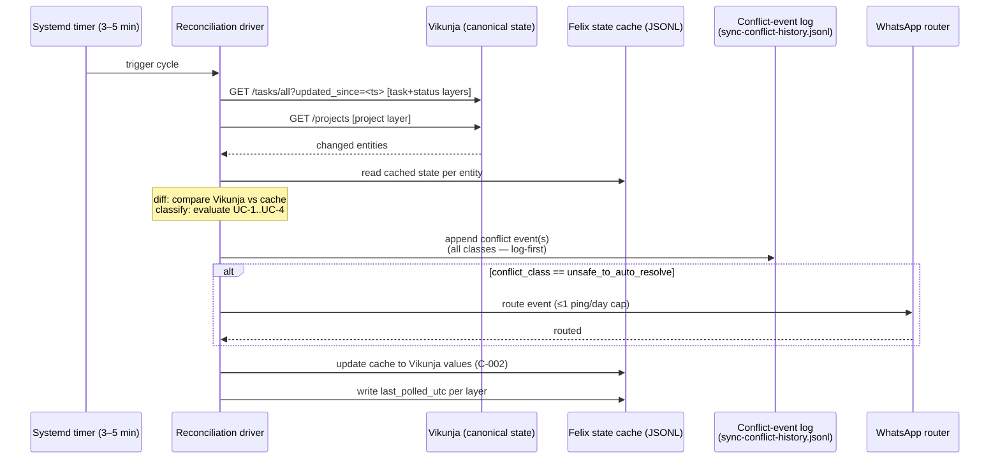

# ADR-0003 — Felix ↔ Vikunja Sync Architecture

**Status**: Draft (operator review on [#508](https://github.com/kentonium3/kg-automation/issues/508)
promotes to Accepted)
**Date**: 2026-06-04
**Deciders**: Kent Gale
**Extends**: [ADR-0002 — Felix ↔ Vikunja task model](<./0002-felix-vikunja-task-model.md>)
(extends decisions Q3, Q4, Q5, Q7, Q10; preserves Q1, Q2, Q6, Q8, Q9)
**Source research**: [Mission felix-vikunja-sync-architecture-research-01KT7Q15](<../../../research/felix-vikunja-sync-architecture/findings.md>)
**Closes design-gate for**: [Epic #507](https://github.com/kentonium3/kg-automation/issues/507)

## Context

ADR-0002 established Felix's task model: `done=true` as the canonical completion signal,
per-domain JSONL history, `felix-bot` identity, and a directional choice of polling over
webhooks (ADR-0002 Q4). That decision was correct but incomplete — it defined *what* to
poll, not *how*.

Two gaps surfaced after ADR-0002's implementation arc:

1. **No centralized reconciliation.** Each Felix script (habits, escalation, tasker) polls
   Vikunja independently, with its own freshness assumptions, and no shared mechanism to
   detect or coordinate when Kent's Vikunja UI writes diverge from Felix's computed state.
   This produced the mission #408 WP01 task_id mis-binding: Felix's sweeper advanced a
   `due_date` after Kent had manually moved it in the UI.

2. **No conflict visibility.** When a divergence occurred, it was silent. There was no log
   record, no alert, and no way to audit what happened.

Epic #507 frames the bi-directional sync need and enumerates seven operator use cases:
(a) status change, (b) task deletion, (c) task move, (d) new project added, (e) bulk task
move, (f) rename, (g) due_date manually set. This ADR establishes the architecture that
handles all seven.

The research mission that produced this ADR (mission `felix-vikunja-sync-architecture-research-01KT7Q15`,
source issue #508) conducted live API probes against Vikunja v0.24.6, an exhaustive codebase
grep (18 touchpoints across 23 files), and analysis of the existing Felix patterns to validate
each architectural choice.

## Decision

**Adopt a three-layer, polling-only reconciliation cycle as the Felix ↔ Vikunja sync
architecture.** Replace ad-hoc per-script polling with a centralized reconciliation driver
that runs on a ~5-minute systemd user timer.

The architecture has five components:

1. **Reconciliation driver** — a Python script triggered by a systemd user timer every 3–5
   minutes. Runs the 6-phase cycle for all three layers.

2. **Three sync layers** — status (`done`/`done_at`), task (all task fields), project
   (`project.id`, `project.title`). Each layer has its Vikunja state surface and detection
   mechanism.

3. **Conflict-event log** — JSONL at `/data/services/openclaw/state/sync-conflict-history.jsonl`.
   Every divergence (resolved or escalated) is appended before any router acts.

4. **WhatsApp router integration** — `unsafe_to_auto_resolve` events route to Kent via
   WhatsApp (≤1 ping/day in steady state with three guards). `auto_resolved` events are
   log-only.

5. **Freshness pointer** — per-layer `{last_polled_utc}` written after each successful cycle.
   The next cycle uses this as the `updated_since` anchor for delta polling.

### Reconciliation Cycle (6 phases)

```
1. fetch    — GET /tasks/all?updated_since=<last_polled_utc>  [task + status layers]
              GET /projects                                     [project layer]
2. diff     — compare each returned entity's fields against Felix's state cache
3. classify — for each diverging field, evaluate UC-1..UC-4 unsafe-class criteria
4. emit     — append conflict event to sync-conflict-history.jsonl; route unsafe events
5. update   — accept Vikunja's value as canonical (C-002); update Felix's state cache
6. complete — write freshness pointer last_polled_utc per layer
```

### Unsafe-Class Criteria

A conflict is `unsafe_to_auto_resolve` (triggers WhatsApp ping) if any of:

- **UC-1 `kent_edit_after_felix_write`**: `vikunja.updated > felix.ts_last_write_utc` on a
  field Felix writes.
- **UC-2 `operator_authored_field`**: Conflicting Vikunja value has `created_by.username != "felix-bot"`.
- **UC-3 `downstream_behavior_depends`**: Diverging field is in {`done`, `done_at`,
  `due_date`, `repeat_after`, `repeat_mode`, `title`}.
- **UC-4 `manual_override_signal`**: Felix's cache has an `override_flags` marker for the
  field (prospective; requires override-flags cache schema extension).

### Conflict Resolution Policy

**Vikunja wins, always** (locked per C-002). There are no operator-decision pathways in the
resolution itself — the operator is *informed* via WhatsApp for unsafe events, but Vikunja's
value is accepted regardless.

### Identifier Contract

`task.id` (integer, globally unique, immutable) is the stable sync primary key.
`task.identifier` (e.g., `#7`) is used only for human-readable display in WhatsApp pings.
`project.id` is the stable project key.

---

## Interaction Model



**Felix touchpoints** (from RQ-2 inventory, grouped by owner component):

| Component | Touchpoints (WP01 RQ-2 IDs) | Sync integration |
|---|---|---|
| habits-agent | TP-01, TP-02, TP-03, TP-04, TP-05, TP-06, TP-07, TP-08, TP-15A, TP-15B, TP-18 | Reads from sync cache; registers Felix writes with driver |
| escalation-agent | TP-09, TP-10 | Same |
| tasker-agent | TP-11, TP-12 | Same |
| credential-health-check | TP-13 | Low-frequency; not on primary sync path |
| provisioning tooling | TP-14, TP-15C, TP-15D, TP-15E, TP-16A-E | Out of scope for sync architecture (manual tooling) |

---

## Consequences

### Positive

- **All seven Epic #507 use cases satisfied** within a 5-minute latency ceiling (exception:
  task deletion at 15 minutes — see Negative).
- **Conflict visibility**: every divergence is logged; unsafe events surface to Kent. No more
  silent overwrites.
- **Single freshness model**: replaces per-script ad-hoc polling with a shared freshness
  pointer. Easier to reason about staleness across the system.
- **Vikunja wins is safe**: the `done=true` + JSONL history model (ADR-0002 Q2/Q3) means
  accepting Vikunja's state never loses history — the JSONL ledger already records Felix's
  side.
- **Extends existing infrastructure**: all four existing Felix patterns (signal pipeline,
  doc-auditor driver, schedule_loader reconciliation, habits-history JSONL) have `extend`
  verdict (RQ-5). No new primitives.
- **WhatsApp volume within existing noise floor**: ≤1 unsafe-class ping/day with three guards
  (NFR-003 passes) — below the 4× IDLE inbox-cron floor.

### Negative

- **Task deletion latency gap**: Vikunja v0.24.6 does not surface task deletions via
  `updated_since`. Worst-case detection = N×5 min (N-cycle confirmation via `GET /tasks/{id}`
  → 404). At N=3, latency = 15 minutes, exceeding NFR-002. Accepted as a design exception:
  deletion is infrequent; 15-minute exposure carries low risk.
- **Project layer requires full fetch**: `updated_since` is task-scoped. Project-layer changes
  (use cases d, e, f) require a full `GET /projects` per cycle. At 14 projects, this is
  lightweight; at 100+ projects, it may need optimization.
- **Two URL bases** (`https://office2.tail0f5f56.ts.net/api/v1` vs `http://100.92.197.90:3456/api/v1`)
  across scripts. Normalization to a single config point is part of the reconciliation driver
  implementation — it is not automated by this ADR.
- **UC-4 is prospective**: The `manual_override_signal` criterion requires an `override_flags`
  cache schema extension not yet built. UC-4 will not fire until implementation closes this gap.

### Risks

- **`updated_since` clock-skew**: If Felix's clock drifts relative to Vikunja's, delta polls
  may miss events. Mitigation: implementation must validate `updated_since` ordering semantics
  and apply a clock-skew buffer.
- **Conflict-event log replay duplication**: If the driver crashes after writing the log but
  before updating the freshness pointer, the next cycle re-processes the same state and emits
  a duplicate event. Mitigation: `event_id` dedup at the WhatsApp router layer.
- **In-prompt agent callsites**: escalation and tasker agents issue Vikunja calls in-prompt
  (not in Python helpers). These are outside the reconciliation driver's visibility until those
  agents migrate to script-based helpers.

---

## Alternatives Considered

### Webhooks (dropped per C-001)

Vikunja v0.24.6 has webhooks enabled (`webhooks_enabled: true`) and supports per-project
webhook endpoints. Rejected per operator constraint C-001 (polling-only, locked). ADR-0002
Q4 established the same precedent with the same re-evaluation criteria: sub-day reactivity.
The current architecture does not need sub-day reactivity for any use case.

### GitHub issue as conflict surfacing channel (dropped per C-003)

Filing a GitHub issue for every sync conflict was considered. Rejected per C-003: silent in
steady-state, WhatsApp only for unsafe class. GitHub issues would create noise for `auto_resolved`
events (majority of conflicts) and add cross-tool cognitive load for what is fundamentally a
"here's something to be aware of" signal, not an action item.

### Implementing #516 framework now (deferred per C-006)

Issue #516 scopes a Felix-wide observability and status-emission framework. The conflict-event
log's `schema_version` and `event_id` fields are forward-compatible with all three #516 outcome
scenarios (see [conflict-event-log.sketch.md](<../../../research/felix-vikunja-sync-architecture/findings/conflict-event-log.sketch.md>)).
Pre-implementing the #516 framework as part of this ADR would couple the sync architecture to
an unresolved design decision. Deferred per C-006.

---

## References

- **Research spec**: [kitty-specs/felix-vikunja-sync-architecture-research-01KT7Q15/spec.md](../../../kitty-specs/felix-vikunja-sync-architecture-research-01KT7Q15/spec.md)
- **Research plan**: [kitty-specs/felix-vikunja-sync-architecture-research-01KT7Q15/plan.md](../../../kitty-specs/felix-vikunja-sync-architecture-research-01KT7Q15/plan.md)
- **Operator recommendation** (explainer): [docs/research/felix-vikunja-sync-architecture/recommendation.md](<../../../research/felix-vikunja-sync-architecture/recommendation.md>)
- **Findings synthesis**: [docs/research/felix-vikunja-sync-architecture/findings.md](<../../../research/felix-vikunja-sync-architecture/findings.md>)
- **Per-RQ findings**:
  - [rq-1-vikunja-api.md](<../../../research/felix-vikunja-sync-architecture/findings/rq-1-vikunja-api.md>)
  - [rq-2-touchpoints.md](<../../../research/felix-vikunja-sync-architecture/findings/rq-2-touchpoints.md>)
  - [rq-3-conflict-policy.md](<../../../research/felix-vikunja-sync-architecture/findings/rq-3-conflict-policy.md>)
  - [rq-4-use-case-mapping.md](<../../../research/felix-vikunja-sync-architecture/findings/rq-4-use-case-mapping.md>)
  - [rq-5-pattern-fit.md](<../../../research/felix-vikunja-sync-architecture/findings/rq-5-pattern-fit.md>)
  - [rq-6-adr-scope.md](<../../../research/felix-vikunja-sync-architecture/findings/rq-6-adr-scope.md>)
- **Conflict-event log schema**: [conflict-event-log.sketch.md](<../../../research/felix-vikunja-sync-architecture/findings/conflict-event-log.sketch.md>)
- **Parent epic**: [#507 — Felix ↔ Vikunja bi-directional sync](https://github.com/kentonium3/kg-automation/issues/507)
- **Operator review issue**: [#508 — Sync architecture research](https://github.com/kentonium3/kg-automation/issues/508)
- **Observability framework spike**: [#516 — Felix-wide observability framework](https://github.com/kentonium3/kg-automation/issues/516)
- **Base ADR**: [ADR-0002 — Felix ↔ Vikunja task model](<./0002-felix-vikunja-task-model.md>)
- **Format precedent**: [ADR-0001 — Google Workspace via gog](<./0001-google-workspace-via-gog.md>)
