# Credentials and Secrets

Authoritative data: [`data/credential-manifest.json`](<./data/credential-manifest.json>)

This document describes the secret management model for kg-automation: what
credentials exist, where they live, who manages them, and which consumers use
them. For expiry policies and review cadences, see the manifest.

---

## Storage Mechanisms

kg-automation uses six distinct secret storage mechanisms. Each credential
uses the mechanism appropriate to the tool that owns or consumes it. There is
no single unified secret store — that is a deliberate trade-off favoring
simplicity on a Tailscale-gated personal server.

### 1. Tool-native auth store (gog)

Used by: `google-workspace-client`, `gog-keyring-password`,
`gog-credentials-keyring` (active). `personal-google` (deprecated; see
"Deprecated credentials" below).

`gog` (the Google Workspace CLI, installed via Linuxbrew tap
`steipete/tap/gogcli`) manages its own OAuth2 token store via
`gog auth credentials` and `gog auth add`. Felix's Google Workspace
integration (Gmail, Calendar, Drive, Contacts, Sheets, Docs) consolidates
on this CLI as of 2026-05-13 (ADR-0001).

Three files participate:

1. `google-workspace-client` — OAuth Desktop `client_secret.json`
   downloaded from the Google Cloud Console. Read once by
   `gog auth credentials` at setup time. Stored at
   `/data/services/openclaw/secrets/google-workspace-client.json` (mode 600,
   claude:felix).
2. `gog-keyring-password` — random passphrase used by gog's encrypted file
   keyring backend. Required because office2 is headless (no D-Bus
   SecretService). Exported as `GOG_KEYRING_PASSWORD` in claude's
   `~/.bashrc`. Stored at `/data/services/openclaw/secrets/gog-keyring-password`
   (mode 600, claude:felix).
3. `gog-credentials-keyring` — gog-managed encrypted bucket holding the
   OAuth refresh tokens. Located at
   `/home/claude/.config/gogcli/credentials.json` (mode 600, claude:claude).
   **Not read or written directly** — only via `gog auth *` commands.

Felix agents do not handle any of these files directly. They shell out to
`gog` and the CLI handles token refresh, scope checks, and encryption
internally. See [`docs/runbooks/google-workspace-ops.md`](<../../runbooks/google-workspace-ops.md>)
for the full setup and operator procedure.

### 2. OpenClaw native auth

Used by: `anthropic`, `whatsapp-session`

OpenClaw manages these internally. The Anthropic API key lives in
`/home/claude/.openclaw/agents/main/agent/auth-profiles.json`. The
WhatsApp session is managed by OpenClaw's Baileys integration in
`~/.openclaw/credentials/whatsapp/`. Neither is touched directly —
OpenClaw handles auth refresh and session management.

### 3. Scoped plaintext files (mode 600)

Used by: `vikunja-api`

OpenClaw skills read credentials at runtime via `cat /data/services/openclaw/secrets/<name>`.
Files are owned by the `claude` user, mode 600. This pattern is appropriate
for API tokens consumed by skills via `exec` calls. It is not used for
credentials that have their own native management mechanism.

As of #304 (ADR-0002 Phase 1), the `vikunja-api` token in this slot is owned
by the `felix-bot` Vikunja user, not `kent`. Every Felix sub-agent API write
therefore attributes to felix-bot at the Vikunja API layer, providing a clean
audit-trail separation between agent-driven writes (felix-bot) and Kent's UI
interactions (kent). See [`identity-model.md` §Agent Service Accounts](<./identity-model.md#agent-service-accounts>)
for the identity model and [`docs/runbooks/felix-bot-vikunja-provisioning.md`](<../../runbooks/felix-bot-vikunja-provisioning.md>)
for the rotation procedure.

### 4. System-managed or standalone tool

Used by: `restic-password`, `tailscale-auth`, `vikunja-admin`

These credentials are owned and managed by their respective tools (Restic,
Tailscale daemon, Vikunja's login endpoint). Neither OpenClaw nor agents
interact with them directly.

### 5. gh CLI auth store

Used by: `kg-felix-bot-pat`, `kentonium3-gh-oauth`

The GitHub CLI (`gh`) stores authentication tokens in two locations
depending on host:

- **office2** (claude user) — `/home/claude/.config/gh/hosts.yml` holds the
  `kg-felix-bot-pat` classic PAT. Felix agents shell out to `gh` and
  `git push` and transparently use this token. See
  [`identity-model.md` §Agent Service Accounts](<./identity-model.md#agent-service-accounts>)
  for the identity model.
- **Mac** (Kent's user) — macOS Keychain (managed by `gh` CLI) holds the
  `kentonium3-gh-oauth` OAuth app token (issued by GitHub CLI's web-flow
  login). Used for Kent's manual git operations and `gh` CLI invocations.

The two tokens are distinct identities; office2 never holds a copy of
`kentonium3-gh-oauth` and Mac never holds `kg-felix-bot-pat`.

### 6. systemd `EnvironmentFile` injection

Used by: `openclaw-gateway-env`

Plain `KEY=VALUE` env-files consumed by systemd `EnvironmentFile=` directives
in drop-in configs under `~/.config/systemd/user/<service>.service.d/`. The
file lives at `/data/services/openclaw/secrets/openclaw-gateway.env` (mode
0600, claude:claude) and injects `GOG_KEYRING_BACKEND` and
`GOG_KEYRING_PASSWORD` into the `openclaw-gateway.service` process and all
child agent sessions it spawns.

This mechanism exists because systemd-launched services do not source
`~/.bashrc`, so the interactive-shell `export GOG_KEYRING_PASSWORD=…` in
claude's bashrc never reaches the gateway or its child agent sessions. The
env-file is a duplicate of `gog-keyring-password`'s contents in a format
systemd can consume directly. If `gog-keyring-password` rotates, this file
must be regenerated to match — see
[`google-workspace-ops.md` §Pitfall 4](<../../runbooks/google-workspace-ops.md>)
for the full operational context and the regeneration command.

The mechanism is distinct from §3 (scoped plaintext files read by skills via
`cat`) and from §1 (gog's own auth store) — it specifically bridges the
systemd-services-don't-see-bashrc gap.

---

## Storage Mechanism Summary

```mermaid
graph TD
    subgraph "gog auth store"
        GC[google-workspace-client<br/>OAuth client_secret]
        GP[gog-keyring-password<br/>file-backend passphrase]
        GK[gog-credentials-keyring<br/>encrypted refresh tokens]
    end

    subgraph "OpenClaw native"
        A[anthropic<br/>API key]
        W[whatsapp-session<br/>Baileys session]
    end

    subgraph "Scoped plaintext<br/>/data/services/openclaw/secrets/"
        V[vikunja-api<br/>API token]
    end

    subgraph "System / standalone tool"
        R[restic-password<br/>password file]
        T[tailscale-auth<br/>system-managed]
        VA[vikunja-admin<br/>runtime JWT only]
    end

    subgraph "gh CLI auth store"
        GH[kg-felix-bot-pat<br/>classic PAT — office2]
        GHK[kentonium3-gh-oauth<br/>OAuth app token — Mac Keychain]
    end

    subgraph "systemd EnvironmentFile"
        OGE[openclaw-gateway-env<br/>GOG_* env injection]
    end

    subgraph "Consumers"
        OC[openclaw-gateway]
        SK[OpenClaw skills<br/>vikunja-api]
        GOG[gog CLI<br/>Gmail/Calendar/Drive/Contacts/Sheets/Docs]
        BK[backup.sh]
        TS[tailscaled]
        UI[Vikunja web UI<br/>setup_vikunja.py]
        FA[Felix agents<br/>felix-doc-auditor]
        KM[Kent on Mac<br/>manual git + gh CLI]
    end

    GC -->|gog auth credentials| GOG
    GP -->|GOG_KEYRING_PASSWORD env| GOG
    GK -->|gog-managed read/write| GOG
    A -->|native auth| OC
    W -->|Baileys| OC
    V -->|cat secrets file| SK
    R -->|password-file flag| BK
    T -->|daemon-managed| TS
    VA -->|runtime JWT| UI
    GH -->|gh CLI / git push| FA
    GHK -->|gh CLI / git push| KM
    OGE -->|systemd EnvironmentFile=| OC
```

---

## Active Credentials

| Name | Type | Storage Mechanism | Used By |
|------|------|-------------------|---------|
| `vikunja-admin` | username/password | Runtime JWT, not stored | Vikunja web UI, `setup_vikunja.py` |
| `restic-password` | password file | Standalone — `/home/claude/.config/restic/password` | `backup.sh` |
| `tailscale-auth` | system-managed | Managed by `tailscaled` | Tailscale daemon |
| `anthropic` | API key | OpenClaw native auth store (`/home/claude/.openclaw/agents/main/agent/auth-profiles.json`) + scoped plaintext (`/data/services/openclaw/secrets/anthropic`, 0600) | `openclaw-gateway` (proxies API calls for all openclaw-launched agents), `felix-doc-auditor-driver` (reads the plaintext file directly each systemd tick and calls `api.anthropic.com` via the `anthropic` Python SDK — bypasses openclaw-gateway; #343) |
| `vikunja-api` | API token (owner: `felix-bot` Vikunja user, #304) | Scoped plaintext — `/data/services/openclaw/secrets/vikunja-api` | OpenClaw skills (all Felix sub-agents — habits, escalation, capture, tasker) |
| `whatsapp-session` | session | OpenClaw native (Baileys) | `openclaw-gateway` |
| `google-workspace-client` | OAuth Desktop `client_secret` | Scoped plaintext — `/data/services/openclaw/secrets/google-workspace-client.json` | `gog auth credentials` (one-time ingest) |
| `gog-keyring-password` | passphrase | Scoped plaintext — `/data/services/openclaw/secrets/gog-keyring-password` | `gog` (via `GOG_KEYRING_PASSWORD` env var in claude's `~/.bashrc`) |
| `gog-credentials-keyring` | gog-managed encrypted bucket | `/home/claude/.config/gogcli/credentials.json` (managed by `gog`, encrypted by `gog-keyring-password`) | `gog` (all subcommands — Gmail, Calendar, Drive, Contacts, Sheets, Docs) |
| `openclaw-gateway-env` | env-file | systemd `EnvironmentFile` — `/data/services/openclaw/secrets/openclaw-gateway.env` (mode 0600, claude:claude) | `openclaw-gateway.service` (via drop-in `EnvironmentFile=`) and all child agent sessions |
| `kg-felix-bot-pat` | classic PAT | gh CLI auth store — `/home/claude/.config/gh/hosts.yml` | `felix-doc-auditor` and future Felix agents (git push, `gh` CLI) |
| `kentonium3-gh-oauth` | OAuth app token | gh CLI auth store — macOS Keychain (managed by `gh` CLI on Mac) | Kent's manual git + `gh` CLI from Mac |

---

## Planned Credentials

| Name | Type | Planned By | Purpose |
|------|------|------------|---------|
| `intentional-google` | OAuth2 (gog client alias `intentional`) | F012 (phase 3) | Intentional LLC Google Workspace — separate OAuth client + refresh-token bucket from `google-workspace-client`. Setup procedure documented in [`google-workspace-ops.md` §5](<../../runbooks/google-workspace-ops.md>). |

---

## Deprecated Credentials

| Name | Deprecated At | Replaced By | Disposition |
|------|---------------|-------------|-------------|
| `personal-google` | 2026-05-13 (#100) | `google-workspace-client` + `gog-credentials-keyring` | Files (`google-calendar-client-id`, `google-calendar-client-secret`, `google-calendar-refresh-token` under `/data/services/openclaw/secrets/`) remain on disk pending operator confirmation that no consumer references them. Deletion deferred to operator discretion post-merge. The legacy script `scripts/google/authorize-calendar.py` has been archived to `docs/archive/scripts/authorize-calendar.py` (history preserved via `git mv`). |

The deprecation reflects the consolidation of all Google Workspace API
access onto the `gog` CLI per ADR-0001. The `personal-google` credential
group was scoped to Calendar only and was managed by the pre-gog OAuth
flow (the now-archived `authorize-calendar.py`). The new credential set
covers all six Google Workspace surfaces (Gmail, Calendar, Drive,
Contacts, Sheets, Docs) under one refresh token.

---

## Access Model

- **claude user**: Owns and reads secrets in `/data/services/openclaw/secrets/`
  and `~/.openclaw/`. Cannot sudo. All agent and skill execution runs as claude.
- **kgale user**: Full sudo access. Used for initial credential setup and any
  operation requiring elevated privileges.
- **Containers**: Credentials injected via environment or read from mounted
  paths at runtime — never baked into images.

---

## Security Posture

All credentials are protected by the Tailscale-only network posture — office2
is not publicly reachable. Additional mitigations: UFW, fail2ban, SSH hardening,
and the ClawHub install approval requirement in the Felix Constitution.

**Credential expiry health check (R-003 closure, #115)**: As of 2026-05-11, an automated daily check (`credential-health-check.service` on office2, fires at 13:00 UTC) reads this manifest, evaluates each credential's `review_cadence` and `last_reviewed`, and files a paired GitHub issue + Vikunja task when a credential is within 30 days of its cadence boundary. The Vikunja task's `due_date = boundary − 7 days` so the existing escalation engine carries the WhatsApp pressure before the actual deadline. `monitor-activity` credentials (`tailscale-auth`, `whatsapp-session`) are evaluated against live activity signals (`tailscale status --json`, `openclaw channels status`) and alerted on drift via a GitHub issue only. See `kitty-specs/credential-expiry-health-check-01KRCF92/` for the design and `scripts/security/credential_health_check/` for the implementation.

**Known risk**: Credentials stored as plaintext files are vulnerable to
exfiltration if the `claude` account is compromised (e.g., via a malicious
OpenClaw skill). Precedent exists for this attack vector. Encrypting secrets
at rest is tracked as the long-term mitigation under R-001 in the
[risk register](<../../archive/risk-register.md>) (archived; now [issue #114](https://github.com/kentonium3/kg-automation/issues/114)) and D06 in the
[capability roadmap](<../felix-capability-roadmap.md>).

---

## Rules

1. **No credentials in committed files** — ever
2. Interactive auth for manual scripts (`setup_vikunja.py` pattern)
3. Use the mechanism native to the consuming tool — don't store credentials
   in a different mechanism just for uniformity
4. Credential names are stable identifiers referenced across docs and code
5. All new credentials must be added to `credential-manifest.json` before
   or alongside their first use
