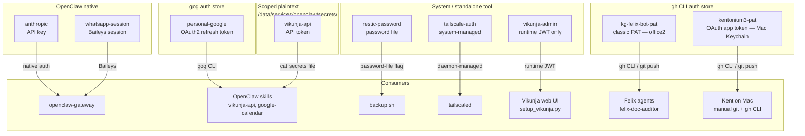

# Credentials and Secrets

Authoritative data: [`data/credential-manifest.json`](<./data/credential-manifest.json>)

This document describes the secret management model for kg-automation: what
credentials exist, where they live, who manages them, and which consumers use
them. For expiry policies and review cadences, see the manifest.

---

## Storage Mechanisms

kg-automation uses four distinct secret storage mechanisms. Each credential
uses the mechanism appropriate to the tool that owns or consumes it. There is
no single unified secret store — that is a deliberate trade-off favoring
simplicity on a Tailscale-gated personal server.

### 1. Tool-native auth store (gog)

Used by: `personal-google`

`gog` (the Google Workspace CLI) manages its own OAuth2 token store via
`gog auth credentials` and `gog auth add`. Credentials are stored in
gog's internal directory on office2. This is the correct home for any
credential that `gog` consumes — agents interact via the `gog` CLI rather
than directly with credential files.

### 2. OpenClaw native auth

Used by: `anthropic`, `whatsapp-session`

OpenClaw manages these internally. The Anthropic API key lives in
`/home/claude/.openclaw/agents/main/agent/auth-profiles.json`. The
WhatsApp session is managed by OpenClaw's Baileys integration in
`~/.openclaw/credentials/whatsapp/`. Neither is touched directly —
OpenClaw handles auth refresh and session management.

### 3. Scoped plaintext files (mode 600)

Used by: `vikunja-api`

OpenClaw skills read credentials at runtime via `cat /data/services/openclaw/secrets/<name>`.
Files are owned by the `claude` user, mode 600. This pattern is appropriate
for API tokens consumed by skills via `exec` calls. It is not used for
credentials that have their own native management mechanism.

### 4. System-managed or standalone tool

Used by: `restic-password`, `tailscale-auth`, `vikunja-admin`

These credentials are owned and managed by their respective tools (Restic,
Tailscale daemon, Vikunja's login endpoint). Neither OpenClaw nor agents
interact with them directly.

### 5. gh CLI auth store

Used by: `kg-felix-bot-pat`, `kentonium3-pat`

The GitHub CLI (`gh`) stores authentication tokens in two locations
depending on host:

- **office2** (claude user) — `/home/claude/.config/gh/hosts.yml` holds the
  `kg-felix-bot-pat` classic PAT. Felix agents shell out to `gh` and
  `git push` and transparently use this token. See
  [`identity-model.md` §Agent Service Accounts](<./identity-model.md#agent-service-accounts>)
  for the identity model.
- **Mac** (Kent's user) — macOS Keychain (managed by `gh` CLI) holds the
  `kentonium3-pat` OAuth app token (issued by GitHub CLI's web-flow
  login). Used for Kent's manual git operations and `gh` CLI invocations.

The two tokens are distinct identities; office2 never holds a copy of
`kentonium3-pat` and Mac never holds `kg-felix-bot-pat`.

---

## Storage Mechanism Summary

---

## Active Credentials

| Name | Type | Storage Mechanism | Used By |
|------|------|-------------------|---------|
| `vikunja-admin` | username/password | Runtime JWT, not stored | Vikunja web UI, `setup_vikunja.py` |
| `restic-password` | password file | Standalone — `/home/claude/.config/restic/password` | `backup.sh` |
| `tailscale-auth` | system-managed | Managed by `tailscaled` | Tailscale daemon |
| `anthropic` | API key | OpenClaw native auth store | `openclaw-gateway` |
| `vikunja-api` | API token | Scoped plaintext — `/data/services/openclaw/secrets/vikunja-api` | OpenClaw skills |
| `whatsapp-session` | session | OpenClaw native (Baileys) | `openclaw-gateway` |
| `personal-google` | OAuth2 | gog auth store | `gog` CLI via google-calendar skill |
| `kg-felix-bot-pat` | classic PAT | gh CLI auth store — `/home/claude/.config/gh/hosts.yml` | `felix-doc-auditor` and future Felix agents (git push, `gh` CLI) |
| `kentonium3-pat` | OAuth app token | gh CLI auth store — macOS Keychain (managed by `gh` CLI on Mac) | Kent's manual git + `gh` CLI from Mac |

---

## Planned Credentials

| Name | Type | Planned By | Purpose |
|------|------|------------|---------|
| `intentional-google` | OAuth2 | F012 (phase 3) | Intentional LLC Google Workspace — separate credential from personal-google |

---

## Access Model

- **claude user**: Owns and reads secrets in `/data/services/openclaw/secrets/`
  and `~/.openclaw/`. Cannot sudo. All agent and skill execution runs as claude.
- **kgale user**: Full sudo access. Used for initial credential setup and any
  operation requiring elevated privileges.
- **Containers**: Credentials injected via environment or read from mounted
  paths at runtime — never baked into images.

---

## Security Posture

All credentials are protected by the Tailscale-only network posture — office2
is not publicly reachable. Additional mitigations: UFW, fail2ban, SSH hardening,
and the ClawHub install approval requirement in the Felix Constitution.

**Credential expiry health check (R-003 closure, #115)**: As of 2026-05-11, an automated daily check (`credential-health-check.service` on office2, fires at 13:00 UTC) reads this manifest, evaluates each credential's `review_cadence` and `last_reviewed`, and files a paired GitHub issue + Vikunja task when a credential is within 30 days of its cadence boundary. The Vikunja task's `due_date = boundary − 7 days` so the existing escalation engine carries the WhatsApp pressure before the actual deadline. `monitor-activity` credentials (`tailscale-auth`, `whatsapp-session`) are evaluated against live activity signals (`tailscale status --json`, `openclaw channels status`) and alerted on drift via a GitHub issue only. See `kitty-specs/credential-expiry-health-check-01KRCF92/` for the design and `scripts/security/credential_health_check/` for the implementation.

**Known risk**: Credentials stored as plaintext files are vulnerable to
exfiltration if the `claude` account is compromised (e.g., via a malicious
OpenClaw skill). Precedent exists for this attack vector. Encrypting secrets
at rest is tracked as the long-term mitigation under R-001 in the
[risk register](<../../archive/risk-register.md>) (archived; now [issue #114](https://github.com/kentonium3/kg-automation/issues/114)) and D06 in the
[capability roadmap](<../felix-capability-roadmap.md>).

---

## Rules

1. **No credentials in committed files** — ever
2. Interactive auth for manual scripts (`setup_vikunja.py` pattern)
3. Use the mechanism native to the consuming tool — don't store credentials
   in a different mechanism just for uniformity
4. Credential names are stable identifiers referenced across docs and code
5. All new credentials must be added to `credential-manifest.json` before
   or alongside their first use
