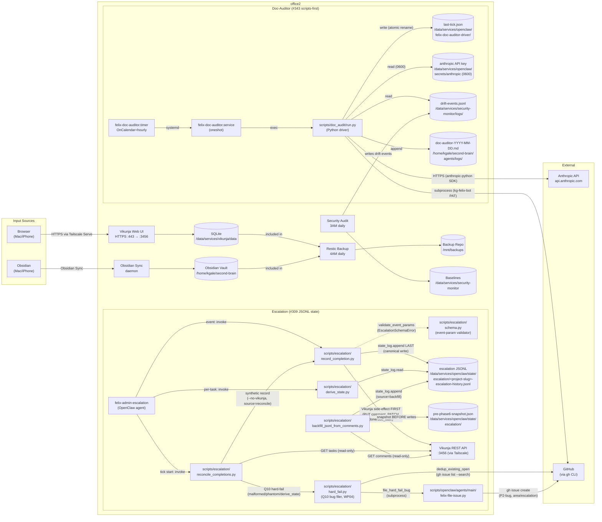

```mermaid
%% source: docs/design/architecture/data-flows.mmd
graph LR
    subgraph inputs["Input Sources"]
        browser["Browser<br/>(Mac/iPhone)"]
        obsidian_app["Obsidian<br/>(Mac/iPhone)"]
    end

    subgraph office2["office2"]
        vikunja_ui["Vikunja Web UI<br/>HTTPS :443 → :3456"]
        vikunja_db[("SQLite<br/>/data/services/vikunja/data")]
        ob_sync["Obsidian Sync<br/>daemon"]
        vault[("Obsidian Vault<br/>/home/kgale/second-brain")]
        restic["Restic Backup<br/>4AM daily"]
        backup_repo[("Backup Repo<br/>/mnt/backups")]
        audit["Security Audit<br/>3AM daily"]
        baselines[("Baselines<br/>/data/services/security-monitor")]

        subgraph doc_audit["Doc-Auditor (#343 scripts-first)"]
            timer["felix-doc-auditor.timer<br/>OnCalendar=hourly"]
            service["felix-doc-auditor.service<br/>(oneshot)"]
            driver["scripts/doc_audit/run.py<br/>(Python driver)"]
            tick_signal[("last-tick.json<br/>/data/services/openclaw/<br/>felix-doc-auditor-driver/")]
            anthropic_key[("anthropic API key<br/>/data/services/openclaw/<br/>secrets/anthropic (0600)")]
            drift_events[("drift-events.jsonl<br/>/data/services/security-monitor/logs/")]
            activity_log[("doc-auditor-YYYY-MM-DD.md<br/>/home/kgale/second-brain/<br/>agents/logs/")]
        end

        subgraph escalation["Escalation (#309 JSONL state)"]
            esc_agent["felix-admin-escalation<br/>(OpenClaw agent)"]
            esc_record["scripts/escalation/<br/>record_completion.py"]
            esc_reconcile["scripts/escalation/<br/>reconcile_completions.py"]
            esc_derive["scripts/escalation/<br/>derive_state.py"]
            esc_backfill["scripts/escalation/<br/>backfill_jsonl_from_comments.py"]
            esc_schema["scripts/escalation/<br/>schema.py<br/>(event-param validator)"]
            esc_hard_fail["scripts/escalation/<br/>hard_fail.py<br/>(Q10 bug filer, WP04)"]
            esc_jsonl[("escalation JSONL<br/>/data/services/openclaw/state/<br/>escalation/&lt;project-slug&gt;-<br/>escalation-history.jsonl")]
            esc_snapshot[("pre-phase6-snapshot.json<br/>/data/services/openclaw/state/<br/>escalation/")]
            vikunja_api["Vikunja REST API<br/>:3456 (via Tailscale)"]
            felix_file_issue["scripts/openclaw/agents/main/<br/>felix-file-issue.py"]
        end
    end

    subgraph external["External"]
        anthropic_api["Anthropic API<br/>api.anthropic.com"]
        gh_api["GitHub<br/>(via gh CLI)"]
    end

    browser -->|"HTTPS via Tailscale Serve"| vikunja_ui
    vikunja_ui --> vikunja_db
    obsidian_app -->|"Obsidian Sync"| ob_sync
    ob_sync --> vault
    vikunja_db -->|"included in"| restic
    vault -->|"included in"| restic
    restic --> backup_repo
    audit --> baselines

    timer -->|"systemd"| service
    service -->|"exec"| driver
    driver -->|"read (0600)"| anthropic_key
    driver -->|"read"| drift_events
    driver -->|"HTTPS (anthropic-python SDK)"| anthropic_api
    driver -->|"subprocess (kg-felix-bot PAT)"| gh_api
    driver -->|"append"| activity_log
    driver -->|"write (atomic rename)"| tick_signal
    audit -->|"writes drift events"| drift_events

    esc_agent -->|"event: invoke"| esc_record
    esc_agent -->|"tick start: invoke"| esc_reconcile
    esc_agent -->|"per-task: invoke"| esc_derive
    esc_record -->|"Vikunja side-effect FIRST<br/>(PUT comment, PATCH done/due_date)"| vikunja_api
    esc_record -->|"state_log.append LAST<br/>(canonical write)"| esc_jsonl
    esc_record -.->|"validate_event_params<br/>(EscalationSchemaError)"| esc_schema
    esc_reconcile -->|"GET tasks (read-only)"| vikunja_api
    esc_reconcile -->|"synthetic record<br/>(--no-vikunja, source=reconcile)"| esc_record
    esc_reconcile -->|"Q10 hard-fail<br/>(malformed/phantom/derive_state)"| esc_hard_fail
    esc_derive -->|"state_log.read"| esc_jsonl
    esc_backfill -->|"GET comments (read-only)"| vikunja_api
    esc_backfill -->|"snapshot BEFORE writes"| esc_snapshot
    esc_backfill -->|"state_log.append<br/>(source=backfill)"| esc_jsonl
    esc_hard_fail -->|"dedup_existing_open<br/>(gh issue list --search)"| gh_api
    esc_hard_fail -->|"file_hard_fail_bug<br/>(subprocess)"| felix_file_issue
    felix_file_issue -->|"gh issue create<br/>(P2-bug, area/escalation)"| gh_api
```
