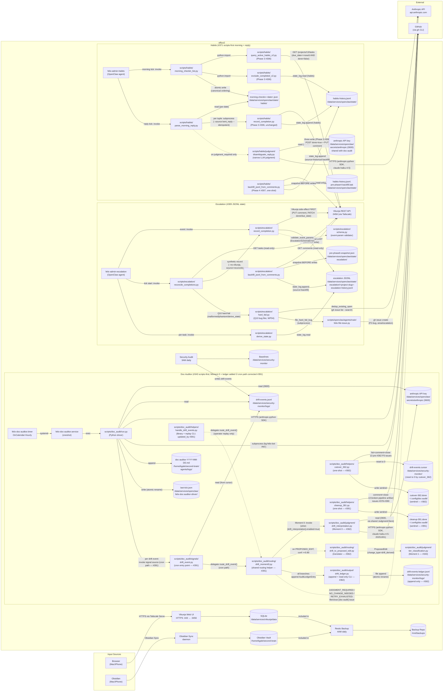

```mermaid
%% source: docs/design/architecture/data-flows.mmd
graph LR
    subgraph inputs["Input Sources"]
        browser["Browser<br/>(Mac/iPhone)"]
        obsidian_app["Obsidian<br/>(Mac/iPhone)"]
    end

    subgraph office2["office2"]
        vikunja_ui["Vikunja Web UI<br/>HTTPS :443 → :3456"]
        vikunja_db[("SQLite<br/>/data/services/vikunja/data")]
        ob_sync["Obsidian Sync<br/>daemon"]
        vault[("Obsidian Vault<br/>/home/kgale/second-brain")]
        restic["Restic Backup<br/>4AM daily"]
        backup_repo[("Backup Repo<br/>/mnt/backups")]
        audit["Security Audit<br/>3AM daily"]
        baselines[("Baselines<br/>/data/services/security-monitor")]

        subgraph doc_audit["Doc-Auditor (#343 scripts-first; Moment 0 + ledger added #362; cron path corrected #391)"]
            timer["felix-doc-auditor.timer<br/>OnCalendar=hourly"]
            service["felix-doc-auditor.service<br/>(oneshot)"]
            driver["scripts/doc_audit/run.py<br/>(Python driver)"]
            tick_signal[("last-tick.json<br/>/data/services/openclaw/<br/>felix-doc-auditor-driver/")]
            anthropic_key[("anthropic API key<br/>/data/services/openclaw/<br/>secrets/anthropic (0600)")]
            drift_events[("drift-events.jsonl<br/>/data/services/security-monitor/logs/")]
            activity_log[("doc-auditor-YYYY-MM-DD.md<br/>/home/kgale/second-brain/<br/>agents/logs/")]
            da_drift_signal["scripts/doc_audit/signals/<br/>drift_event.py<br/>(cron entry point — #391)"]
            da_handle_drift["scripts/doc_audit/helpers/<br/>handle_drift_events.py<br/>(library + replay CLI; updated_by #391)"]
            da_drift_moment0["scripts/doc_audit/routing/<br/>drift_moment0.py<br/>(shared routing helper — #391)"]
            da_drift_interp["scripts/doc_audit/judgment/<br/>drift_interpretation.py<br/>(Moment 0 — #362)"]
            da_tier_class["scripts/doc_audit/judgment/<br/>tier_classification.py<br/>(Moment 1 — #343)"]
            da_translator["scripts/doc_audit/routing/<br/>drift_to_proposed_edit.py<br/>(translator — #362)"]
            da_ledger["scripts/doc_audit/output/<br/>drift_ledger.py<br/>(append + read-only CLI — #362)"]
            da_ledger_file[("drift-events-ledger.jsonl<br/>/data/services/security-monitor/logs/<br/>(append-only — #362)")]
            da_cutover["scripts/doc_audit/helpers/<br/>cutover_362.py<br/>(one-shot — #362)"]
            da_cutover_marker[("cutover-362.done<br/>~/.config/doc-audit/<br/>(sentinel — #362)")]
            da_cursor[("drift-events.cursor<br/>/data/services/security-monitor/<br/>(reset to 0 by cutover_362)")]
            da_cleanup["scripts/doc_audit/helpers/<br/>cleanup_391.py<br/>(one-shot — #391)"]
            da_cleanup_marker[("cleanup-391.done<br/>~/.config/doc-audit/<br/>(sentinel — #391)")]
        end

        subgraph escalation["Escalation (#309 JSONL state)"]
            esc_agent["felix-admin-escalation<br/>(OpenClaw agent)"]
            esc_record["scripts/escalation/<br/>record_completion.py"]
            esc_reconcile["scripts/escalation/<br/>reconcile_completions.py"]
            esc_derive["scripts/escalation/<br/>derive_state.py"]
            esc_backfill["scripts/escalation/<br/>backfill_jsonl_from_comments.py"]
            esc_schema["scripts/escalation/<br/>schema.py<br/>(event-param validator)"]
            esc_hard_fail["scripts/escalation/<br/>hard_fail.py<br/>(Q10 bug filer, WP04)"]
            esc_jsonl[("escalation JSONL<br/>/data/services/openclaw/state/<br/>escalation/&lt;project-slug&gt;-<br/>escalation-history.jsonl")]
            esc_snapshot[("pre-phase6-snapshot.json<br/>/data/services/openclaw/state/<br/>escalation/")]
            vikunja_api["Vikunja REST API<br/>:3456 (via Tailscale)"]
            felix_file_issue["scripts/openclaw/agents/main/<br/>felix-file-issue.py"]
        end

        subgraph habits["Habits (#371 scripts-first morning + reply)"]
            hab_agent["felix-admin-habits<br/>(OpenClaw agent)"]
            hab_morning["scripts/habits/<br/>morning_checkin_list.py"]
            hab_query["scripts/habits/<br/>query_active_habits_v2.py<br/>(Phase 3 #306)"]
            hab_exclude["scripts/habits/<br/>exclude_completed_v2.py<br/>(Phase 3 #306)"]
            hab_parse["scripts/habits/<br/>parse_morning_reply.py"]
            hab_disambig["scripts/habits/judgment/<br/>disambiguate_reply.py<br/>(narrow LLM judgment)"]
            hab_record["scripts/habits/<br/>record_completion.py<br/>(Phase 3 #306, unchanged)"]
            hab_artifact[("morning-checkin-&lt;date&gt;.json<br/>/data/services/openclaw/state/<br/>habits/")]
            hab_history[("habits-history.jsonl<br/>/data/services/openclaw/state/")]
            hab_backfill["scripts/habits/<br/>backfill_jsonl_from_comments.py<br/>(Phase 4 #307, one-shot)"]
            hab_backfill_snapshot[("habits-history.jsonl.<br/>pre-phase4-backfill.bak<br/>/data/services/openclaw/state/")]
            anthropic_key_habits[("anthropic API key<br/>/data/services/openclaw/<br/>secrets/anthropic (0600)<br/>shared with doc-audit")]
        end
    end

    subgraph external["External"]
        anthropic_api["Anthropic API<br/>api.anthropic.com"]
        gh_api["GitHub<br/>(via gh CLI)"]
    end

    browser -->|"HTTPS via Tailscale Serve"| vikunja_ui
    vikunja_ui --> vikunja_db
    obsidian_app -->|"Obsidian Sync"| ob_sync
    ob_sync --> vault
    vikunja_db -->|"included in"| restic
    vault -->|"included in"| restic
    restic --> backup_repo
    audit --> baselines

    timer -->|"systemd"| service
    service -->|"exec"| driver
    driver -->|"read (0600)"| anthropic_key
    driver -->|"read"| drift_events
    driver -->|"HTTPS (anthropic-python SDK)"| anthropic_api
    driver -->|"subprocess (kg-felix-bot PAT)"| gh_api
    driver -->|"append"| activity_log
    driver -->|"write (atomic rename)"| tick_signal
    audit -->|"writes drift events"| drift_events

    driver -->|"per drift event:<br/>invoke signal source (cron path — #391)"| da_drift_signal
    da_drift_signal -->|"read (from cursor)"| drift_events
    da_drift_signal -->|"delegate route_drift_event()<br/>(cron path)"| da_drift_moment0
    da_handle_drift -.->|"delegate route_drift_event()<br/>(operator replay only)"| da_drift_moment0
    da_drift_moment0 -->|"Moment 0: invoke<br/>(when [drift_interpretation].enabled=true)"| da_drift_interp
    da_drift_interp -->|"read (0600,<br/>via shared JudgmentClient)"| anthropic_key
    da_drift_interp -->|"HTTPS (anthropic-python SDK,<br/>claude-haiku-4-5-20251001)"| anthropic_api
    da_drift_moment0 -.->|"on PROPOSED_EDIT, conf >=0.80"| da_translator
    da_translator -.->|"ProposedEdit<br/>(change_type=drift_derived)"| da_tier_class
    da_drift_moment0 -->|"all branches:<br/>append AuditLedgerEntry"| da_ledger
    da_ledger -->|"file append<br/>(atomic rename)"| da_ledger_file
    da_drift_moment0 -.->|"JUDGMENT_REQUIRED /<br/>NO_CHANGE_NEEDED /<br/>RETRY_EXHAUSTED:<br/>file/close [doc-audit] issue"| gh_api

    da_cutover -->|"list+comment+close<br/>13 pre-#362 P3 issues"| gh_api
    da_cutover -->|"reset to 0"| da_cursor
    da_cutover -->|"write sentinel"| da_cutover_marker

    da_cleanup -->|"comment+close<br/>13 broken-pipeline artifact<br/>issues #378-#390"| gh_api
    da_cleanup -->|"write sentinel"| da_cleanup_marker

    esc_agent -->|"event: invoke"| esc_record
    esc_agent -->|"tick start: invoke"| esc_reconcile
    esc_agent -->|"per-task: invoke"| esc_derive
    esc_record -->|"Vikunja side-effect FIRST<br/>(PUT comment, PATCH done/due_date)"| vikunja_api
    esc_record -->|"state_log.append LAST<br/>(canonical write)"| esc_jsonl
    esc_record -.->|"validate_event_params<br/>(EscalationSchemaError)"| esc_schema
    esc_reconcile -->|"GET tasks (read-only)"| vikunja_api
    esc_reconcile -->|"synthetic record<br/>(--no-vikunja, source=reconcile)"| esc_record
    esc_reconcile -->|"Q10 hard-fail<br/>(malformed/phantom/derive_state)"| esc_hard_fail
    esc_derive -->|"state_log.read"| esc_jsonl
    esc_backfill -->|"GET comments (read-only)"| vikunja_api
    esc_backfill -->|"snapshot BEFORE writes"| esc_snapshot
    esc_backfill -->|"state_log.append<br/>(source=backfill)"| esc_jsonl
    esc_hard_fail -->|"dedup_existing_open<br/>(gh issue list --search)"| gh_api
    esc_hard_fail -->|"file_hard_fail_bug<br/>(subprocess)"| felix_file_issue
    felix_file_issue -->|"gh issue create<br/>(P2-bug, area/escalation)"| gh_api

    hab_agent -->|"morning tick: invoke"| hab_morning
    hab_agent -->|"reply tick: invoke"| hab_parse
    hab_morning -->|"python-import"| hab_query
    hab_morning -->|"python-import"| hab_exclude
    hab_query -->|"GET /projects/13/tasks<br/>(due_date<=now/d AND done=false)"| vikunja_api
    hab_exclude -->|"state_log.read (habits)"| hab_history
    hab_morning -->|"atomic write<br/>(canonical ordering)"| hab_artifact
    hab_parse -->|"read (per-date)"| hab_artifact
    hab_parse -->|"per tuple: subprocess<br/>(--source kent_reply --idempotent)"| hab_record
    hab_parse -.->|"on judgment_required only"| hab_disambig
    hab_disambig -->|"read (0600)"| anthropic_key_habits
    hab_disambig -->|"HTTPS (anthropic-python SDK,<br/>claude-haiku-4-5)"| anthropic_api
    hab_record -->|"three-write (Phase 3 #306)<br/>POST done=true + PUT comment"| vikunja_api
    hab_record -->|"state_log.append (habits)"| hab_history

    hab_backfill -->|"GET comments (read-only)"| vikunja_api
    hab_backfill -->|"snapshot BEFORE writes"| hab_backfill_snapshot
    hab_backfill -->|"state_log.append<br/>(source=historical-backfill)"| hab_history
```
