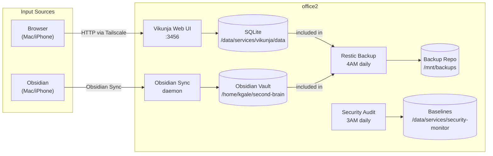

```mermaid
%% source: docs/design/architecture/data-flows.mmd
graph LR
    subgraph inputs["Input Sources"]
        browser["Browser<br/>(Mac/iPhone)"]
        obsidian_app["Obsidian<br/>(Mac/iPhone)"]
    end

    subgraph office2["office2"]
        vikunja_ui["Vikunja Web UI<br/>:3456"]
        vikunja_db[("SQLite<br/>/data/services/vikunja/data")]
        ob_sync["Obsidian Sync<br/>daemon"]
        vault[("Obsidian Vault<br/>/home/kgale/second-brain")]
        restic["Restic Backup<br/>4AM daily"]
        backup_repo[("Backup Repo<br/>/mnt/backups")]
        audit["Security Audit<br/>3AM daily"]
        baselines[("Baselines<br/>/data/services/security-monitor")]
    end

    browser -->|"HTTP via Tailscale"| vikunja_ui
    vikunja_ui --> vikunja_db
    obsidian_app -->|"Obsidian Sync"| ob_sync
    ob_sync --> vault
    vikunja_db -->|"included in"| restic
    vault -->|"included in"| restic
    restic --> backup_repo
    audit --> baselines
```
