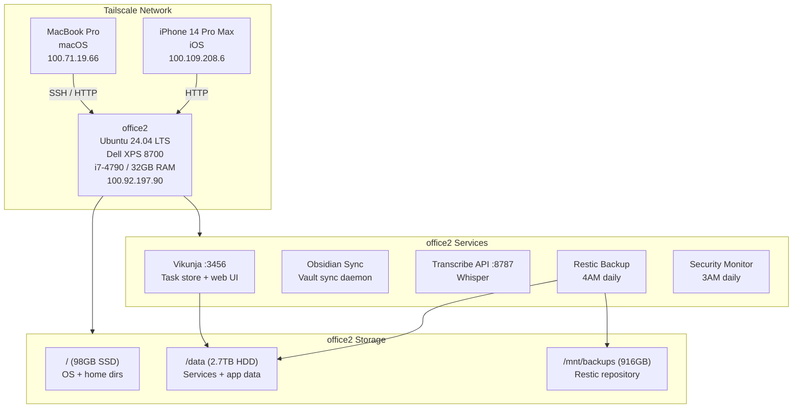

```mermaid
%% source: docs/design/architecture/physical-topology.mmd
graph TB
    subgraph tailnet["Tailscale Network"]
        office2["office2<br/>Ubuntu 24.04 LTS<br/>Dell XPS 8700<br/>i7-4790 / 32GB RAM<br/>100.92.197.90"]
        mac["MacBook Pro<br/>macOS<br/>100.71.19.66"]
        iphone["iPhone 14 Pro Max<br/>iOS<br/>100.109.208.6"]
    end

    subgraph office2_storage["office2 Storage"]
        os_disk["/ (98GB SSD)<br/>OS + home dirs"]
        data_disk["/data (2.7TB HDD)<br/>Services + app data"]
        backup_disk["/mnt/backups (916GB)<br/>Restic repository"]
    end

    subgraph office2_services["office2 Services"]
        vikunja["Vikunja :3456<br/>Task store + web UI"]
        obsidian_sync["Obsidian Sync<br/>Vault sync daemon"]
        transcribe["Transcribe API :8787<br/>Whisper"]
        restic["Restic Backup<br/>4AM daily"]
        security["Security Monitor<br/>3AM daily"]
    end

    mac -->|"SSH / HTTP"| office2
    iphone -->|"HTTP"| office2
    office2 --> office2_storage
    office2 --> office2_services
    vikunja --> data_disk
    restic --> backup_disk
    restic --> data_disk
```
