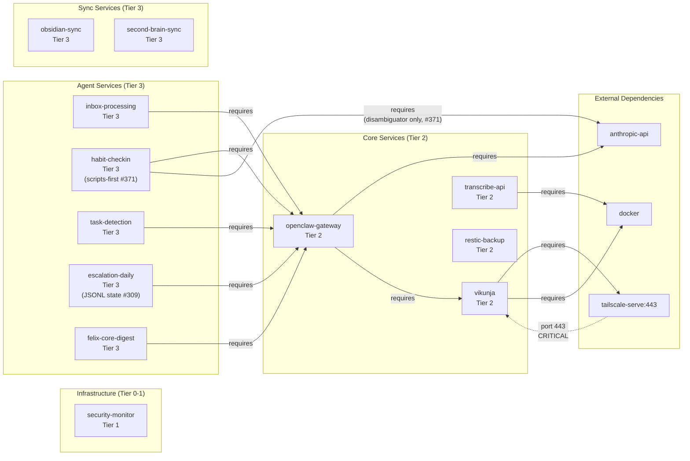

# Service Dependencies

Visual dependency map of office2 services, grouped by tier.
Arrows show runtime dependencies. The critical external path
(port 443 through tailscale-serve into vikunja) is highlighted.
Updated 2026-05-22 (#371) — `habit-checkin` cron is now scripts-first
for both the morning tick and reply handling (mirrors the #309
escalation port); the agent dependency edge is unchanged but the
agent now depends on the `anthropic-api` for narrow LLM judgment on
ambiguous replies (via `scripts/habits/judgment/disambiguate_reply.py`),
the same direct path used by `felix-doc-auditor` (#343). Updated
2026-05-21 (#309) to include `escalation-daily`, which migrates
to a JSONL state model parallel to the post-#306 habits pattern; see
[`data-flows.view.md`](<./data-flows.view.md>) for the escalation
subgraph (record/reconcile/derive_state/backfill/hard-fail) and the
habits subgraph (morning_checkin_list/parse_morning_reply/disambiguate_reply)
detail.

## Reading the Diagram

| Symbol | Meaning |
|--------|---------|
| Solid arrow (`-->`) | Runtime dependency ("requires") |
| Dotted arrow (`-.->`) | Critical external ingress path |
| Subgraph shading | Tier grouping |

## Key Observations

- **Single point of failure**: All four agent services depend on
  openclaw-gateway, which in turn depends on both anthropic-api (external)
  and vikunja (internal). An openclaw outage disables all agent automation.
- **Critical ingress chain**: External HTTPS traffic reaches vikunja only
  through tailscale-serve on port 443. Loss of Tailscale severs remote
  access to task management.
- **Infrastructure isolation**: security-monitor has no upstream
  dependencies and no downstream consumers shown here; it operates
  independently.
- **Sync independence**: obsidian-sync and second-brain-sync have no
  dependency on the core or agent tiers, so sync continues even during
  service outages.
