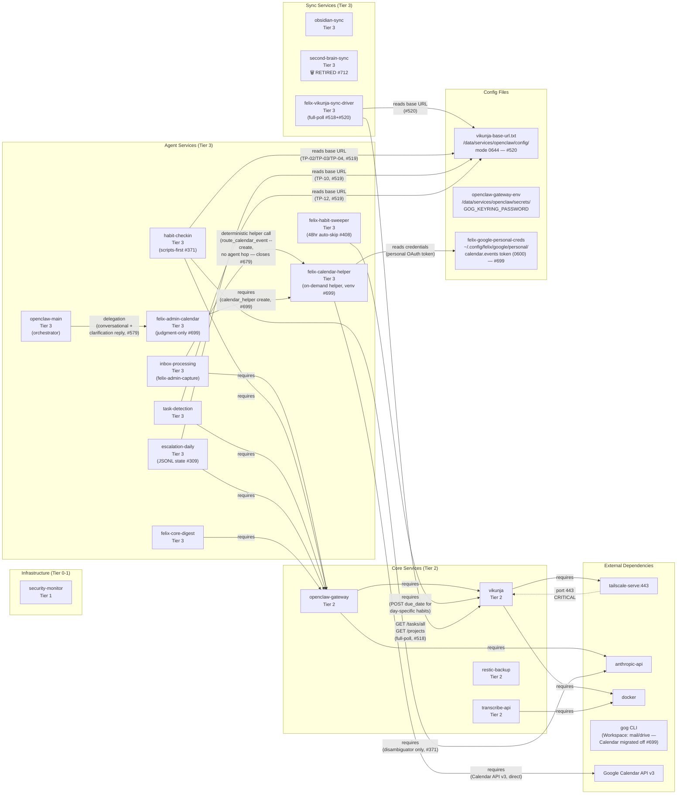

# Service Dependencies

Visual dependency map of office2 services, grouped by tier.
Arrows show runtime dependencies. The critical external path
(port 443 through tailscale-serve into vikunja) is highlighted.
Updated 2026-07-09 (#699, closes #679) — the Calendar surface migrated
off `gog`: added the `felix-calendar-helper` node (on-demand helper, venv)
with direct edges to `Google Calendar API v3` and the per-account personal
OAuth credential; `felix-admin-calendar` is now judgment-only and calls the
helper; `inbox-processing` reaches the calendar via a deterministic helper
call (no agent-to-agent delegation). The `gog` CLI is retained for its other
Workspace surfaces.
Updated 2026-06-11 (#579) — added `felix-admin-calendar` agent node
(extracted from `main/AGENTS.md` per mission
`felix-calendar-subagent-extraction-01KTTA33`) with delegation edges
from `main` and `inbox-processing` (capture initiates calendar event
creation) and runtime edges to the `gog` CLI (Google Calendar) and
`openclaw-gateway-env` (credential surface for `GOG_KEYRING_PASSWORD`).
Updated 2026-06-05 (#520) — added `felix-vikunja-sync-driver` node and
`vikunja-url-config` file node; the sync driver depends on Vikunja API
and the URL config file, and the URL config file is also consumed by the
six migrated touchpoints (habits, escalation, enrichment). Updated
2026-05-22 (#371) — `habit-checkin` cron is now scripts-first
for both the morning tick and reply handling (mirrors the #309
escalation port); the agent dependency edge is unchanged but the
agent now depends on the `anthropic-api` for narrow LLM judgment on
ambiguous replies (via `scripts/habits/judgment/disambiguate_reply.py`),
the same direct path used by `felix-doc-auditor` (#343). Updated
2026-05-21 (#309) to include `escalation-daily`, which migrates
to a JSONL state model parallel to the post-#306 habits pattern; see
[`data-flows.view.md`](<./data-flows.view.md>) for the escalation
subgraph (record/reconcile/derive_state/backfill/hard-fail) and the
habits subgraph (morning_checkin_list/parse_morning_reply/disambiguate_reply)
detail.

## Reading the Diagram

| Symbol | Meaning |
|--------|---------|
| Solid arrow (`-->`) | Runtime dependency ("requires") |
| Dotted arrow (`-.->`) | Critical external ingress path |
| Subgraph shading | Tier grouping |

## Key Observations

- **Single point of failure**: All four agent services depend on
  openclaw-gateway, which in turn depends on both anthropic-api (external)
  and vikunja (internal). An openclaw outage disables all agent automation.
- **Critical ingress chain**: External HTTPS traffic reaches vikunja only
  through tailscale-serve on port 443. Loss of Tailscale severs remote
  access to task management.
- **Infrastructure isolation**: security-monitor has no upstream
  dependencies and no downstream consumers shown here; it operates
  independently.
- **Sync independence**: obsidian-sync has no dependency on the core or
  agent tiers, so sync continues even during service outages.
  (second-brain-sync was retired 2026-07-12 — #712.)
- **Sync driver read-only contract**: felix-vikunja-sync-driver reads
  Vikunja state via the REST API (full-poll, GET only — never writes to
  Vikunja) and resolves the base URL from the shared config file
  (`vikunja-base-url.txt`, mode 0644 — not a secret). The same config
  file is consumed by the six touchpoint scripts migrated by #519.
- **Calendar substrate is now a Felix-owned helper (#699, closes #679)**:
  Google Calendar interactions no longer go through `gog`. The deterministic
  **`felix-calendar-helper`** CLI (run on-demand under a dedicated venv,
  `/data/services/openclaw/felix-calendar/venv`) talks to the Google Calendar
  API v3 directly, authenticating with a per-account personal OAuth token
  (`~/.config/felix/google/personal/`, scope `calendar.events`, 0600). Two
  callers: (1) `inbox-processing` reaches the calendar via a single
  deterministic helper call (`route_calendar_event --create`) — **no
  agent-to-agent delegation**, which is what closes #679; (2) `felix-admin-calendar`
  is now judgment-only (natural-language parsing + clarification round-trips
  for the conversational path relayed from `main`) and invokes the same helper
  instead of `gog`. The `gog` CLI is retained for its other Workspace surfaces
  (mail/drive) and its `GOG_KEYRING_PASSWORD` credential; only the Calendar
  surface migrated off it (#572 gog residual stays open).
