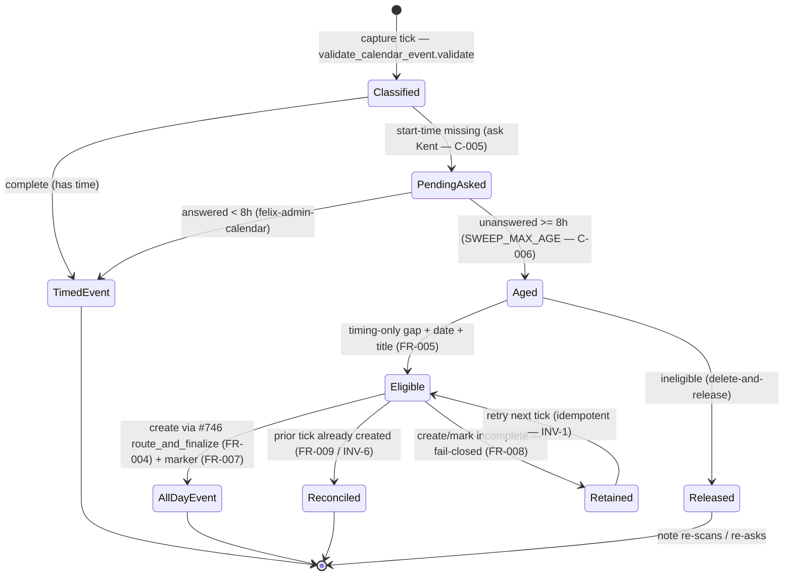

# Calendar Clarification Process Flow

> **Divio type: Explanation / Reference (current-state).** This is not a runbook.
> It describes *what the system does today* when a captured note resolves to an
> appointment with a date but no time — the actors, the states, the operating
> rules (with the invariant IDs they enforce), and the code seams that implement
> them. Runbooks and agent `TOOLS.md` link here rather than restating the rules.

> **Reusable shape (for #794).** This document's structure —
> **actors + trigger → flow + states → operating rules & invariants → implementing
> seams → state diagram** — is the exemplar template that
> [#794](https://github.com/kentonium3/kg-automation/issues/794) will generalize
> into a machine-discoverable home for *all* process-flow docs (inbox routing,
> someday, journal, habits). This calendar-clarification flow is the first one
> written to that shape. When #794 back-fills the others, keep the section order
> and the "cite the FR/INV IDs the code enforces" discipline identical.

## Why this document exists

The calendar-clarification flow spans several prior missions. Before this doc,
the only way to learn its current-state behavior was to open the individual
`kitty-specs/` missions and reconstruct it — the exact pain
[#780](https://github.com/kentonium3/kg-automation/issues/780) hit. This is the
single canonical explanation. It **credits and consolidates** the missions that
built the flow; it does not reinvent them:

| Contribution | Origin |
|---|---|
| Forced clarification — a no-time appointment is **asked about, never guessed** | Locked decision [#739](https://github.com/kentonium3/kg-automation/issues/739) |
| The pending-clarification **state file** + the aging **timeout window** (originally 24h → `needs-review` + a `calendar_event_clarification_timeout` log action; all-day events explicitly out of scope) | `inbox-calendar-and-aspiration-routing-01KTHHXS` **FR-007** |
| The atomic, idempotent **`route_and_finalize` transaction** (create → log → mark note processed) | [#746](https://github.com/kentonium3/kg-automation/issues/746) |
| The **all-day calendar-helper** support (`start.date`/`end.date`) | [#786](https://github.com/kentonium3/kg-automation/issues/786) |
| The **age-out → create-all-day fallback** + the **8h** window + the distinct routing-log marker | **This mission**, [#780](https://github.com/kentonium3/kg-automation/issues/780) items 2 & 3 |
| Systemic generalization of this doc's shape to all process flows | Follow-up [#794](https://github.com/kentonium3/kg-automation/issues/794) |

## Actors & trigger

- **`felix-admin-capture`** — the OpenClaw capture agent. Its serialized tick
  drives the whole flow: it classifies inbox notes, records pending
  clarifications, and runs the deterministic sweep. The tick is single and
  serialized, which is the concurrency model the exactly-once guarantee relies on
  (NFR-004: no lock — serial invocation).
- **`felix-admin-calendar`** — a separate agent that handles **Kent's reply** to a
  clarification. Kent's answer arrives as an inbound message to *that* agent (not a
  capture→agent hop); it matches the pending record, re-validates, and creates the
  timed event itself.
- **Kent** — answers (or does not answer) the "what time?" ask.

**Trigger.** During a capture tick, an inbox note is classified as a **calendar**
event whose payload has a **resolved date and a title but no start time**
(e.g. *"Meet Rob Thursday"*). `validate_calendar_event.validate` returns
`complete: false` with `missing_fields` containing `start_time` (and usually
`end_or_duration`), plus the resolved `start_date`.

## Flow & states

```
capture tick (felix-admin-capture)
  │
  ▼
validate_calendar_event.validate(block)
  │
  ├─ complete ─────────────────────────────► route_and_finalize → timed event
  │                                            (existing path, unchanged)
  │
  └─ start-time missing (complete:false, "start_time" in missing_fields)
        │
        ▼
     record pending clarification + ASK Kent            (C-005 ask-first)
     (persist title + start_date + missing_fields;
      handle_clarification_state add)
        │
        ▼
     ── 8h window (SWEEP_MAX_AGE) ──                     (C-006 whole-lifecycle 8h)
        │
        ├─ answered in <8h ──► felix-admin-calendar creates the timed event
        │                       (answered path, unchanged; never reaches fallback)
        │
        └─ unanswered ≥8h  ──► clarification_sweep_finalize (Step 1a)
              │
              ├─ ELIGIBLE (timing-only gap + resolved date + title, FR-005)
              │     └─► build all-day plan (FR-006) → route_and_finalize._run_finalize
              │           ├─ success  ─► all-day event created + note marked
              │           │              processed + calendar_all_day_fallback
              │           │              marker logged ─► remove pending record
              │           │              (outcome: finalized)
              │           ├─ reconcile ─► event already created by a prior tick;
              │           │              remove stale record WITHOUT re-creating;
              │           │              emit missing marker (outcome: reconciled)
              │           └─ failure   ─► RETAIN record, note left unprocessed
              │                          (fail-closed; next tick retries)
              │                          (outcome: retained)
              │
              └─ INELIGIBLE (missing title / non-timing gap / legacy no-signal)
                    └─► delete-and-release: drop the record so the note
                        re-scans / re-asks (outcome: released)
```

### States, precisely

| State | Meaning | Terminal? |
|---|---|---|
| **complete → timed** | Payload had a time; a timed event is created on the normal path. | Yes |
| **pending (asked)** | Start time missing; a pending record is stored and Kent is asked. | No — awaits answer or age-out |
| **answered → timed** | Kent replies within 8h; `felix-admin-calendar` creates the timed event. | Yes |
| **finalized (all-day)** | ≥8h unanswered, eligible; an all-day event is created and the note marked processed. | Yes |
| **reconciled** | A prior tick already created the all-day event; the stale record is removed without re-creating. | Yes |
| **retained** | The create/mark did not complete; record kept, note unprocessed, retried next tick. | No — retries |
| **released** | ≥8h unanswered, ineligible; record dropped so the note re-scans / re-asks. | No — re-enters the flow |

## Operating rules & invariants

Each rule cites the mission ID(s) it enforces so a reader can trace the rule back
to the requirement and the code enforces exactly what is written here.

1. **Ask first — never pre-empt the clarification (C-005).** An incomplete no-time
   entry ALWAYS triggers the ask first. The all-day fallback is *exclusively* the
   ≥8h age-out path; an entry never becomes an all-day event on first sight.
2. **One 8h window for the whole lifecycle (C-006).** `SWEEP_MAX_AGE` in
   `handle_clarification_state.py` is `timedelta(hours=8)` (reduced from FR-007's
   original 24h). The same threshold governs both the fallback trigger and the
   delete-and-release aging for ineligible records. The boundary is inclusive of
   8h exactly.
3. **Timing-only-gap eligibility (FR-005).** A record is fallback-eligible **iff**
   it has a resolved `start_date` (well-formed `YYYY-MM-DD`) **and** a non-empty
   `title` **and** `"start_time"` is in `missing_fields` **and** `missing_fields`
   is a subset of `{"start_time", "end_or_duration"}`. A missing `end_or_duration`
   is acceptable (an all-day event needs no end). A missing **title**, any
   **non-timing** missing field, or an absent/malformed `start_date` → **not
   eligible** (fail-closed). No exact `== ["start_time"]` match — the canonical
   "Meet Rob Thursday" yields `["start_time", "end_or_duration"]`.
4. **Idempotent & atomic via #746 (FR-004).** The all-day create is routed through
   the `route_and_finalize._run_finalize` transaction — create → routing-log →
   mark note processed — as one idempotent, atomic unit. The calendar helper's
   `--idempotency-key` is the single canonical absolute inbox path (INV-7), so
   retries never double-create.
5. **Fail-closed, then reconcile (FR-008 / FR-009).** If the transaction does
   **not** reach mark, the record is retained and the note left unprocessed — no
   partial or duplicate state (FR-008, INV-3). If a prior tick *did* create + log
   the event but the mark or record-removal did not complete, the sweep
   **reconciles**: it recognizes the already-logged block (skipped) and removes
   the stale record **without re-creating** the event (FR-009, INV-6).
6. **Deterministic — no LLM on the sweep path (NFR-001).** Eligibility and payload
   construction use only the persisted `partial_payload`; nothing is re-parsed
   from natural language and no agent/LLM is invoked in `clarification_sweep_finalize`
   (Directive 6: deterministic work → helper). INV-4.
7. **Date fidelity — no week-drift (INV-5).** The all-day event's date equals the
   `start_date` resolved **at capture time** (`start_dt.date().isoformat()`),
   independent of when the sweep later runs. The natural-language string
   (`start_natural`, e.g. "Thursday") is retained for context but is **never**
   re-parsed at sweep time.
8. **Distinct, durable observability marker (FR-007 / C-007).** Every age-out
   all-day create emits a routing-log row with `kind = "calendar_all_day_fallback"`,
   separable from a normal timed/answered `calendar` create and from a plain
   sweep-delete, so the operator can count appointments that landed via this
   fallback (SC-004). The marker extends the existing `routing_log` `kind`
   vocabulary rather than introducing a parallel logging scheme (C-007). It is
   emitted **exactly once** whenever the fallback event exists — idempotent and
   reconcile-aware (`RoutingLogReader.has_kind`), so even the mark-fail → reconcile
   interleaving still records it.
9. **All-day payload shape (FR-006 / C-004).** `start_date` = the resolved date;
   `end_date` = `start_date + 1 day` (Google's **exclusive** end for a single-day
   all-day event); all timed fields (`start_rfc3339`, `start_timezone`, …) dropped.
10. **Backward compatibility (C-002).** Records written before this feature carry
    neither `missing_fields` nor `start_date`. The eligibility gate treats their
    absence as **not eligible**, so a legacy in-flight record follows today's
    delete-and-release path. No migration; the sweep never crashes on an old record.

## Implementing seams

The current-state behavior lives in these files. Keep this list current when the
seams move; a reader should be able to jump straight from a rule above to the code
that enforces it.

| Seam | File | Role in the flow |
|---|---|---|
| `validate` | `scripts/calendar_routing/validate_calendar_event.py` | Classifies the block; surfaces `complete`, `missing_fields`, and the resolved `start_date` on the start-time-missing result (WP01). |
| `validate_payload` / `_is_all_day` | `scripts/inbox/route_calendar_event.py` | Accepts the all-day (`start_date`/`end_date`) payload shape and passes it verbatim to the calendar helper's all-day branch (WP02, #786-aware). |
| `_run_finalize` / `_adapt_calendar` | `scripts/inbox/route_and_finalize.py` | The #746 atomic transaction: create → routing-log → mark note processed; per-block idempotency (`RoutingLogReader.has_block`) is the no-double-create backstop. |
| `SWEEP_MAX_AGE`, `_is_aged_out`, `pending_filenames`, `add`, `load_state`/`save_state` | `scripts/inbox/handle_clarification_state.py` | The 8h window, the age-out predicate, the pending-record store, and the read-time WITHHOLD contract. |
| `is_eligible`, `build_all_day_plan`, `finalize_record`, `sweep_finalize`, `FALLBACK_MARKER_KIND` | `scripts/inbox/clarification_sweep_finalize.py` | The deterministic sweep-finalize path: eligibility, all-day plan construction, per-record create/reconcile, and the `calendar_all_day_fallback` marker emit. |
| `felix-admin-capture` **Step 1a** (sweep), **Step 3 / 3c** (classify + finalize), **Calendar clarification flow** (record pending with signal), **Step 6** (processing log) | `scripts/openclaw/agents/felix-admin-capture/AGENTS.md` | The agent-prompt wiring that invokes the deterministic helpers each tick and records the pending clarification carrying `title` + `start_date` + `missing_fields` byte-for-byte from `validate`. |

**State store**:
`/data/services/openclaw/state/pending-calendar-clarifications.json` — a JSON
array of `{note_filename, partial_payload, created_at}` records. The
`partial_payload` carries `title`, `start_date` (resolved `YYYY-MM-DD`), and
`missing_fields` (the eligibility signal). See
[`data-model.md`](<../../../kitty-specs/clarification-allday-fallback-01KXVBPK/data-model.md>)
in the mission for the full field table (INV-1..7).

## State diagram



## Cross-references

- **Source issue**: [#780](https://github.com/kentonium3/kg-automation/issues/780)
  (items 2 & 3 — the age-out all-day fallback; item 1, all-day helper support,
  shipped in #786).
- **Systemic follow-up**: [#794](https://github.com/kentonium3/kg-automation/issues/794)
  — generalizes this doc's shape into a discovery home for all process-flow docs.
- **Prior missions consolidated here**: [#739](https://github.com/kentonium3/kg-automation/issues/739)
  (forced clarification), `inbox-calendar-and-aspiration-routing-01KTHHXS` FR-007
  (pending state file + timeout), [#746](https://github.com/kentonium3/kg-automation/issues/746)
  (atomic `route_and_finalize`), [#786](https://github.com/kentonium3/kg-automation/issues/786)
  (all-day calendar helper).
- **Related next work**: [#635](https://github.com/kentonium3/kg-automation/issues/635)
  (calendar recurrence / RRULE) will extend this flow; update this doc when it lands.
- **Mission spec** (full FRs, invariants, constraints):
  [`kitty-specs/clarification-allday-fallback-01KXVBPK/spec.md`](<../../../kitty-specs/clarification-allday-fallback-01KXVBPK/spec.md>).
