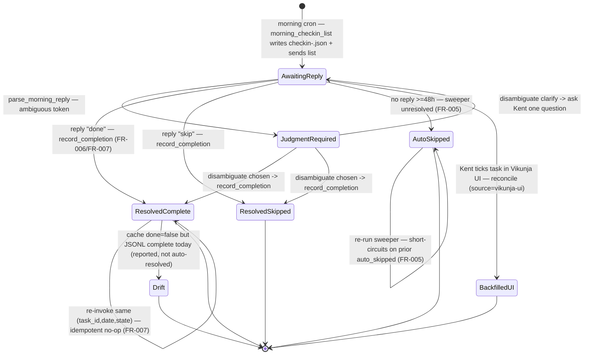

# Habits Process Flow

> **Divio type: Explanation / Reference (current-state).** This is not a runbook.
> It describes *what the system does today* for the habit completion lifecycle —
> the actors, the states, the operating rules (with the FR/INV IDs they enforce),
> and the code seams that implement them.

## Why this document exists

The habits lifecycle spans several missions and a subtle split between what Vikunja
owns (native `repeat_after` scheduling and "done today") and what Felix owns
(per-occurrence completion **history**, because Vikunja discards repeating-task
occurrence history — context for [#729](https://github.com/kentonium3/kg-automation/issues/729)).
This is the single canonical explanation, crediting the missions that built it.

| Contribution | Origin issue / mission |
|---|---|
| Three-write atomic `record_completion` (done=true + `[Felix]` comment + JSONL append), idempotent on `(task_id,date,state)`; native `repeat_after`/`repeat_mode` canonical for scheduling | `habits-native-repeat-jsonl-state-01KS0M59` (FR-006, FR-007, C-005; ADR-0002) |
| Preserve `repeat_after`/`repeat_mode` on the completion POST (read-modify-write) | [#524](https://github.com/kentonium3/kg-automation/issues/524) |
| EOD-ET `due_date` write (`23:59:59±HH:MM`, never `Z`) + regression guard | [#112](https://github.com/kentonium3/kg-automation/issues/112); ET-vs-UTC date fix [#733](https://github.com/kentonium3/kg-automation/issues/733); canonical helpers [#761](https://github.com/kentonium3/kg-automation/issues/761) |
| Day-specific `repeat_after=0`/sub-week no-rearm ratchet at schedule-load | [#607](https://github.com/kentonium3/kg-automation/issues/607) / [#608](https://github.com/kentonium3/kg-automation/issues/608) |
| `correlated_checkin_date_et` piped into resolution | [#515](https://github.com/kentonium3/kg-automation/issues/515) / mission #408 WP-02 |
| 48h auto-skip sweeper (idempotent, day-specific EOD-ET advance) | `habit-day-specific-scheduling-01KT48Y6` (FR-003, FR-005) |
| JSONL is canonical history; comment is a UI mirror; weekly report reads the JSONL not `done_at` | ADR-0002 Phase 2; `trustworthy-weekly-habit-report-01KV4GZ7` ([#605](https://github.com/kentonium3/kg-automation/issues/605)) |
| Deterministic weekly cron driver with truthful delivery confirmation | `deterministic-cron-hardening-01KXA4PX` ([#723](https://github.com/kentonium3/kg-automation/issues/723)) |
| Weekly-report ownership decision (dedicated reporting agent; habits out-of-scope) | [#409](https://github.com/kentonium3/kg-automation/issues/409) |

## Actors & trigger

- **`felix-admin-habits`** (OpenClaw agent, Sonnet; Assisted / Level 1) — delivers
  the morning check-in and records completions from Kent's replies. Every
  deterministic step is delegated to a helper (Constitution Directive 6). Emits
  either the literal `[felix-admin-habits]: IDLE` token or a message behind the
  identity line `Sent by felix-admin-habits:<model>`.
- **Kent** — receives the WhatsApp check-in, replies with completion/skip text,
  and issues out-of-band add/pause/resume/remove commands.
- **`felix-habit-sweeper`** — stateless Python oneshot (`scripts/habits/sweeper.py`),
  fired by a systemd user timer daily ~07:30 ET; zero LLM. Closes the 48h response
  window with `auto_skipped` events.
- **Vikunja** (v0.24.6, project 13 "Habits") — source of truth for *when a habit
  is due* (native `repeat_after`/`repeat_mode`) and *done today* (`done=true` →
  auto-advance). It **discards** repeating-task occurrence history.
- **`habits-history.jsonl`** (`/data/services/openclaw/state/habits-history.jsonl`)
  — canonical append-only completion history (ADR-0002 `state_log`, domain
  `"habits"`).

**Triggers** (three entry points into the same lifecycle):
1. **Morning cron** → agent runs `morning_checkin_list`, writes
   `morning-checkin-<date>.json`, sends the WhatsApp list.
2. **Kent's reply** → agent runs `parse_morning_reply` → `record_completion` per tuple.
3. **Sweeper timer** (07:30 ET) → `sweeper.run_sweep` auto-skips habits unresolved >48h.

## Flow & states

```
MORNING CRON (felix-admin-habits tick)
  │  python3 -m scripts.habits.morning_checkin_list --date <ET today>
  ▼  morning-checkin-<date>.json  ── habits due<=today AND done=false, minus already-in-history-today
  ▼  WhatsApp list sent                                              [state: AWAITING_REPLY]
  │
  ├── Kent replies (any time) ─► parse_morning_reply --reply … --date <ET today>
  │       → tuples[](task_id,state) + correlated_checkin_date_et (#515) + judgment_required[]
  │       │
  │       ▼ per tuple, exactly once
  │     record_completion (idempotent on task_id,date,state)
  │       validate → idempotency read → GET task → POST done=true ECHOING repeat_after/repeat_mode (#524)
  │         └─ Vikunja NATIVE auto-advance moves due_date by repeat_after
  │       → PUT /comments  "[Felix] <date> | <state>"  → state_log.append → habits-history.jsonl
  │       ▼                                     [state: RESOLVED_COMPLETE / RESOLVED_SKIPPED]  (terminal)
  │
  └── no reply within 48h ─► SWEEPER TIMER (07:30 ET, sweeper.run_sweep)
          find_expired_checkins: delivered >48h ago, <7d
          evaluate_habit_resolution(history, task, checkin_date):
            ├─ prior auto_skipped exists → already_auto_skipped (no-op, FR-005)
            ├─ history has complete/skipped → resolved-in-window (no-op)
            └─ else UNRESOLVED → auto-skip:
                 day-specific? ─ yes ─► compute_next_eod_et_for_weekdays → validate_iso_eod_et (#112)
                 │                       → POST /tasks/{id} {due_date: EOD-ET}
                 │  daily habits: NO PUT (native repeat_after cadence)
                 └─► append auto_skipped event → habits-history.jsonl   [state: AUTO_SKIPPED]  (terminal)

RECONCILE (reconcile_completions.py, cache-driven)
  backfill: cache done=true but no JSONL complete → append source="vikunja-ui" (Kent ticked in UI)
  drift:    JSONL complete today but cache done=false → report on stdout (NOT auto-resolved)
```

### States, precisely

| State | Meaning | Terminal? |
|---|---|---|
| **AWAITING_REPLY** | Morning list delivered; habit unresolved, inside the 48h window. | No |
| **RESOLVED_COMPLETE** | Kent replied done; `record_completion` wrote `done=true` + `[Felix]` comment + JSONL `complete`. | Yes |
| **RESOLVED_SKIPPED** | Kent replied skip; JSONL `skipped`. | Yes |
| **JUDGMENT_REQUIRED** | Parser could not deterministically match a token; narrow LLM disambiguation pending. | No — resolves to complete/skip or a clarify question |
| **AUTO_SKIPPED** | No resolution within 48h; sweeper appended `auto_skipped`; day-specific habits also got an EOD-ET `due_date` PUT. | Yes |
| **BACKFILLED (vikunja-ui)** | Kent ticked the task done in the Vikunja UI; reconcile appended a `complete` record with `source="vikunja-ui"`. | Yes |
| **DRIFT** | JSONL says complete today but cache says not-done; reported, never auto-resolved (a conflict signal). | No — operator triage |
| **IDEMPOTENT_NOOP** | Re-invocation for an already-recorded `(task_id, date, state)`; no writes. | Yes |

## Operating rules & invariants

1. **Three-write atomic completion, fixed order (FR-006 / C-005,
   `habits-native-repeat-jsonl-state-01KS0M59`).** `record_completion.record()`:
   validate → idempotency read → POST `done=true` → PUT comment →
   `state_log.append`. No automatic compensation; a post-POST failure exits
   non-zero naming the failed step, and `reconcile_completions.py` surfaces the
   partial state next tick.
2. **Idempotent on `(task_id, date, state)` (FR-007).** Step 1 reads the state log;
   a match returns **before** any Vikunja call.
3. **`done=true` POST must echo `repeat_after`/`repeat_mode` ([#524](https://github.com/kentonium3/kg-automation/issues/524)).**
   Vikunja v0.24.6 treats `POST /tasks/<id>` as a *replacement*; posting
   `{done:true}` alone zeros `repeat_after`, silently stripping recurrence (the
   2026-06-04 incident where 4 of 7 daily habits vanished). The helper GETs the
   task first and echoes `repeat_after`/`repeat_mode` back.
4. **Native `repeat_after` is canonical for "when due"; `done=true` triggers
   Vikunja's auto-advance (ADR-0002).** The habits `record_completion` does **not**
   PUT a `due_date` — Vikunja advances the repeating occurrence itself. The
   explicit **EOD-ET `due_date` write** lives elsewhere: `set_due_dates.py`
   (morning) and `sweeper.py` (day-specific auto-skip); do not attribute the
   reschedule to `record_completion`.
5. **EOD-ET `due_date`, never UTC `Z` — the [#112](https://github.com/kentonium3/kg-automation/issues/112) regression guard.**
   Any `due_date` written must be `YYYY-MM-DDT23:59:59±HH:MM` (explicit EDT
   `-04:00` / EST `-05:00`), enforced by `ISO_EOD_PATTERN` / `validate_iso_eod_et`.
   A UTC-midnight due date reads back as the prior ET evening and appears overdue
   at the morning cron (the #112 bug; the [#733](https://github.com/kentonium3/kg-automation/issues/733)
   ET-vs-UTC class).
6. **Canonical ET boundary helpers ([#761](https://github.com/kentonium3/kg-automation/issues/761) / #733).**
   `scripts/common/et_datetime.py` is the single source of truth for ET/UTC
   conversion. **Current-state caveat:** `scripts/habits/*` is **not yet migrated**
   — the sweeper and `set_due_dates.py` still carry their own inline
   `ET_ZONE`/`ISO_EOD_PATTERN` copies (a latent #733-class risk until migrated;
   the escalation domain *has* adopted `et_datetime.et_end_of_day`).
7. **Day-specific habits must re-arm at least weekly — the #607/#608 no-rearm
   ratchet.** `schedule_loader._validate_entry` rejects at load time any entry with
   `designated_weekdays` set but `repeat_after_seconds < 604800` — the load-time
   guard against the [#607](https://github.com/kentonium3/kg-automation/issues/607)
   class (a completed one-shot with `repeat_after=0` that never re-armed). This
   ratchet lives in `schedule_loader`, not `record_completion`.
8. **48h window, idempotent auto-skip (FR-003 / FR-005,
   `habit-day-specific-scheduling-01KT48Y6`).** Only check-ins delivered >48h ago
   (and <7d) are candidates. `evaluate_habit_resolution` short-circuits on any prior
   `auto_skipped` event for `(task_id, original_checkin_date_et)`, so re-running the
   sweeper is a no-op. On day-specific auto-skip the sweeper PUTs the next
   designated-weekday EOD-ET; a failed PUT means **no** history event is appended,
   so the next tick retries both.
9. **`correlated_checkin_date_et` pins the resolution date ([#515](https://github.com/kentonium3/kg-automation/issues/515)).**
   `parse_morning_reply` stamps `correlated_checkin_date_et` so
   `record_completion --date` resolves the correct check-in's habits (not merely
   "today").
10. **Canonical history is the JSONL, comment is a UI mirror (C-005; #729
    context).** Because Vikunja discards repeating-occurrence history,
    `habits-history.jsonl` is the retained per-occurrence record. Weekly reporting
    reads the JSONL, **not** `done_at`, enforced by an architectural ratchet
    ([#605](https://github.com/kentonium3/kg-automation/issues/605),
    `trustworthy-weekly-habit-report-01KV4GZ7`).
11. **Reconcile backfills UI completions, reports (never auto-resolves) drift
    (FR-008 / FR-009).** Cache `done=true` with no JSONL `complete` → append
    `source="vikunja-ui"`; JSONL `complete` today with cache `done=false` → drift
    reported on stdout only.

## Weekly reporting — ownership relocated ([#409](https://github.com/kentonium3/kg-automation/issues/409))

Weekly habit pattern reporting is **being moved out of `felix-admin-habits`.** Per
the [#409](https://github.com/kentonium3/kg-automation/issues/409) decision
(Kent, 2026-07-19), a **dedicated reporting agent** will own weekly pattern
reports; the felix-admin-habits `SOUL.md` and `AGENTS.md` are being updated (via
#409) to mark them out-of-scope. Until that change lands, the in-repo habits
prompts still describe the weekly report as an agent job — this doc records the
decided target so a future mission reads the intended end-state, not the transient.

Current-state delivery mechanism: the deterministic **`felix-habits-weekly-driver`**
cron (`scripts/habits/weekly_report_driver.py`, systemd `felix-habits-weekly.timer`,
Mon 06:00 ET) runs `query_active_habits_weekly` in-process — reading
`habits-history.jsonl` (not `done_at`, [#605](https://github.com/kentonium3/kg-automation/issues/605))
— and delivers via `openclaw message send` with truthful delivery confirmation
([#723](https://github.com/kentonium3/kg-automation/issues/723)). The report
*content* pipeline is stable; only *agent ownership* moved. A follow-up issue
tracks authoring the dedicated reporting agent that will own this responsibility.

## Implementing seams

| Seam | File | Role |
|---|---|---|
| `build_morning_list` | `scripts/habits/morning_checkin_list.py` | Builds today's due-and-not-done list; writes `morning-checkin-<date>.json`; emits WhatsApp text. |
| `parse_reply`, `correlated_checkin_date_et` stamping | `scripts/habits/parse_morning_reply.py` | Deterministic reply → `tuples[]/judgment_required[]/errors[]`; pins the correlated check-in date (#515). |
| `record`, `_format_comment`, `main` | `scripts/habits/record_completion.py` | Three-write atomic completion; idempotency read; `done=true` POST echoing `repeat_after`/`repeat_mode` (#524); comment PUT; `state_log.append`. |
| `disambiguate` | `scripts/habits/judgment/disambiguate_reply.py` | Narrow LLM resolution for `judgment_required` items. |
| `run_sweep`, `evaluate_habit_resolution`, `find_expired_checkins`, `_vikunja_put_due_date`, `_append_history_event` | `scripts/habits/sweeper.py` | 48h auto-skip: candidate discovery, resolution eval (FR-005), EOD-ET PUT for day-specific, `auto_skipped` append, tick artifact + ledger. |
| `ISO_EOD_PATTERN`, `validate_iso_eod_et`, `compute_next_eod_et_for_weekdays` | `scripts/habits/set_due_dates.py` | The #112 EOD-ET format guard and next-weekday EOD-ET computation reused by the sweeper. |
| `_validate_entry` (#608 ratchet), `is_day_specific`, `load_schedule` | `scripts/habits/schedule_loader.py` | Parse of `migrations/phase3-schedule.yaml`; rejects day-specific-but-sub-week `repeat_after` at load. |
| `reconcile` | `scripts/habits/reconcile_completions.py` | Cache↔JSONL backfill of UI completions + drift reporting. |
| `query_completion_events`, `build_report` | `scripts/habits/query_active_habits_weekly.py` | Weekly report — reads `habits-history.jsonl` (not `done_at`, #605). |
| `run`, `confirm_delivery` | `scripts/habits/weekly_report_driver.py` | Deterministic weekly cron driver; in-process helper call + truthful delivery confirmation (#723). |
| ET boundary helpers | `scripts/common/et_datetime.py` | `et_end_of_day` / `today_et` / `et_calendar_date` (#761). **Habits not yet migrated.** |
| Agent standing orders | `scripts/openclaw/agents/felix-admin-habits/{AGENTS,SOUL,TOOLS}.md` | Tick wiring: morning, reply, habit management, output discipline. (Weekly-report ownership being removed per #409.) |
| systemd units | `scripts/office2/felix-habit-sweeper.{service,timer}`, `felix-habits-weekly.{service,timer}` | Timer wiring: sweeper (07:30 ET), weekly driver (Mon 06:00 ET). |

**State stores.** `/data/services/openclaw/state/habits-history.jsonl` (canonical
history); `…/state/habits/morning-checkin-<date>.json`, `sweeper-tick-<date>.json`,
`sweeper-tick-latest.json`, `sweeper-ledger.jsonl`; `…/state/sync/task-cache.json`
(reconcile read source); `/data/services/felix-habits-weekly/state/last-tick.json`.

## State diagram



## Cross-references

- **Related work**: [#729](https://github.com/kentonium3/kg-automation/issues/729)
  (track-record inquiry — Felix retains habit history Vikunja discards);
  [#515](https://github.com/kentonium3/kg-automation/issues/515) (pipe
  `correlated_checkin_date_et` into history);
  [#582](https://github.com/kentonium3/kg-automation/issues/582) (intentional
  authoring of the habits agent workspace).
- **Ownership decision**: [#409](https://github.com/kentonium3/kg-automation/issues/409)
  (weekly reports → dedicated reporting agent; see the weekly-reporting section).
- **Migration debt**: `scripts/habits/*` should adopt
  `scripts/common/et_datetime.py` ([#761](https://github.com/kentonium3/kg-automation/issues/761))
  to retire the inline ET copies.
- **Mission specs**: `kitty-specs/habits-native-repeat-jsonl-state-01KS0M59/spec.md`,
  `kitty-specs/habit-day-specific-scheduling-01KT48Y6/spec.md`,
  `kitty-specs/trustworthy-weekly-habit-report-01KV4GZ7/spec.md`.
