# Inbox Routing Process Flow

> **Divio type: Explanation / Reference (current-state).** This is not a runbook.
> It describes *what the system does today* when the `felix-admin-capture` tick
> processes the Obsidian inbox — the actors, the note lifecycle states, the
> operating rules (with the FR/INV IDs they enforce), and the code seams that
> implement them. Runbooks (`docs/runbooks/inbox-ops.md`) and the capture agent's
> `AGENTS.md` link here rather than restating the rules.

## Why this document exists

Inbox routing is the umbrella lifecycle every captured signal moves through:
tick → prescan → classify → route → atomic finalize → mark processed. Its
current-state behavior is the product of a dozen missions, and several of the
founding requirements have since been **superseded** (calendar creation moved
in-process; the "Someday project" was retired; the clarification timeout dropped
from 24h to 8h). Before this doc, reconstructing current behavior meant reading
those missions and mentally applying the supersessions. This is the single
canonical explanation; it credits and consolidates the missions that built it.

| Contribution | Origin issue / mission |
|---|---|
| Inbox prescan — frontmatter+mtime classification, 7-day archive, malformation detection | `027-inbox-pre-scan-helper`; dedup/parser hardening `inbox-capture-dedup-and-parser-hardening-01KREZJ8` ([#185](https://github.com/kentonium3/kg-automation/issues/185)) |
| Block classification helper (`classify_content`, kinds + documented heuristics) | `capture-d6-helpers-extraction-01KTMS5Q` (FR-007 / FR-014) |
| Calendar / someday / journal classification; pending-clarification state file + timeout; aspiration→journal | `inbox-calendar-and-aspiration-routing-01KTHHXS` (FR-001…FR-012) — **several since superseded (see rules)** |
| Someday = task-state not project; `q:schedule` + no-due-date in Inbox; anti-silent-loss | [#745](https://github.com/kentonium3/kg-automation/issues/745) / [#743](https://github.com/kentonium3/kg-automation/issues/743) / [#715](https://github.com/kentonium3/kg-automation/issues/715) / [#524](https://github.com/kentonium3/kg-automation/issues/524) — see [someday.md](./someday.md) |
| **Atomic `route_and_finalize` transaction** (route→verify→log→mark once), health rails, `needs-review` terminal, `empty` disposition, provenance verification | `capture-atomic-finalize-01KXRM7J` ([#746](https://github.com/kentonium3/kg-automation/issues/746); [#683](https://github.com/kentonium3/kg-automation/issues/683) error-not-success; [#751](https://github.com/kentonium3/kg-automation/issues/751) provenance; [#753](https://github.com/kentonium3/kg-automation/issues/753) cutover) |
| Pending-clarification **WITHHOLD** in prescan (stops the 4×/day re-ask storm) | `harden-inbox-capture-01KWVGZM` ([#740](https://github.com/kentonium3/kg-automation/issues/740)) |
| 8h sweep-finalize + all-day fallback (the child flow) | `clarification-allday-fallback-01KXVBPK` ([#780](https://github.com/kentonium3/kg-automation/issues/780)) — see [calendar-clarification.md](./calendar-clarification.md) |

**Boundary.** This doc owns everything *around* the calendar-clarification
sub-flow. When `route_and_finalize` returns `needs_clarification`, control passes
to the [calendar-clarification flow](./calendar-clarification.md); that hand-off
edge is where this doc stops.

## Actors & trigger

- **`felix-admin-capture`** — the OpenClaw capture agent (autonomy Level 1
  "Assisted", model `haiku`). Its serialized cron tick drives the whole flow and
  supplies only LLM judgment (block disambiguation, plan assembly, goal
  promotion); every state-changing step is a deterministic helper. Seam:
  `scripts/openclaw/agents/felix-admin-capture/AGENTS.md`.
- **Deterministic Python helpers** under `scripts/inbox/`, all invoked as
  `python3 -m scripts.inbox.<helper>` — do the state-changing work.
- **`felix-admin-tasker`** — separate agent for enriched Vikunja task creation;
  returns a `task_id` that finalize verifies by provenance.
- **`felix-admin-calendar`** — separate agent that handles **Kent's reply** to a
  calendar clarification (the child flow).
- **Kent** — owner of the vault inbox; recipient of the WhatsApp digest.

**Trigger.** Four inbox crons — `inbox-7am / noon / 5pm / 10pm` (each
`delivery.mode: "announce"`). A note enters the routable population when prescan
classifies it `unprocessed` (or `unknown-treated-as-unprocessed`, the safety
default) **and** it is not currently withheld for a pending calendar clarification.

## Flow & states

```
inbox cron tick (felix-admin-capture, host=gateway)
  │
  ▼
Step 1  prescan.run_prescan  (classify each 01-Inbox/*.md by frontmatter status + mtime)
  │   • archive processed-stale (>7d) → 02-Inbox-Processed/          (STALE_AGE_DAYS=7)
  │   • WITHHOLD notes with a live (<8h) pending-clarification entry  (#740, fail-OPEN)
  │   • health rails: archive_anomalies + processed-without-routing-log (#568/#746/#753)
  │   → PrescanResult {unprocessed_paths, parse_failures, pending_skipped, archive_anomalies, …}
  │
  ├─ all-clean gate → emit literal "[felix-admin-capture]: IDLE"                (terminal: IDLE)
  │   (blocked while archive_anomalies is non-empty — anomaly sent to Kent)
  │
Step 1a clarification_sweep_finalize   (deterministic 8h sweep — CHILD FLOW boundary)
Step 1b scripts.intake.scan_inbox      (Vikunja Inbox Tier-1 digest — parallel, not note routing)
  │
  ▼  for each path in unprocessed_paths:
Step 2  read + parse frontmatter/body ── parse failure ─► Step 5 + continue
  ▼
Step 3  classify_content  → blocks[{index, kind, confidence, flag?}]
  │        kinds: journal | calendar | someday | github_issue | vikunja_task | parse_failure | ambiguous
  ▼
Step 3a  agent resolves each `ambiguous` block by LLM judgment
  │        └─ any block → parse_failure ⇒ status:needs-review (direct FM edit, NO processed_at)  (terminal)
  ▼
Step 3b  assemble ONE RoutingPlan (block content byte-for-byte verbatim)
  ▼
Step 3c  route_and_finalize._run_finalize
  │        per block (in block_index order): already-logged? skip ; else route+verify → log row (log-BEFORE-mark)
  │        after ALL blocks logged → _invoke_mark_processed (subprocess, ONCE)
  │        branch on status:
  │
  ├─ "finalized"           → note marked processed                              (terminal: processed)
  ├─ "needs_clarification" → calendar block incomplete; record pending + ask Kent
  │                          → ENTER calendar-clarification child flow           (withheld)
  └─ "error"               → block or mark failed; note left UNPROCESSED; surface to Kent; retry (#683)
  ▼
Step 4  marker cleanup    Step 5  parse-failure batch → ONE GH issue    Step 6  forensic log line
```

### States, precisely

| State | Meaning | Terminal? |
|---|---|---|
| **unprocessed** | Default capture state (`status: unprocessed`, or missing/unknown → treated as unprocessed). Routable each tick. | No |
| **withheld (pending-clarification)** | A live (<8h) entry in `pending-calendar-clarifications.json`; prescan drops it from `unprocessed_paths` into `pending_skipped` ([#740](https://github.com/kentonium3/kg-automation/issues/740)). Still `unprocessed` on disk. | No — released when the 8h entry ages out |
| **processed** | `status: processed` + `processed_at`, written by `mark_processed` **only** through a successful `route_and_finalize`; every routed block has a routing-log row. | Yes (until 7-day archive) |
| **needs-review** | Terminal triage park for an unclassifiable/parse_failure block (Step 3a): direct frontmatter edit, **no** `processed_at`, excluded from the scan and the health rail (FR-008 / D13). | Yes — parked for human |
| **parse-failure** | Frontmatter malformation / YAML error; surfaced in `parse_failures`, a `> [!error]` marker injected. Note stays in inbox. | No — re-scanned once frontmatter fixed |
| **errored (finalize)** | `route_and_finalize` returned `status:"error"`. Note left UNPROCESSED, no partial state; surfaced to Kent ([#683](https://github.com/kentonium3/kg-automation/issues/683)). | No — retries next tick |
| **archived** | A `processed` note older than 7 days (`STALE_AGE_DAYS = 7`, exclusive) moved to `02-Inbox-Processed/`. | Yes |

Per-block outcomes inside one `_run_finalize`: `routed` (logged), `skipped`
(already logged), `needs_clarification` (calendar only), `error`. Aggregation:
any `error` ⇒ note errored; else any `needs_clarification` ⇒ note
`needs_clarification`; else all routed/skipped ⇒ mark once → `finalized`.

## Operating rules & invariants

1. **Note-level atomic finalize (FR-001 / [#746](https://github.com/kentonium3/kg-automation/issues/746)).**
   `_run_finalize` routes every block → verifies every artifact → writes a
   per-block routing-log row → marks the note processed **only** after every block
   is routed+verified+logged, as one indivisible unit. There is no standalone
   route, log, or mark step (FR-005, FR-016).
2. **Log-before-mark, reconcile on retry (FR-011 / FR-009).** Each block's
   routing-log entry is written durably **before** the note is marked; the mark
   happens once after all blocks are logged. The dedup key is
   `(filename, block_index, block_hash)` (`RoutingLogReader.has_block`), so one
   routed block never masks another block in the same note and a reused basename
   never masks an unrelated note (FR-009). A re-run skips already-logged blocks
   (FR-010).
3. **Fail-loud, never silent-green (FR-004 / [#683](https://github.com/kentonium3/kg-automation/issues/683)).**
   On any block route/verify/log failure OR a mark failure, the whole note is left
   unprocessed — no `status: processed`, no `processed_at`, file uncorrupted — and
   the failing block/stage is surfaced. AGENTS.md Step 3c: "Never treat an `error`
   as success."
4. **Per-block idempotency guards precede each side effect (FR-010).** calendar:
   the single canonical absolute inbox path is the idempotency key; someday /
   `vikunja_task` (in-process): `_find_existing_task_by_provenance` scans
   `Source:`+`Block:` footers, failing **closed** on scan error ([#751](https://github.com/kentonium3/kg-automation/issues/751));
   journal: a per-block sentinel `<!-- src: <filename>#<index> -->` verified before
   append; github_issue: block-key + `gh issue view` verification.
5. **Delegated-artifact provenance verification (FR-006 / FR-012).** A
   tasker-delegated `vikunja_task` (plan carries `task_id`, no payload) is **not**
   re-created — `_adapt_vikunja_task` verifies the id exists **and** belongs to
   this note via a **line-anchored** `Source: <note_filename>` match (a substring
   test would false-match `Inbox 1.md` inside `Source: Inbox 10.md` — #746
   post-merge finding). A delegated `github_issue` is verified via `gh issue view`.
6. **`empty` disposition may not bury content (FR-007).** `_finalize_empty`
   verifies the body is genuinely empty (only whitespace after stripping
   `<% … %>` Templater tags) before writing a `kind="empty"` routing-log row and
   marking processed; a non-empty body is refused loudly.
7. **`needs-review` is terminal; only successful finalize marks processed
   (FR-008 / FR-005 / D13).** `prescan.classify_file` maps `status: needs-review`
   to its own class — excluded from `unprocessed_paths` (no reprocess loop) and
   out of the health rail. The single sanctioned direct-frontmatter edit is
   Step 3a's `needs-review` write (no `processed_at`).
8. **Never delete/move the original note (Step 4 invariant).** The source note is
   preserved in `01-Inbox/`; `route_and_finalize` writes `status: processed` in
   place (frontmatter only, body verbatim). `prescan.archive_stale` moves it only
   after the 7-day window.
9. **Pending-clarification WITHHOLD prevents the re-ask storm ([#740](https://github.com/kentonium3/kg-automation/issues/740)).**
   Prescan filters `unprocessed` notes whose basename is in
   `handle_clarification_state.pending_filenames(...)` (live = well-formed,
   non-future, `< SWEEP_MAX_AGE`). Withheld notes go to `pending_skipped`.
   **Fail-open**: any error reading the store disables the filter (never withhold
   on a broken read). Bounded by the 8h sweep, so a note re-enters the scan once
   its entry ages out — once-per-window, not 4×/day.
10. **Health rails make silent loss visible (FR-013 / FR-014 / [#568](https://github.com/kentonium3/kg-automation/issues/568) / #746).**
    `scan_archive_anomalies` (a non-`processed` file in `02-Inbox-Processed/`) and
    `scan_processed_without_routing_log` (a `processed` note absent from the log —
    the silent-loss signature) populate `archive_anomalies`, which blocks `IDLE`.
    Pre-`2026-07-17` processed notes are exempt (`ROUTING_LOG_CUTOVER_UTC`, [#753](https://github.com/kentonium3/kg-automation/issues/753))
    to avoid a retroactive false-positive storm.
11. **One deterministic dedup substrate; no parallel scheme (C-004 / #185).** All
    routes ride the single append-only JSONL log at
    `/data/services/openclaw/state/inbox-routing.jsonl`. The `kind` vocabulary is
    additive; `calendar_all_day_fallback` extends it rather than replacing it (C-007).
12. **Aspirations/goals route to journal, never a task (FR-008).**
    Aspiration-classified content routes to `08-Journal/…` and never produces a
    Vikunja task. A valid *goal declaration* is promoted into
    `03-Constitution/Goals-MOC.md` by the agent's own judgment — outside
    `route_and_finalize`/the routing log. There is no `aspiration` route *kind* in
    code; "aspiration" is an AGENTS.md judgment concept mapping to `journal` (or
    `someday`). See [journal.md](./journal.md) and [someday.md](./someday.md).
13. **Inbox-scope guard.** `mark_processed` refuses any path outside the resolved
    inbox root (folder-independent guard). Kent's private growth content is not present
    on office2 at all — it lives in a separate laptop/phone-only vault office2 never
    joins — so privacy rests on physical exclusion, not a `_private`-literal refusal in
    the pipeline (#848).
14. **`-m` invocation form mandatory
    ([[feedback_helper_m_invocation_form]]).** Every helper CLI is
    `python3 -m scripts.inbox.<helper>`; the script-path form is forbidden (it
    caused two production `ModuleNotFoundError` incidents).

## Implementing seams

| Seam | File | Role in the flow |
|---|---|---|
| `run_prescan`, `classify_file`, `_detect_malformation`, `archive_stale`, `_pending_clarification_filenames`, `scan_archive_anomalies`, `scan_processed_without_routing_log`, `ROUTING_LOG_CUTOVER_UTC` | `scripts/inbox/prescan.py` | Step 1: classify inbox `.md`; archive stale; #740 WITHHOLD (fail-open); health rails (#568/#746/#753). |
| `classify_note`, `split_blocks`, `classify_block` | `scripts/inbox/classify_content.py` | Step 3: split body into blocks and classify each (FR-007 kinds / FR-014 documented heuristics). Emits `ambiguous` for agent resolution. |
| `_run_finalize`, `_route_and_verify_block`, `_validate_routed_blocks`, `_finalize_empty`, `_invoke_mark_processed` | `scripts/inbox/route_and_finalize.py` | Step 3c: the #746 atomic note-level transaction — route→verify→log every block, then mark once. |
| `_adapt_calendar`, `_build_clarification_signal` | `scripts/inbox/route_and_finalize.py` | Calendar block route; on `needs_clarification` builds the `{title,start_date,missing_fields}` signal handed to the child flow (INV-5 capture-anchor). |
| `_adapt_someday`, `_adapt_vikunja_task`, `_create_and_verify_task`, `_find_existing_task_by_provenance`, `_match_provenance` | `scripts/inbox/route_and_finalize.py` | Someday / Vikunja route+verify; #751 provenance precheck (fail-closed); delegated-id line-anchored provenance match (FR-006). |
| `_adapt_journal`, `_adapt_github_issue`, `_parse_filed_issue_number` | `scripts/inbox/route_and_finalize.py` | Journal sentinel append+verify (FR-010); github_issue file/verify (FR-012). |
| `route_someday`, `_attach_someday_label`, `_resolve_destination_project_id` | `scripts/inbox/route_someday.py` | Durable-landing task creator (see [someday.md](./someday.md)). |
| `resolve_journal_dir`, `target_filename`, `append_section`, `ensure_journal_file`, `_atomic_write` | `scripts/inbox/route_journal_entry.py` | Journal write primitives (see [journal.md](./journal.md)). |
| `main` | `scripts/inbox/mark_processed.py` | The ONLY processed-stamper; subprocess-only; outside-inbox-root refusal; symlink `.resolve()` guard. |
| `RoutingLogReader.has_block` / `has_kind`, `RoutingLogWriter.append`, `block_hash`, `KNOWN_KINDS` | `scripts/inbox/routing_log.py` | Append-only dedup substrate + per-block idempotency key. |
| `pending_filenames`, `_is_live`, `SWEEP_MAX_AGE`, `subcommand_add`/`remove` | `scripts/inbox/handle_clarification_state.py` | Pending-clarification store: WITHHOLD read contract + record add/remove; 8h window. |
| `is_eligible`, `build_all_day_plan`, `sweep_finalize`, `FALLBACK_MARKER_KIND` | `scripts/inbox/clarification_sweep_finalize.py` | Step 1a child-flow boundary (see [calendar-clarification.md](./calendar-clarification.md)). |
| `handle_marker_cleanup`, `handle_parse_failures`, `inject_parse_error_marker` | `scripts/inbox/*.py` | Steps 4/5: parse-error marker lifecycle + batched GH quality issue (#185). |
| Steps 1–6, Step 3a-3c, "Goal declaration handling", "Task bridge" | `scripts/openclaw/agents/felix-admin-capture/AGENTS.md` | Agent-prompt wiring: invokes the helpers each tick; supplies LLM disambiguation + plan assembly + goal promotion. |

**State stores.** Routing log:
`/data/services/openclaw/state/inbox-routing.jsonl`. Pending clarifications:
`/data/services/openclaw/state/pending-calendar-clarifications.json`. Vault inbox
paths: `scripts/vault/paths.json` (`paths.inbox`, `paths.inbox_processed`).
Forensic log: `<vault>/agents/logs/inbox-processing-YYYY-MM-DD.md`.

## State diagram

```mermaid
stateDiagram-v2
    [*] --> Unprocessed: capture writes note to 01-Inbox/ (status: unprocessed)

    Unprocessed --> Withheld: live <8h pending-clarification entry (prescan — #740)
    Withheld --> Unprocessed: entry ages out >=8h (re-enters scan)

    Unprocessed --> ParseFailure: frontmatter malformed (_detect_malformation / YAML error)
    ParseFailure --> Unprocessed: frontmatter fixed; marker stripped (Step 4)

    Unprocessed --> Classified: classify_content (journal/calendar/someday/vikunja_task/github_issue)
    Classified --> NeedsReview: a block unclassifiable -> parse_failure (Step 3a; no processed_at)
    NeedsReview --> [*]: terminal, parked for human (FR-008 / D13)

    Classified --> Finalizing: route_and_finalize._run_finalize (log-before-mark, per-block)
    Finalizing --> Errored: block route/verify/log OR mark failed (FR-004 / #683)
    Errored --> Finalizing: retry next tick (idempotent skip of logged blocks — FR-010)

    Finalizing --> PendingClarification: calendar block needs_clarification (-> child flow)
    PendingClarification --> Withheld: pending record added + Kent asked

    Finalizing --> Processed: all blocks routed+logged -> mark_processed ONCE (FR-001)
    Processed --> Archived: processed_at age > 7d (prescan.archive_stale)
    Archived --> [*]
    Processed --> [*]

    Unprocessed --> IDLE: prescan all-clean gate
    IDLE --> [*]
```



## Cross-references

- **Child flow**: [calendar-clarification.md](./calendar-clarification.md) — the
  `needs_clarification` hand-off (ask-first → 8h → all-day fallback).
- **Route detail**: [someday.md](./someday.md) and [journal.md](./journal.md) —
  the two non-calendar routes, described in full.
- **Superseded requirements (do not follow the old specs):** calendar events are
  now created **in-process** in `_adapt_calendar` (not via `gog`/a main-agent hop
  — original FR-005/C-002 obsolete); the incomplete-calendar disposition is now a
  *pending clarification* (not `needs-review` — original FR-006); the timeout is
  **8h** with all-day fallback or delete-and-release (not 24h→`needs-review` —
  original FR-007); the "Someday **project**" is retired for the `q:schedule` task
  state (original FR-009). All from `inbox-calendar-and-aspiration-routing-01KTHHXS`,
  superseded by #746 / #745 / #780.
- **Runbook**: `docs/runbooks/inbox-ops.md` (how to operate; links here for behavior).
- **Mission specs** (full FRs): `kitty-specs/capture-atomic-finalize-01KXRM7J/spec.md`,
  `kitty-specs/harden-inbox-capture-01KWVGZM/spec.md`,
  `kitty-specs/inbox-calendar-and-aspiration-routing-01KTHHXS/spec.md`.
