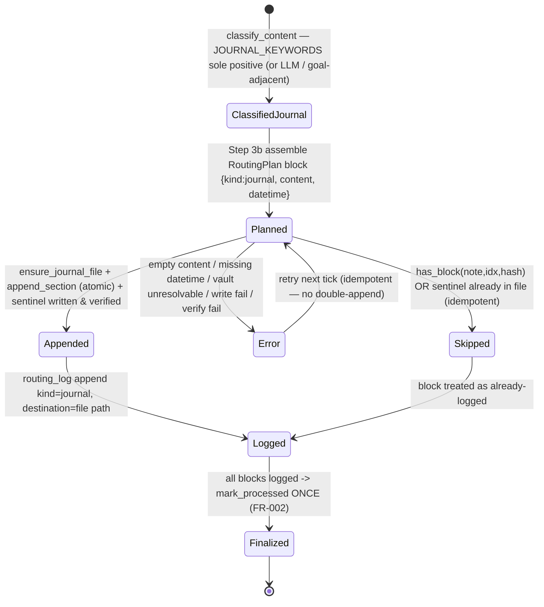

# Journal Process Flow

> **Divio type: Explanation / Reference (current-state).** This is not a runbook.
> It describes *what the system does today* when a captured note is classified
> "journal" — the actors, the states, the operating rules (with the FR/INV IDs
> they enforce), and the code seams that implement them.

## Why this document exists

"Journal" is one of the routes out of [inbox routing](./inbox-routing.md). Unlike
calendar, it is a **single-shot append-and-done** route: a first-person reflective
capture is written once, atomically, into the Obsidian `08-Journal/` tree. There
is **no** ask-Kent step, no pending state, no aging, no sweep — so this doc is
simpler than the calendar exemplar. It consolidates the helper-driven behavior.

| Contribution | Origin issue / mission |
|---|---|
| The `route_journal_entry.py` helper — dated append, canonical frontmatter, atomic write, registry path resolution, `-m` invocation form | `capture-d6-helpers-extraction-01KTMS5Q` (**FR-003** append/create, **FR-010** atomic write, **FR-011** path via `scripts.vault`, **NFR-004** `-m` form) |
| Deterministic first-person keyword classification | `capture-d6-helpers-extraction-01KTMS5Q` (**FR-007** classify_content, **FR-014** documented heuristics) |
| Folding journal into the note-level atomic transaction (`_adapt_journal`); `journal` added to the routing-log `kind` vocabulary; per-block sentinel + verify-before-append; log-before-mark-once | `capture-atomic-finalize-01KXRM7J` (**FR-002**, **FR-010**; [#683](https://github.com/kentonium3/kg-automation/issues/683) error-not-success) |
| Vault path registry (`paths.json` key `"journal"` = `08-Journal`) enabling folder-renumber-safe resolution | `026-vault-path-registry-and-folder-renumber` |

> **ID caution.** Journal is governed by **two different FR-010s**:
> `capture-d6-helpers-extraction-01KTMS5Q` FR-010 = *atomic write*;
> `capture-atomic-finalize-01KXRM7J` FR-010 = *per-block idempotency (the
> sentinel)*. Both are real and both govern this flow — always cite by mission
> slug, never a bare "FR-010."

## Actors & trigger

- **`felix-admin-capture`** — the only agent in this flow. Its serialized tick
  classifies inbox notes and drives finalize. Journal never asks Kent anything;
  his reflection is appended without confirmation.
- **Deterministic helpers** (no LLM): `classify_content.py`,
  `route_and_finalize.py` (+ `_adapt_journal`), `route_journal_entry.py`,
  `routing_log.py`, `scripts/vault/resolver.py`.
- **Kent** — passive; his captured reflection is the input.

**Trigger.** During a capture tick a block is classified `kind == "journal"` —
either deterministically by `classify_content.classify_block` matching
`JOURNAL_KEYWORDS` (first-person reflective phrases: "today i", "i feel",
"i noticed", "reflecting on", "grateful for", …) as the **sole** positive signal,
or by the agent's Step 3a LLM disambiguation of an `ambiguous` block, or by a
borderline goal-adjacent routing decision ("I'd like to be more X" → journal). The
block enters the finalize plan with `kind: "journal"` and
`payload: {content, datetime}` (datetime = note `created` or mtime, ISO-8601).

## Flow & states

```
capture tick — classify_content → kind=journal (JOURNAL_KEYWORDS sole positive,
  │            or LLM Step 3a, or goal-adjacent)
  ▼
Step 3b assemble ONE RoutingPlan block {kind:"journal", content, payload:{content,datetime}}
  ▼
Step 3c route_and_finalize → _run_finalize → _adapt_journal(block, note_filename)
  │
  ├─ reader.has_block(note, idx, hash)? ── already logged ──► SKIPPED (idempotent)
  ├─ empty content OR missing/invalid datetime ──► ERROR (note NOT marked; retry)
  │
  └─ valid:
        resolve journal dir (scripts.vault.resolver get_vault_path("journal") → 08-Journal)
        target = <journal>/Journal YYYY-MM-DD HHmm.md   (from --datetime)
        sentinel = "<!-- src: <note_filename>#<block_index> -->"
          │
          ├─ sentinel already in target file ──► already_present → skip append (dup-safe)
          └─ not present:
               ensure_journal_file()  (create w/ frontmatter if absent; atomic)
               append_section(heading, content + sentinel)   (atomic write)
          │
          ▼  VERIFY target exists AND sentinel present ── fail ──► ERROR (stage=verify)
          ▼  ok
        routing_log.append (kind="journal", destination=<file path>)
          ▼
     (after ALL blocks routed+logged) mark_processed subprocess ONCE ──► finalized
```

### States, precisely

| State | Meaning | Terminal? |
|---|---|---|
| **classified-journal** | Block resolved to `kind="journal"` (keyword, LLM, or goal-adjacent). | No — feeds finalize |
| **appended** | `_adapt_journal` wrote/verified the dated section + sentinel and logged `kind="journal"`. | No — awaits note-level mark |
| **skipped (idempotent)** | Block key already in the routing log, OR the sentinel is already in the target file; no re-append. | No — folds into finalized |
| **finalized** | All blocks routed+logged; note marked processed once. The journal section is durable in `08-Journal/`. | **Yes** |
| **error** | Empty content, missing/invalid datetime, vault unresolvable, write error, or sentinel-missing verify failure. Note left unprocessed; surfaced; retried next tick. | No — retries |

There is **no** pending / answered / aged / released / reconciled state — those are
calendar-only. Journal is create-once.

## Operating rules & invariants

1. **Deterministic classification, first-person keyword signal (FR-007 / FR-014,
   `capture-d6-helpers-extraction-01KTMS5Q`).** `classify_content` marks a block
   `journal` only when `JOURNAL_KEYWORDS` is the **sole** positive of
   {journal, calendar, someday}; two-or-more positives → `ambiguous` (deferred to
   the agent's LLM judgment). Heuristics are documented inline (FR-014).
2. **Append as a dated level-2 section; create the file with canonical frontmatter
   if absent (FR-003, `capture-d6-helpers-extraction-01KTMS5Q`).** Target =
   `<journal>/Journal YYYY-MM-DD HHmm.md`, filename derived from `--datetime`.
   Heading = `## HH:mm` (or `## HH:mm — <excerpt>`). Frontmatter on creation =
   `{id: j<hex>, doc_type: journal, created, last_validated}`.
3. **Atomic write — temp + fsync + `os.replace` (FR-010,
   `capture-d6-helpers-extraction-01KTMS5Q`).** Both file-create and section-append
   go through `_atomic_write` (`mkstemp` in the target dir → write → flush →
   fsync → chmod `0o664` → `os.replace`; unlink temp on error).
4. **Path resolution through the vault registry — never a hardcoded path (FR-011,
   `capture-d6-helpers-extraction-01KTMS5Q`).** `resolve_journal_dir()` →
   `scripts.vault.resolver.get_vault_path("journal")` → `scripts/vault/paths.json`
   key `"journal"` = `08-Journal`. Registry indirection makes a folder renumber
   propagate automatically.
5. **Per-block idempotency: sentinel + verify-before-append (FR-010,
   `capture-atomic-finalize-01KXRM7J`).** `_adapt_journal` writes
   `<!-- src: <note_filename>#<block_index> -->` into the appended section and
   **checks for the sentinel before appending** (`already_present`), so a reprocess
   never duplicates a section even if the routing-log row was lost. After write it
   **verifies** the sentinel is present or returns a `verify`-stage error. This is a
   second, file-level idempotency guard under the routing-log key guard.
6. **Note-level atomicity: log-before-mark, mark once (FR-002 / FR-010,
   `capture-atomic-finalize-01KXRM7J`).** The journal append is one block inside
   `_run_finalize`: each block is routed → verified → routing-log-appended, and only
   **after all blocks are logged** is `mark_processed` invoked once. Any journal
   error → whole note left unprocessed (no silent loss, [#683](https://github.com/kentonium3/kg-automation/issues/683)).
7. **Distinct routing-log marker `kind="journal"`, destination = file path
   (`capture-atomic-finalize-01KXRM7J`).** `journal` is a first-class member of
   `routing_log.KNOWN_KINDS`.
8. **Privacy by physical exclusion (#848).** Kent's private growth content (formerly
   `04-Growth/_private/`) is not present on office2 — it lives in a separate
   laptop/phone-only vault office2 never joins. The journal write target is a wholly
   separate tree (`08-Journal/`, registry key `"journal"`); the flow resolves and writes
   only within that registered path, and `mark_processed` refuses any path outside the
   resolved inbox root (folder-independent guard).
9. **`-m` invocation form mandatory (NFR-004,
   `capture-d6-helpers-extraction-01KTMS5Q`; [[feedback_helper_m_invocation_form]]).**
   `python3 -m scripts.inbox.route_journal_entry …`; the script-path form is
   forbidden.

## Implementing seams

| Seam | File | Role in the flow |
|---|---|---|
| `JOURNAL_KEYWORDS`, `classify_block`, `classify_note` | `scripts/inbox/classify_content.py` | Deterministic first-person-keyword classification → `kind="journal"`; sole-positive gate. |
| `_adapt_journal` | `scripts/inbox/route_and_finalize.py` | The journal adapter inside the note-level transaction: content precedence, datetime parse, sentinel dup-guard + verify-before-append, returns `kind="journal"` log fields. |
| `_run_finalize`, `_dry_run_validate_block` | `scripts/inbox/route_and_finalize.py` | Note-level atomic transaction dispatching the journal block; log-before-mark-once; per-block `has_block` idempotency. |
| `resolve_journal_dir`, `target_filename`, `make_heading`, `_frontmatter`, `ensure_journal_file`, `append_section`, `_atomic_write`, `_parse_iso_datetime`, `main` | `scripts/inbox/route_journal_entry.py` | The journal write helper: registry path resolution, dated filename, heading shape, canonical frontmatter, atomic create + append. Also a standalone CLI. |
| `get_vault_path` + `paths.json` key `"journal"` | `scripts/vault/resolver.py`, `scripts/vault/paths.json` | Resolves logical `"journal"` → `08-Journal` (registry indirection, FR-011). |
| `KNOWN_KINDS` (`journal`), `RoutingLogWriter.append`, `RoutingLogReader.has_block` | `scripts/inbox/routing_log.py` | `journal` route-kind vocabulary; per-block dedup key `(filename, block_index, block_hash)`. |
| Step 3/3a/3b/3c, §Goal declaration handling (aspirational → journal), §File naming, §Privacy | `scripts/openclaw/agents/felix-admin-capture/AGENTS.md` | Agent-prompt wiring: journal as a target/kind, borderline-routing rules, invocation discipline. **No journal-specific loop.** |

**State store.** None. The only durable side effects are (a) the appended section
in `08-Journal/Journal YYYY-MM-DD HHmm.md` and (b) the `kind="journal"` row in
`/data/services/openclaw/state/inbox-routing.jsonl`.

> **Footgun.** `route_journal_entry.main()` (the standalone CLI) does **not** write
> the `<!-- src: … -->` sentinel or a routing-log row — those live only in
> `_adapt_journal`. Invoking the bare helper directly bypasses idempotency guard #5
> and the routing log. In production the agent always goes through
> `route_and_finalize` (Step 3c), never the bare helper.

## State diagram



## Cross-references

- **Parent flow**: [inbox-routing.md](./inbox-routing.md) (the umbrella lifecycle).
- **Sibling routes**: [someday.md](./someday.md), [calendar-clarification.md](./calendar-clarification.md).
- **Provenance note:** the journal helper's provenance is mission-slug-based
  (`capture-d6-helpers-extraction-01KTMS5Q`, `capture-atomic-finalize-01KXRM7J`)
  rather than pinned to a single feature issue; the adjacent issue references are
  [#683](https://github.com/kentonium3/kg-automation/issues/683) (never-treat-error-as-success)
  and [#746](https://github.com/kentonium3/kg-automation/issues/746) (the atomic transaction).
- **Mission specs**: `kitty-specs/capture-d6-helpers-extraction-01KTMS5Q/spec.md`,
  `kitty-specs/capture-atomic-finalize-01KXRM7J/spec.md`.
