# Someday Routing Process Flow

> **Divio type: Explanation / Reference (current-state).** This is not a runbook.
> It describes *what the system does today* when a captured note is classified
> "someday" — the actors, the states, the operating rules (with the FR/INV IDs
> they enforce), and the code seams that implement them.

## Why this document exists

"Someday" is one of the routes out of [inbox routing](./inbox-routing.md). Its
current shape is a deliberate reversal of the original design: it used to route to
a Vikunja **"Someday" project**, which was the direct cause of the [#743](https://github.com/kentonium3/kg-automation/issues/743)
silent-loss incident (the project was deleted in the #714 reset and the by-title
lookup started failing). Today "someday" is a Vikunja **task state** — a
`q:schedule`-labelled, no-due-date task landed in **Inbox** — not a project. This
doc consolidates that current behavior.

| Contribution | Origin issue / mission |
|---|---|
| Someday = `q:schedule` + no-due-date task (not a project); retire the by-title `find_someday_project` lookup | FR-011, `vikunja-reference-seam-01KXK68Z` ([#745](https://github.com/kentonium3/kg-automation/issues/745), epic [#747](https://github.com/kentonium3/kg-automation/issues/747)) |
| The `#743` silent-loss regression this route fixes; loud-failure guard | [#743](https://github.com/kentonium3/kg-automation/issues/743) (root cause) |
| The reference seam — declared registry, fail-loud resolution, unprovisioned-vs-missing states, per-token label namespaces | FR-001/003/006/007/009, `vikunja-reference-seam-01KXK68Z` ([#748](https://github.com/kentonium3/kg-automation/issues/748)) |
| Fail-soft label attach vs felix-bot HTTP 403 on the kent-owned label (two-token model) | [#715](https://github.com/kentonium3/kg-automation/issues/715) |
| CREATE endpoint only; never `POST /tasks/<id>` partial-replace | [#524](https://github.com/kentonium3/kg-automation/issues/524) ([[reference_vikunja_post_partial_replace]]) |
| Atomic create→log→mark transaction wrapping the create | [#746](https://github.com/kentonium3/kg-automation/issues/746) (shape from #737) |
| Per-block provenance idempotency (`Block:` footer + provenance precheck) | [#751](https://github.com/kentonium3/kg-automation/issues/751) |
| Tier-1 labels applied downstream (not here) | [#749](https://github.com/kentonium3/kg-automation/issues/749) `task-intake-validation-loop-01KXS06W` (FR-002) |

## Actors & trigger

- **`felix-admin-capture`** — classifies an inbox block as `someday`
  (open-ended "I should look into Y"; AGENTS.md). Delegates structured tasks to
  `felix-admin-tasker`; when tasker is unreachable it invokes `route_someday`
  directly (the in-agent fallback).
- **`route_and_finalize`** — the deterministic per-note transaction that
  dispatches `someday` / in-process `vikunja_task` blocks into `route_someday`.
- **`route_someday`** — the durable-landing creator: resolves the destination
  project via the reference seam, creates the task, best-effort attaches
  `q:schedule`.
- **`#749` task-intake loop** — downstream, not part of this flow; applies the
  Tier-1 taxonomy labels this route leaves unattached.

**Trigger.** During a capture tick a block is classified `someday` (or an
in-process `vikunja_task` with no delegated `task_id`) and enters
`_run_finalize` → `_adapt_someday` / `_adapt_vikunja_task` →
`route_someday.route_someday()`.

## Flow & states

```
capture tick — block kind == "someday" (or in-process "vikunja_task")
  │
  ▼
route_and_finalize._run_finalize   (per-note atomic transaction, #746)
  │
  ├─ block already in routing log (reader.has_block) ─► SKIP (no re-create)
  │
  ▼
_adapt_someday → _create_and_verify_task
  │
  ├─ provenance precheck (_find_existing_task_by_provenance, #751)
  │     scan GET /tasks/all, match line-anchored "Source:" + "Block:"
  │     ├─ FOUND ─► DEDUPED (return existing task_id, no create)     [terminal]
  │     └─ scan error ─► ERROR (fail-closed, note unprocessed)       [retry]
  │
  ▼
route_someday(title, body, note_filename, project="inbox", block_key)
  │
  ├─ _resolve_destination_project_id(project)   (reference seam)
  │     ├─ resolves (default "inbox" id 1, or --project topic) ─► continue
  │     └─ unresolvable name ─► RouteSomedayError exit 2 (FAIL LOUD, NOT Inbox-fallback)
  │
  ▼
client.put("/projects/<id>/tasks", {title, description})   [CREATE; NO due date]
  │   description = "<body>\n\nSource: <note>[\nBlock: <block_key>]"
  │     └─ create fails / no 'id' ─► RouteSomedayError exit 2         [retry]
  │
  ▼  task_id created — DURABLE LANDING (anti-silent-loss, #743)
  │
  ├─ _attach_someday_label(task_id)   (best-effort, #715)  label q:schedule (id 23, kent)
  │     ├─ attached                   ─► CREATED + LABELED            [terminal, exit 0]
  │     ├─ unprovisioned / 403 / net  ─► CREATED, label-degraded (warn) [terminal, exit 0]
  │     └─ genuine registry breakage  ─► RouteSomedayError exit 2 (names task_id)
  │
  ▼  (back in route_and_finalize)
_fetch_vikunja_task(task_id) verify ─► routing_log.append (BEFORE mark) ─► mark_processed ONCE
```

### States, precisely

| State | Meaning | Terminal? |
|---|---|---|
| **classified-someday** | Block classified `someday` (or in-process `vikunja_task`); enters finalize. | No |
| **skipped (already logged)** | Block key already in the routing log; no side effect repeated. | Yes (idempotent no-op) |
| **deduped** | Provenance precheck ([#751](https://github.com/kentonium3/kg-automation/issues/751)) matched an existing task by `Source:`+`Block:`; returns that `task_id`, no create. | Yes |
| **created + labeled** | Task created (no due date); `q:schedule` (id 23) attached. Exit 0. | Yes |
| **created, label-degraded** | Task created (durable landing) but `q:schedule` attach failed — label unprovisioned, or `PUT /tasks/<id>/labels` 403/network (felix-bot [#715](https://github.com/kentonium3/kg-automation/issues/715) boundary). Loud `label_attach_failed` warning; **still exit 0**; #749 applies the label later. | Yes (label pending) |
| **hard failure** | Cannot create, response missing `id`, unresolvable supplied `--project`, or a genuine `q:schedule` registry breakage. `{"error":"vikunja_error"}`, exit 2 → block `error`, note left unprocessed. | No — retried |
| **verify/log/mark failure** | Task created but downstream verify / routing-log / `mark_processed` failed. Note unprocessed; #751 precheck prevents a duplicate on retry. | No — retried |
| **note processed** | All blocks routed + logged; `mark_processed` succeeded once. | Yes |

**On "fallback to the Inbox".** Inbox (id 1) is the **default destination /
fall-through bucket** (`DEFAULT_PROJECT_NAME = "inbox"`, FR-010), chosen at call
time — *not* a runtime catch after a failed attempt. A caller-supplied `--project`
that cannot be resolved **fails loud** (exit 2), deliberately, to avoid acting on
the wrong target. The true fail-soft in this flow is the **label attach**, not the
destination.

## Operating rules & invariants

1. **Someday = `q:schedule` + no due date, never a project (FR-011 / C-004,
   `vikunja-reference-seam-01KXK68Z`).** `route_someday` builds
   `{title, description}` with **no** due-date field. There is no "Someday"
   project; the registry deliberately declares none. Supersedes the
   `find_someday_project` by-title lookup that caused [#743](https://github.com/kentonium3/kg-automation/issues/743).
2. **CREATE endpoint, never partial-replace ([#524](https://github.com/kentonium3/kg-automation/issues/524)).**
   Creation is `client.put("/projects/<id>/tasks", …)`. The helper must never
   `POST /tasks/<id>` (partial-replace of an existing task — the #524 root cause,
   [[reference_vikunja_post_partial_replace]]).
3. **Destination resolves through the reference seam; unresolvable = fail loud
   (FR-003 / SC-002, regression guard for #743).**
   `_resolve_destination_project_id` raises `RouteSomedayError` on any
   `VikunjaRefError`. Inbox is the *default* target, never a fallback for a broken
   supplied name.
4. **Anti-silent-loss: task first, label fail-soft ([#743](https://github.com/kentonium3/kg-automation/issues/743) / [#715](https://github.com/kentonium3/kg-automation/issues/715)).**
   `_attach_someday_label` degrades (warn + `return False`, exit unchanged) for
   exactly two cases — label declared-but-unprovisioned (`VikunjaRefUnprovisioned`,
   FR-009) and attach `VikunjaError/ConnectionError` (the felix-bot **HTTP 403** on
   the kent-owned label). Any *other* registry breakage (undeclared name / wrong
   owner token / invalid provisioned id) is **not** swallowed — it propagates,
   naming the created `task_id`.
5. **Loud, structured degradation — never silent (SC-002 / NFR-002).**
   `_emit_warning` writes `{"warning":"label_attach_failed",…,task_id}` to stderr;
   `_emit_error` writes `{"error":"vikunja_error",…}` on hard failure.
6. **Tier-1 labels are applied downstream, not here (FR-012).** This helper never
   guesses labels not declared in the registry; the `f:/q:/t:/loe:` intake taxonomy
   is deferred to the [#749](https://github.com/kentonium3/kg-automation/issues/749)
   task-intake loop.
7. **Per-token label ownership (FR-006 / [#715](https://github.com/kentonium3/kg-automation/issues/715)).**
   `label_id("q:schedule", "kent")` resolves in the kent namespace (id 23).
   felix-bot's own native Inbox (id 14) is never a target (C-002).
8. **Zero network on the resolution hot path (NFR-001).** `vikunja_refs`
   accessors read the declared `vikunja_refs.json` registry — no live `/projects`
   listing, no by-title lookup.
9. **Idempotency on the routing-log/dedup substrate (FR-013 / #751 / #746).**
   Three layers: `reader.has_block` skips already-logged blocks; the #751
   provenance precheck matches the line-anchored `Source:`+`Block:` footer *before*
   the create; the `Block: <block_key>` footer makes an in-process create
   idempotent per block. Log-before-mark makes the whole transaction retry-safe.
10. **Fail-closed transaction, mark exactly once ([#746](https://github.com/kentonium3/kg-automation/issues/746)).**
    `mark_processed` runs only after every block is routed + logged, as a
    subprocess. Any block error → note left unprocessed, non-zero exit.

## Implementing seams

| Seam | File | Role |
|---|---|---|
| `route_someday`, `_resolve_destination_project_id`, `_attach_someday_label`, `_emit_warning`/`_emit_error`, `main`; consts `DEFAULT_PROJECT_NAME="inbox"`, `SOMEDAY_LABEL_NAME="q:schedule"`, `SOMEDAY_LABEL_TOKEN="kent"`; `RouteSomedayError` | `scripts/inbox/route_someday.py` | The core creator: seam resolution → CREATE (no due date) → best-effort `q:schedule` attach; owns the anti-silent-loss guarantee + exit-code contract. |
| `_adapt_someday`, `_adapt_vikunja_task`, `_create_and_verify_task`, `_find_existing_task_by_provenance`, `_run_finalize`, `_invoke_mark_processed` | `scripts/inbox/route_and_finalize.py` | Per-note atomic transaction over `route_someday`; catches `RouteSomedayError` → block `error`; #751 precheck. |
| `project_id`, `label_id`, `VikunjaRefError`, `VikunjaRefUnprovisioned` | `scripts/common/vikunja_refs.py` | Network-free reference-seam accessor; distinguishes clean / unprovisioned(`null`) / missing resolution. |
| registry data (`inbox`→1, `q:schedule`→23 owner `kent`; no "someday" project) | `scripts/common/vikunja_refs.json` | The declared post-#714-reset registry. |
| `VikunjaClient.put`/`get`, `VikunjaError` + HTTP subclasses | `scripts/common/vikunja_client.py` | HTTP transport for CREATE + label-attach; raises typed errors mapped to hard/soft outcomes. |
| `RoutingLogReader.has_block`, `RoutingLogWriter.append` | `scripts/inbox/routing_log.py` | Per-block dedup + the routing-log entry written before mark (FR-013). |
| Classification, tasker delegation, tasker-unreachable `route_someday` fallback, block-key stability | `scripts/openclaw/agents/felix-admin-capture/AGENTS.md` | Agent-prompt wiring. |

**State store.** No dedicated someday store. Durable side effects: the created
task in Vikunja (Inbox by default) and the `kind="someday"` row in
`/data/services/openclaw/state/inbox-routing.jsonl`.

## State diagram

```mermaid
stateDiagram-v2
    [*] --> ClassifiedSomeday: capture tick — block kind == "someday"

    ClassifiedSomeday --> Skipped: block key already in routing log (has_block)
    ClassifiedSomeday --> Deduped: provenance precheck matched Source+Block (#751)
    ClassifiedSomeday --> Resolving: _resolve_destination_project_id (reference seam)

    Resolving --> HardFailure: supplied project name unresolvable — FAIL LOUD (FR-003/SC-002)
    Resolving --> Creating: default "inbox" id 1 (FR-010) or --project topic

    Creating --> HardFailure: PUT /projects/id/tasks failed or no 'id' (#524-safe CREATE)
    Creating --> Created: task_id created, NO due date (durable landing — #743)

    Created --> CreatedLabeled: q:schedule (id 23) attached (FR-011)
    Created --> LabelDegraded: unprovisioned OR 403/network (fail-soft — #715)
    Created --> HardFailure: genuine q:schedule registry breakage (names task_id)

    CreatedLabeled --> Verified: _fetch_vikunja_task resolves id
    LabelDegraded --> Verified: _fetch_vikunja_task resolves id
    Deduped --> Logged

    Verified --> Logged: routing_log.append BEFORE mark (FR-013)
    Verified --> RetryPending: verify/log error — note unprocessed
    HardFailure --> RetryPending: block error — note unprocessed

    Logged --> NoteProcessed: mark_processed subprocess once (#746)
    Logged --> RetryPending: mark_processed nonzero
    RetryPending --> ClassifiedSomeday: next tick (idempotent via #751 precheck)

    Skipped --> [*]
    CreatedLabeled --> [*]
    LabelDegraded --> [*]: exit 0 + warning; #749 applies label later
    NoteProcessed --> [*]
```



## Cross-references

- **Parent flow**: [inbox-routing.md](./inbox-routing.md) (the umbrella lifecycle).
- **Related next work**: [#749](https://github.com/kentonium3/kg-automation/issues/749)
  task-intake loop (applies Tier-1 labels this route leaves pending);
  [#725](https://github.com/kentonium3/kg-automation/issues/725) (Vikunja is-null
  date-filter primitive — lets a Someday *view* isolate no-due-date tasks).
- **Note on the steady state:** because felix-bot receives HTTP 403 attaching the
  kent-owned `q:schedule` label ([#715](https://github.com/kentonium3/kg-automation/issues/715),
  live-probed 2026-07-15), the *observed* current-state outcome is usually
  **created, label-degraded** (task in Inbox, `q:schedule` applied later by #749),
  not **created+labeled**. The labeled terminal is reachable once felix-bot gains
  attach capability.
- **Config source of truth**: `docs/design/vikunja-configuration-design.md`.
- **Mission spec**: `kitty-specs/vikunja-reference-seam-01KXK68Z/spec.md` (FR-011,
  C-004, and the full reference-seam contract).
