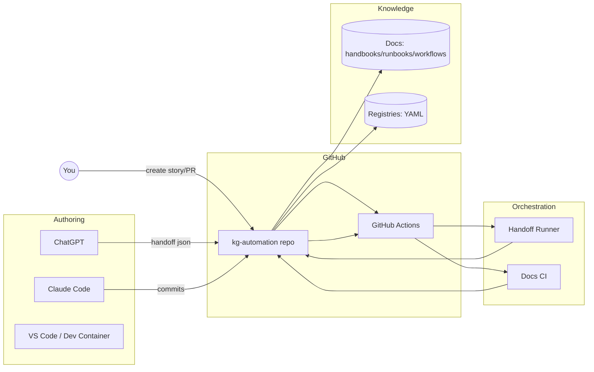

```mermaid
%% source: docs/diagrams/integration-architecture.mmd
%% Title: Integration Architecture — kg-automation
flowchart LR
  User((You))
  subgraph GitHub[GitHub]
    Repo[kg-automation repo]
    Actions[GitHub Actions]
  end
  subgraph Authoring[Authoring]
    ChatGPT
    ClaudeCode[Claude Code]
    VSCode[VS Code / Dev Container]
  end
  subgraph Orchestration[Orchestration]
    Runner[Handoff Runner]
    CI[Docs CI]
  end
  subgraph Knowledge[Knowledge]
    Docs[(Docs: handbooks/runbooks/workflows)]
    Registries[(Registries: YAML)]
  end

  User -->|create story/PR| Repo
  ChatGPT -->|handoff json| Repo
  ClaudeCode -->|commits| Repo
  Repo --> Actions --> Runner --> Repo
  Repo --> Actions --> CI --> Repo
  Repo --> Docs
  Repo --> Registries
```
