# Data Model — 849 Arms Run Pre-Run Preconditions

The baseline is arms-run-01M3APTA's `data-model.md` and contracts. This file lists only the deltas.

## Smoke ledger identity

- A smoke ledger's header carries the plan identity `SMOKE_PLAN`: a distinct integer constant, 10 cells, fixed at creation and immutable like every header field. Its serving binding is the PRIMARY configuration, so the limits are identical to the run's.
- `require_complete_primary` refuses it: its plan is not the 72-cell primary plan.
- `status` reports it as `smoke`, not as secondary. `open_existing` reopens it only as a smoke ledger.
- The grading export refuses it.
- Tests cover creation, reopen, status and every refusal.

## Run row (ledger `run` record)

| Field | Change | Rule |
|---|---|---|
| `outcome` | **adds** `sampler_unreadable_at_send` | The GTT read failed at `before_send`, after the attempt began. Could-not-check. Terminal for the attempt, never averaged, not scored. Refuses the cell and does NOT stop the session. Distinct from `exceeds_memory_ceiling` and from the pre-attempt `sampler_unreadable` event. |
| `outcome` | **adds** `exceeds_memory_ceiling` | Terminal for the attempt. Never averaged. Not a scored outcome. Carries `memory_ceiling: {measured_gib: float, ceiling_gib: float, stage: "before_send"}`. Distinct from `error`, from `exceeds_model_context`, and from an unreadable sampler (which is `sampler_unreadable`, an event, and no attempt). |
| `falkordb_rss_peak_mib` / any graph-store column | **REMOVED** from G rows (retired; must not appear anywhere) | Per-cell rows carry NO graph-store memory column; a row carrying one is refused (rubric §5 third correction @`91e679e6`). |

## attempt_start record

| Field | Change | Rule |
|---|---|---|
| `session_id` | **new**, required | Non-empty str. Replay requires that the most recent `session_gates` event above this row has the same `session_id`, `passed: true`, and `skipped: false`. Skipped is allowed only under a `SKIP_GATES_SHA` header. |

## Event records

| Kind | Change | Detail |
|---|---|---|
| `premise_violated` | **new** | `{arm: str, reason: "tripwire" \| "cross_group_leak", message: str, at_key: RunKey dict}`. Its presence makes the ledger **unusable as a primary, for export, and for `Ledger.summarise()`** (correction C). Rows stay untouched. |
| `memory_ceiling` | unchanged | The pre-cell ceiling refusal stays as it is. |
| `series_generation` | **new**, one per `substrate.run` | `{series_id, path, container_id, interval_s, started_ts}`. Recorded before any graph activity. |
| `graph_store_first_build` | **new**, once per generation | `{ts, series_id}` at the first `build_graph` start. |
| `graph_store_all_resident` | **new**, once per generation | `{ts, series_id, n_graphs}` when the last question's repeat-1 build succeeds with no harness retirement yet. |
| `session_stopped` | **new** | `{reason, grace_s?}`, with reason one of `g_cancellation_unacknowledged`, `ceiling_breach_at_send`, `premise_violated`, `operator`, … Every stop reason is distinguishable. |

These events are validated on write and replay (types, canonical UTC, known `series_id`).

### Graph-store report (computed, NOT persisted)

Computed at summary and export time from the series files plus the events above (contracts/memory-series.md item 4):
- `{baseline_mib, peak_mib, all_resident_mib, interval_s, series_ids}`, each figure a number or `could_not_check: <reason>`.
- It is validated when produced (it is not persisted, so there is no replay). It is never a primary-completeness condition and never a score.

## Arm registration (in-memory, not persisted)

| Field | Rule |
|---|---|
| `refusal` | The unified `ArmRefusal`, the same class for all three arms. Terminality by identity. |
| `answer` \| `bind` | Exactly one, as today. R also exposes `calibration_inputs(views, cache)`. |
| `build_graph`, `drop_graph` | G only. Synchronous wrappers over the persistent loop. |
| `close()` | **new, optional**. G shuts down its loop and driver. The Session calls it on stop. |

## Memory series files (`RUNS_DIR/falkordb-cgroup-<series_id>.jsonl`, one per generation, never truncated)

- **Header**: `{series: "arms849-falkordb-cgroup/1", started, container, container_id, interval_s}`. The format id changes with the measure; `interval_s` is the real interval.
- **Records**: `{ts, cgroup_mib, container_id}`. `ts` is canonical UTC only (C12).
- **A failed read writes no line**, so the hole surfaces as a gap.

## State transitions

```mermaid
stateDiagram-v2
    [*] --> attempt_started: begin_attempt (session gates passed; attempt carries session_id)
    attempt_started --> ok: arm answered, samplers readable
    attempt_started --> exceeds_model_context: D over native limit
    attempt_started --> exceeds_memory_ceiling: before_send breach (nothing sent)
    attempt_started --> error: ArmRefusal (terminal) or other failure (retryable)
    attempt_started --> halted: PremiseViolated (run stops; ledger unusable as primary)
    ok --> [*]
    exceeds_model_context --> [*]
    exceeds_memory_ceiling --> [*]
    error --> attempt_started: retryable and attempts remain
    error --> [*]
    halted --> [*]
```

