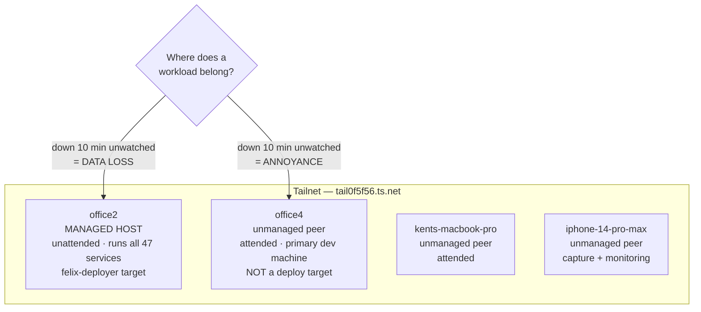

# Mission Specification: Register office4 in the Architecture

**Mission Branch**: `feat/office4-architecture-registration`
**Created**: 2026-08-29
**Status**: Draft
**Mission**: documentation
**Input**: GitHub issue [kentonium3/kg-automation#909](https://github.com/kentonium3/kg-automation/issues/909) — "Infra: office4 Phase 0 — ADR + architecture-data registration for the three-machine model"

## Documentation Scope

**Iteration Mode**: mission-specific
**Target Audience**: the maintainer (Kent) and future agent sessions reading the architecture store to decide where work belongs
**Selected Divio Types**: **explanation** (ADR 0008 — the decision and its reasoning) and **reference** (the architecture-data JSON and its narrative views)

This mission adds no documentation generator and configures no toolchain. The
deterministic verification it needs already exists as two blocking Docs-CI
validators; nothing new is introduced.

### The model being documented

The placement test is the load-bearing idea: office4 *is* always-on, so uptime
is not the axis that separates the machines. **Attendedness** is.

## User Scenarios & Testing *(mandatory)*

### User Story 1 - An agent session needs to know if office4 is a deploy target (Priority: P1)

A future Claude Code session picks up work that touches office4 and must
determine whether changes reach it through the `deploys/queued/` manifest
pipeline, or by some other means.

**Why this priority**: this is the question most likely to be answered wrongly
and most costly to get wrong. Felix's substrate is single-host *in code*, not
by convention — a session that assumes office4 is a managed host will write a
manifest that silently never applies, or worse, will try to make it apply.

**Independent Test**: a reader with no prior context can answer "is office4 a
felix-deployer target?" and cite the reason, using only the architecture store.

**Acceptance Scenarios**:

1. **Given** ADR 0008 is merged, **When** a session searches the architecture
   store for office4's deploy status, **Then** it finds an explicit statement
   that office4 is not a managed host, supported by named file-and-line
   evidence rather than assertion.
2. **Given** a session is about to place a `kg-automation` checkout on office4,
   **When** it consults ADR 0008, **Then** it finds the constraint that no
   checkout may live at a path felix-deployer would recognise, and why
   (`self-pull` makes "which checkout is the deploy" ambiguous).

---

### User Story 2 - Deciding where a new workload belongs (Priority: P2)

Kent or an agent is placing a new service, cron, or long-running process and
must choose between office2 and office4.

**Why this priority**: without a recorded rule, each placement is re-argued
from scratch and drifts toward whichever machine is convenient that day.

**Independent Test**: given a described workload, a reader applies the recorded
test and reaches the same placement Kent would, without asking him.

**Acceptance Scenarios**:

1. **Given** ADR 0008 is merged, **When** a reader applies the placement test
   to a workload whose ten-minute unattended outage would lose data, **Then**
   they place it on office2.
2. **Given** the same, **When** the outage would merely be an annoyance,
   **Then** they place it on office4.

---

### User Story 3 - Auditing the tailnet against the architecture store (Priority: P3)

Someone reconciles live tailnet devices against what the architecture store
records, looking for undocumented infrastructure.

**Why this priority**: this is the drift class that produced the undocumented
`codex` account (#917) — found live before it was found in documentation.

**Independent Test**: every device returned by `tailscale status` appears in
the architecture store, and the reconciliation finds no gaps.

**Acceptance Scenarios**:

1. **Given** the mission is merged, **When** the four live tailnet devices are
   compared against `network-topology.json`, **Then** all four are present with
   matching Tailscale IPs.
2. **Given** the mission is merged, **When** the same comparison is made against
   `hardware-inventory.json`, **Then** all four are present — office4 at the
   thin detail level used for the other unmanaged peers.

### Edge Cases

- **A checkout appears on office4 at a recognisable path.** ADR 0008 must state
  this constraint explicitly enough that a later session recognises the
  violation; the ADR is the only thing standing between the constraint and an
  accidental breach, since nothing enforces it mechanically.
- **office4's Tailscale IP changes.** The recorded IP becomes stale. The
  architecture store is the authority, so the fix is to update it — this
  mission records a point-in-time fact, verified live at authoring.
- **A future mission puts a service on office4.** That would contradict the
  `service-inventory.json` exclusion. The ADR must make clear that the exclusion
  is a *decision that can be revisited*, not an invariant of the schema — but
  revisiting it means amending the ADR, not quietly adding a row.
- **#909's own success criteria are internally inconsistent.** The issue asserts
  the Mac is absent from `hardware-inventory.json`; it is not. The spec resolves
  this in favour of verified reality (FR-007) and corrects the issue (FR-012).

## Requirements *(mandatory)*

### Functional Requirements

| ID | Requirement | Status |
|---|---|---|
| FR-001 | ADR 0008 MUST exist at `docs/design/architecture/adr/0008-*.md` and record the three-machine model: office2 as the managed host; the MacBook Pro and office4 as unmanaged peers. | Ready |
| FR-002 | ADR 0008 MUST record the governing principle "office2 is unattended, office4 is attended", stating explicitly that uptime is not the distinguishing axis, and MUST give the placement test in a form a reader can apply to a concrete workload. | Ready |
| FR-003 | ADR 0008 MUST justify why office4 is deliberately not a managed host with named file-and-line evidence that Felix's substrate is single-host in code. | Ready |
| FR-004 | ADR 0008 MUST record the constraint that office4 holds no `kg-automation` checkout at any path felix-deployer would recognise, and state the `self-pull` reasoning behind it. | Ready |
| FR-005 | ADR 0008 MUST record why office4 has no `claude`/`codex` Unix users — the office2 `claude` user exists because the agent is a remote actor on a host it does not live on; office4 inverts that. | Ready |
| FR-006 | `network-topology.json` MUST gain an office4 entry under `network.devices` with hostname `office4`, `tailscale_ip` `100.112.83.28`, and `os` `linux`. | Ready |
| FR-007 | `hardware-inventory.json` MUST gain an office4 entry under `hosts` at the *thin* detail level used for `kents-macbook-pro` and `iphone-14-pro-max` (hostname, role, hardware, os, network) — not the rich office2 form. | Ready |
| FR-008 | office4 MUST remain absent from `service-inventory.json`, and the spec MUST treat that absence as a positive, verified outcome rather than an omission. | Ready |
| FR-009 | The narrative views MUST be updated: `physical-topology.md` gains office4; `security-posture.md` is reviewed so its access-model text reads correctly with four tailnet devices. | Ready |
| FR-010 | ADR 0008 MUST be registered in `docs/INDEX.md`, `docs/DEVELOPER_PORTAL.md`, and `docs/design/architecture/README.md`. | Ready |
| FR-011 | Review-only targets (`adr/0004-tailscale-ssh-with-accept-acl.md`, `docs/runbooks/phone-termius-setup.md`) MUST be explicitly affirmed as changed or unchanged, so "reviewed" is distinguishable from "overlooked". | Ready |
| FR-012 | Issue #909 MUST receive a comment correcting the `hardware-inventory.json` premise and the success criterion that depended on it. | Ready |

### Non-Functional Requirements

| ID | Requirement | Threshold | Status |
|---|---|---|---|
| NFR-001 | The architecture-data validator passes. | `python3 tooling/scripts/validate_architecture_data.py` exits 0 | Ready |
| NFR-002 | The docs validator passes. | `python3 tooling/scripts/validate_docs.py` exits 0 | Ready |
| NFR-003 | Every new or edited markdown file carries YAML frontmatter, per the charter documentation policy. | 100% of touched markdown files under `docs/` | Ready |
| NFR-004 | No broken internal links are introduced. | 0 broken links reported by the docs validator | Ready |
| NFR-005 | office4's recorded network identity matches the live host. | Recorded `tailscale_ip` is byte-identical to `tailscale ip -4` on office4 | Ready |
| NFR-006 | The ADR's file-and-line citations resolve to the content they claim. | 5 of 5 citations verified against the working tree at authoring time | Ready |

### Constraints

| ID | Constraint | Status |
|---|---|---|
| C-001 | Tier 4 (Auto-Commit). The mission changes documentation and architecture metadata only — no host, service, credential, port, or network change. office4 is already on the tailnet; this records that fact, it does not create it. | Ready |
| C-002 | No felix-deployer, manifest-schema, lock-namespacing, or baseline-registry change. Making office4 a managed host is a design change across five subsystems and is out of scope. | Ready |
| C-003 | JSON files are authoritative; markdown views follow. Where the two disagree, the JSON wins. | Ready |
| C-004 | No rebaseline is required — architecture-data JSON is not an audited surface per `audited-surfaces.json`. The merge commit MUST record `Rebaseline: not required — documentation and architecture metadata only`. | Ready |
| C-005 | `kitty-specs/` and `.kittify/` are spec-kitty-owned and MUST NOT be hand-edited; all changes flow through spec-kitty commands. | Ready |
| C-006 | office4 MUST NOT be added to `service-inventory.json` in this mission. Adding it would imply managed-host status, which is precisely the decision being recorded against. | Ready |

## Domain Language

Terminology that must stay canonical, because the whole decision rests on it:

| Canonical term | Meaning | Avoid |
|---|---|---|
| **managed host** | A machine whose state Felix deploys to and audits — currently office2 alone. | "server", "the box", "production" |
| **unmanaged peer** | A tailnet device Felix does not deploy to: the MacBook Pro, the iPhone, and now office4. | "client", "workstation" used as if it implied a tier |
| **attended** / **unattended** | Whether a human is present to notice a failure. The axis that separates office4 from office2. | "always-on" as a synonym — office4 *is* always-on; that is the point |
| **thin entry** | The reduced `hardware-inventory.json` record used for unmanaged peers (hostname, role, hardware, os, network). | "stub", "placeholder" |

## Key Entities

- **ADR** — a numbered, immutable-once-merged decision record under
  `docs/design/architecture/adr/`. Records *why*, not just *what*.
- **Architecture data store** — the JSON under
  `docs/design/architecture/data/`, authoritative over its markdown views.
- **Signal-to-doc map** — `signal-to-doc-map.json`, which enumerates the doc
  targets a change class must address; the source of this mission's eight targets.
- **Device record vs service record** — `hardware-inventory.json` lists every
  tailnet device; `service-inventory.json` lists only what office2 runs. The
  managed/unmanaged boundary is carried by the second, not the first.

## Success Criteria *(mandatory)*

### Measurable Outcomes

- **SC-001**: A reader who has never seen the migration can answer "is office4 a
  deploy target, and why not?" from the architecture store alone, in under two
  minutes, without consulting a GitHub issue or a local plan file.
- **SC-002**: A reader applying the recorded placement test to a described
  workload reaches the intended machine for both the data-loss and the
  annoyance case — 2 of 2.
- **SC-003**: All four live tailnet devices appear in both the device topology
  and the hardware inventory — 4 of 4 in each, with IPs matching the live hosts.
- **SC-004**: office4 appears in zero service records.
- **SC-005**: All eight doc targets named by the signal-to-doc map are either
  updated or explicitly affirmed as requiring no change — 8 of 8 accounted for,
  none silently skipped.
- **SC-006**: Both validators pass and Docs CI is green on the merge commit.
- **SC-007**: Issue #909's incorrect premise is corrected in the issue thread,
  so the next reader of #909 is not misled by it.

### Quality Gates

- Heading hierarchy is proper (H1 → H2 → H3, no skipped levels)
- No broken internal links
- YAML frontmatter present on every touched markdown file under `docs/`
- Every file-and-line citation in the ADR resolves to the claimed content
- The merge commit carries the `Rebaseline:` line required by C-004

## Assumptions

- **ASM-001**: office4's Tailscale IP `100.112.83.28` is stable for the
  foreseeable future. Verified live at authoring time via `tailscale ip -4`
  and `tailscale status`; the architecture store records point-in-time truth
  and is updated when the fact changes.
- **ASM-002**: The Tailscale device name `office4` (lowercase) is the correct
  identifier for both JSON records, following the `kents-macbook-pro`
  precedent of using the Tailscale device name rather than the system hostname
  (which is `Office4`, capitalised).
- **ASM-003**: ADR 0008 is the next free number; `adr/` currently ends at 0007.
  Verified by directory listing at authoring time.
- **ASM-004**: No concurrent mission is adding an ADR, so 0008 will not collide.

## Out of Scope

- Making office4 a managed host, or any felix-deployer, manifest-schema,
  lock-namespacing, or baseline-registry change to enable that
- Adding office4 to `service-inventory.json`, or registering any service,
  port, binding, credential, or data flow on office4
- Creating `claude` or `codex` Unix users on office4 — the ADR records why
  they are absent; it does not create them
- The remaining office4 migration issues under epic #908 — this is Phase 0 only
- Moving the spec-kitty-qa QA pipeline off office2 (#887 — targets exe.dev,
  not office4)
- Resolving the undocumented `codex` account (#917), which is cited only as
  precedent for the drift class this mission prevents
