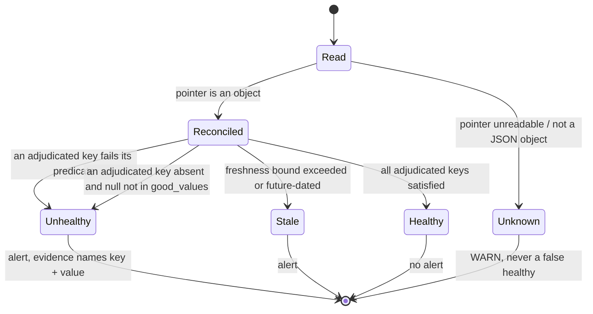

# Data Model: Backup Pointer Key Ledger

Phase 1 output. Entities, invariants, and the state transitions of a health verdict. No storage schema
is introduced — the ledger is declarative configuration inside an existing JSON document, and the
runtime input is an existing pointer file read read-only.

## Entities

### KeyLedger

The per-producer declaration. Lives at `health_check.key_ledger`.

| Field | Type | Required | Notes |
|---|---|---|---|
| `adjudicated` | map of key name → Predicate | no | Absent means no key decides health |
| `diagnostic_only` | array of unique key names | no | Absent means no key is excluded by declaration |

Both members are individually optional, but a `key_ledger` declaring neither is meaningless and is a
structural error — it would assert that a producer emits nothing.

**Invariant L1**: the two member sets are disjoint. Enforced structurally, not by precedence.
**Invariant L2**: `adjudicated ∪ diagnostic_only` equals the producer's emitted key set exactly.
Enforced by test, not by the validator — the validator cannot know what a producer emits, which is
precisely why Obligation 2 exists.

### Predicate

Exactly one of three forms. The discriminator is which field is present.

| Form | Field | Type | Healthy when |
|---|---|---|---|
| Membership | `good_values` | non-empty array of scalars / `null` | value is in the list, by value **and** type |
| Floor | `minimum` | number | value is numeric and `>= minimum` |
| Freshness | `freshness` | `true` | freshness probe judges it fresh and not future-dated |

**Invariant P1**: exactly one predicate field per adjudicated key — zero is undecidable, two is
ambiguous, and both are structural errors.
**Invariant P2**: membership is evaluated without a type pre-filter. A value of an unexpected type is
*not in* the good-set and is therefore unhealthy. This is stated as an invariant rather than a coding
note because the surrounding module's existing style does the opposite, and matching that style would
reintroduce the defect.
**Invariant P3**: boolean identity is checked before numeric equality, so `1` does not satisfy
`[true, null]` and `0` does not satisfy `[false]`.

### StatePointer

The producer's output document. Read-only to this mission — no field is added, removed, or renamed
(spec C-001).

office2's `restic-backup` emits exactly ten keys. Their disposition under this mission:

| Key | Disposition | Predicate | Why |
|---|---|---|---|
| `restic_exit_code` | adjudicated | `good_values: [0, 3]` | 3 = warnings but a snapshot was produced |
| `prune_exit_code` | adjudicated | `good_values: [0]` | `forget` exiting 3 gives no snapshot guarantee; **never merge with the set above** |
| `snapshot_timestamp_utc` | adjudicated | `freshness` | Authoritative anchor; must be parseable and not future-dated |
| `integrity_check_passed` | adjudicated | `good_values: [true, null]` | **The defect.** `null` = not run on the six non-Sunday days and is healthy |
| `snapshot_count` | adjudicated | `minimum: 2` | A wiped-and-reinitialised repo yields one snapshot and otherwise reads all-green |
| `schema_version` | diagnostic_only | — | Describes the document's shape, not the backup's condition |
| `snapshot_id` | diagnostic_only | — | Identifier for investigation |
| `repo_size_bytes` | diagnostic_only | — | Trend data |
| `script_finished_at_utc` | diagnostic_only | — | Separate witness; deliberately **not** a freshness fallback (#902) |
| `integrity_check_run` | diagnostic_only | — | Whether the check ran; the verdict is what decides health |

Five adjudicated, five diagnostic. Before this mission: four effectively adjudicated (two by hardcoded
clause, one by freshness, one by the timestamp-fallback guard) and six inert.

### HealthVerdict

Produced by the probe; consumed by the alert path. Existing entity, unchanged in shape.

| Field | Meaning |
|---|---|
| `ok` | pass/fail |
| `stale` | freshness bound exceeded |
| `evaluable` | `false` → caller maps to `unknown` |
| `evidence` | human-readable cause; must name the key and value for ledger failures (NFR-004) |
| `signal` | optional run-identity fingerprint for frozen-past-event dedup |

## State transitions

A ledger-declared component's verdict, per canary tick:

The `Unknown` branch is deliberately preserved: an unreadable or uninterpretable pointer must not
become a health verdict in either direction. A persistent `unknown` is honest and is the existing
documented behaviour.

## What changes for office2 today

Evaluated against the live pointer read 2026-08-30 02:51 UTC (`restic_exit_code: 0`,
`prune_exit_code: 0`, `snapshot_count: 14`, `integrity_check_passed: null`, fresh timestamp):

**Nothing.** All five adjudicated keys are satisfied, so the component continues to read healthy. The
new rules change the verdict only in the conditions they were written for — a failed integrity check,
a repository reduced to one snapshot, or a future-dated clock. This is the intended property and is
worth asserting as a test: introducing the contract must not change the reported health of a healthy
system.

## Externally visible events

None added. Failures flow through the existing canary → alert-bus path, and the alert payload shape is
unchanged. The only observable difference is that a condition which previously produced silence now
produces an alert whose evidence names the responsible key.
