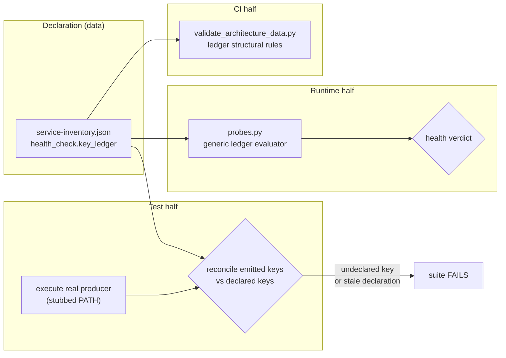

# Implementation Plan: Backup Pointer Key Ledger

**Branch**: `feat/934-pointer-key-ledger` | **Date**: 2026-08-30 | **Spec**: [spec.md](spec.md)
**Input**: Feature specification from `kitty-specs/pointer-key-ledger-01M189P6/spec.md`

## Summary

Convert the backup health contract from prose that nobody enforces into declared data that a probe
reads and a test enforces.

The rules already exist — `service-inventory.json`'s `health_check.expected` for `restic-backup`
states, in English, that `restic_exit_code` must be in `{0, 3}`, that `prune_exit_code` must be `0`,
and that the snapshot timestamp must be non-null and parseable. Its `note` even enumerates the
schema-v1 fields *including* `integrity_check_run` and `integrity_check_passed`. Every one of those
sentences is true, and not one of them is executable. The two rules that happen to be implemented
live in `scripts/canary/probes.py` as hand-written clauses; the rest are decoration.

So the approach is: **give the prose teeth by making it data.** Each component's `health_check`
gains a `key_ledger` declaring every key its producer emits as either *adjudicated* (with an
explicit good-set) or *diagnostic_only*. `probes.py` gains one generic evaluator that reads whatever
a component declares — it learns nothing about restic, office2, or office4. A test executes the real
producer and reconciles the keys it actually emits against the declaration.

That last part is what makes this different from writing a better comment. The contract is only
worth having if the ledger cannot quietly drift from the producer, and the only way to know what a
producer emits is to run it.



Three halves, and each covers a failure the others cannot see. The runtime half alone would adjudicate
declared keys while a newly added key stayed inert. The test half alone would prove the ledger matches
the producer while nothing acted on it. The CI half alone would prove the ledger is well-formed while
saying nothing about whether it is true.

## Technical Context

**Language/Version**: Python 3.11 — **CI pins 3.11** (`.github/workflows/test-ci.yml`) while office2
and office4 both run 3.12.3. Code must be 3.11-compatible; a 3.12-only construct passes locally and
reddens CI.
**Primary Dependencies**: None added. Standard library only (`json`, `datetime`). The probe layer is
deliberately dependency-free and effect-injected.
**Storage**: JSON declaration in `docs/design/architecture/data/service-inventory.json`; the runtime
input is the producer's state pointer at `/data/services/backup/state/last-backup.json` (read-only).
**Testing**: pytest 9.1.1 via `make test` → `pytest -q --ignore=docs/archive`. **Baseline: 6324 tests
collected.** New tests are offline and deterministic — the producer is executed with `restic`,
`mountpoint` and `du` stubbed on `PATH` and its output directories redirected, per the existing
harness in `tests/office2/restic_backup/test_pointer_emission.py`.
**Target Platform**: Linux. Runtime consumer is `felix-canary` on office2 (15-minute user timer),
running from the `/home/claude/kg-automation` checkout.
**Project Type**: single — scripts + tests in an existing repository, no new project.
**Performance Goals**: No measurable change to canary tick cost. The evaluator is a dictionary walk
over ≤ 15 keys per component, several orders below the existing per-tick file read.
**Constraints**: No change to `scripts/office2/restic-backup.sh` (spec C-001). No deploy manifest
(C-002). Existing exit-code good-sets preserved and **not merged** (C-003). Tier 2 change control
(C-006).
**Scale/Scope**: 2 producers in scope (office2 restic now, office4 restic via #913) out of 17
pointer-emitting components; the other 15 are explicitly deferred (C-005).

## Charter Check

*GATE: Must pass before Phase 0 research. Re-checked after Phase 1 design — see end of section.*

| Charter gate | Status | Note |
|---|---|---|
| **Testing Standards — pytest coverage for non-trivial helpers** | PASS | The evaluator is the core behaviour and is directly unit-tested; the reconciliation test is itself the deliverable. |
| **Testing Standards — fixtures mirror real inputs** | PASS | Pointer fixtures are taken from the **live** office2 document read 2026-08-30 02:51 UTC, not invented. Recorded in `research.md`. |
| **Testing Standards — no dead code before `for_review`** | PASS (with an explicit check) | The named risk here is shipping an evaluator nothing calls — the exact defect class this mission exists to close. A grep-for-callers check is an acceptance item, not an afterthought. |
| **Testing Standards / Quality Gates — live verification, feasibility-scaled** | PASS | No pre-merge live exercise is possible: the canary runs from office2's own checkout and only picks this up post-merge. Therefore a **post-merge operator canary** is defined below and must be recorded. |
| **Quality Gates — CI validation passes** | PASS | Docs CI + Test CI both gate. The architecture-data validator is itself extended by this mission. |
| **Change-Risk Taxonomy — Tier 2** | PASS | Health signal gating operator awareness. Requires a Restic snapshot ≤ 24 h before the change is applied. The 2026-08-30 04:00 UTC run satisfies this; confirm at merge. |
| **Rebaseline Obligation** | PASS — **not required** | Verified, not assumed: `check_audited_surface_drift.py` reports no match for any file this mission touches (`probes.py`, `service-inventory.json`, `validate_architecture_data.py`, the tests, the runbook). Merge record states `Rebaseline: not required — no audited surface touched`. |
| **Branch Strategy — conventional commits, feature branch** | PASS | Mission lands on `feat/934-pointer-key-ledger`; `feat → main` by PR after the post-merge review. |
| **Deployment Constraints — manifest discipline** | PASS — **N/A** | No deploy to office2. The canary runs from a git checkout; the change arrives on that checkout's pull. Precedent #746. |
| **Supply-chain safety** | PASS — **N/A** | No dependency added, upgraded, or removed in any ecosystem. |

**Post-Phase-1 re-check**: no new gate conflicts. Phase 1 introduced no dependency, no deployed
artifact, and no new runtime surface — the design stays inside the three files the gates were
evaluated against, plus documentation.

### Post-merge operator canary (the charter's required live verification)

Pre-merge tests cannot prove the live canary reads the live pointer. So this is defined now and its
outcome recorded on #934 at close:

1. After the feature branch reaches `main` and office2's checkout pulls, read the live pointer and
   confirm the component's evaluated health is unchanged (still healthy) on a normal day — proving no
   false positive was introduced.
2. On the **Sunday** verdict, confirm the evaluated health reflects `integrity_check_passed`.
3. Confirm the canary's own tick pointer still advances — i.e. the evaluator did not make the runner
   throw. A raised exception is caught and mapped to `unknown`, so a silent degradation to `unknown`
   is the specific failure to look for, not a crash.

## Project Structure

### Documentation (this mission)

```
kitty-specs/pointer-key-ledger-01M189P6/
├── plan.md              # This file
├── spec.md              # Committed 61843458
├── research.md          # Phase 0 output
├── data-model.md        # Phase 1 output
├── quickstart.md        # Phase 1 output
├── contracts/           # Phase 1 output — key-ledger declaration contract
├── checklists/
│   └── requirements.md  # Specify quality checklist (all pass)
└── decisions/           # 3 Decision Moments, all resolved
```

### Source Code (repository root)

```
scripts/canary/
└── probes.py                       # MODIFIED — generic ledger evaluator + future-dating guard

docs/design/architecture/data/
└── service-inventory.json          # MODIFIED — restic-backup.health_check gains key_ledger

tooling/scripts/
└── validate_architecture_data.py   # MODIFIED — structural rules for key_ledger

tests/
├── canary/                         # MODIFIED/ADDED — evaluator unit tests, generic-reuse test
└── office2/restic_backup/
    └── test_pointer_emission.py    # MODIFIED — producer-emission ↔ ledger reconciliation

docs/runbooks/
└── restic-backup-ops.md            # MODIFIED — document the ledger as the contract
```

**Structure Decision**: No new top-level structure. Every change lands in an existing module that
already owns the concern: declaration in the architecture-data store, evaluation in the canary probe
layer, structural validation in the architecture-data validator, reconciliation in the existing
producer-execution test package. This follows the charter's locality-of-change directive and keeps
the diff reviewable as one idea rather than a new subsystem.

## Complexity Tracking

*No Charter Check violations. Section retained empty by design.*

## Implementation Concern Map

> Concerns are not work packages. `/spec-kitty.tasks` translates these into executable WPs.

### IC-01 — Ledger declaration format and structural validation

- **Purpose**: Define the `key_ledger` shape and make a malformed or self-contradictory ledger
  impossible to merge.
- **Relevant requirements**: FR-003, FR-009, C-003
- **Affected surfaces**: `docs/design/architecture/data/service-inventory.json`,
  `tooling/scripts/validate_architecture_data.py`, `contracts/key-ledger.md`
- **Sequencing/depends-on**: none — this is the vocabulary everything else consumes.
- **Risks**: The validator is a **blocking** Docs-CI gate, so a rule that is too strict blocks
  unrelated work repo-wide. Rules must constrain only the new `key_ledger` structure and must treat
  its absence as legal — 16 components have no ledger and must stay valid. The other real risk is
  declaring a key in both lists; that must be a hard structural error, not a precedence rule, because
  a precedence rule would silently pick a winner.

### IC-02 — Generic ledger evaluator in the probe layer

- **Purpose**: Adjudicate declared keys against their declared good-sets, generically, without the
  probe layer learning any component's name.
- **Relevant requirements**: FR-001, FR-002, FR-007, FR-010, NFR-004
- **Affected surfaces**: `scripts/canary/probes.py`
- **Sequencing/depends-on**: IC-01
- **Risks**: **The tri-state trap.** `integrity_check_passed` has three meaningful values —
  `true`, `false`, `null` — and `null` means "not run" and must read healthy. A truthiness test makes
  the component unhealthy six days a week; an `isinstance` guard that skips non-bools makes `false`
  slip through when it arrives as a string. The good-set must be matched by explicit membership
  including `None`, with an unrecognised value treated as unhealthy rather than skipped — the existing
  `isinstance(code, int)` guards in `_explicit_error` are precisely the fail-open shape to avoid
  repeating. **Precedence** is the second risk: `_explicit_error` already hardcodes
  `restic_exit_code` and `prune_exit_code`. If both it and the ledger adjudicate the same key, the
  good-sets exist in two places and can drift — the coupling failure this mission is about. The
  ledger must be authoritative for every key it declares, with `_explicit_error` applying only to keys
  the ledger does not name.

### IC-03 — Producer-emission reconciliation test

- **Purpose**: Derive the emitted key set by executing the real producer and fail on any key that is
  undeclared, or any declared key the producer no longer emits.
- **Relevant requirements**: FR-004, FR-005, FR-006, NFR-002
- **Affected surfaces**: `tests/office2/restic_backup/test_pointer_emission.py`
- **Sequencing/depends-on**: IC-01
- **Risks**: This test is the mission's whole thesis, so a weak version of it is worse than none — it
  would certify the contract while enforcing nothing. Two specific weaknesses to refuse: comparing
  against a hand-written key list in the test file (that is the defect, relocated), and asserting only
  one direction (undeclared-key detection without stale-declaration detection lets the ledger rot).
  The producer must be executed across its **early-exit paths** too — a run that exits before the
  backup still writes a pointer via its `EXIT` trap, and that pointer's key set must also reconcile.

### IC-04 — Future-dated timestamp guard

- **Purpose**: Stop a clock skew from pinning a component "fresh" indefinitely.
- **Relevant requirements**: FR-008
- **Affected surfaces**: `scripts/canary/probes.py` (freshness path)
- **Sequencing/depends-on**: none
- **Risks**: Small but genuinely shared — it applies to every freshness-probed component, not just
  backup, so the tolerance must absorb legitimate clock skew and the ms-scale difference between
  start-type and completion-type timestamp anchors. Too tight and 17 components start flapping.

### IC-05 — Documentation and the deferred surface

- **Purpose**: Record the contract where an operator will find it, and convert the 15 unenforced
  components from a silent gap into a tracked decision.
- **Relevant requirements**: FR-011, C-005
- **Affected surfaces**: `docs/runbooks/restic-backup-ops.md`, `service-inventory.json` prose fields,
  a follow-up issue
- **Sequencing/depends-on**: IC-01, IC-02
- **Risks**: The `health_check.expected` prose currently *is* the contract. Once the ledger is
  authoritative, leaving that prose unchanged creates two descriptions that can disagree — reproducing
  the mission's own defect in the documentation layer. The prose must be reduced to pointing at the
  ledger rather than restating it.
