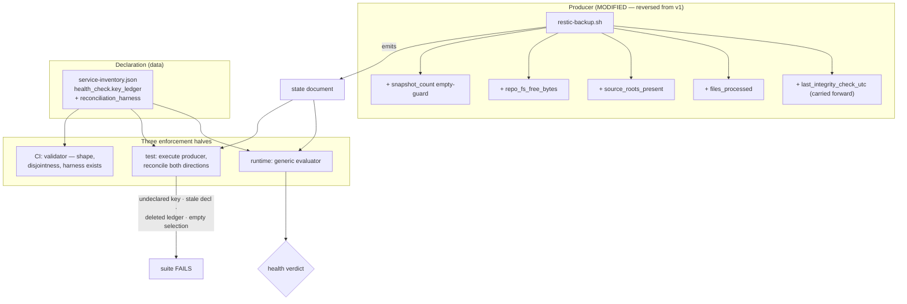

# Implementation Plan: Backup Pointer Key Ledger

**Branch**: `feat/934-pointer-key-ledger` | **Date**: 2026-08-30 (**v2**, revised after the post-plan
review point-cut) | **Spec**: [spec.md](spec.md)
**Input**: `kitty-specs/pointer-key-ledger-01M189P6/spec.md` (v2)

> **v2 supersedes the plan committed at `340d0dfc`.** Three independent review lenses returned
> "revise before tasks". v1 would have shipped a live #902/FR-009 regression, mis-stated its own
> baseline counts, and left three of the four catastrophic conditions green without disclosing it.
> Scope was then widened by explicit decision to close all four. See spec.md *What the review changed*.

## Summary

Make the backup's self-reported health complete, and make the completeness enforceable.

Two halves, and v1 only had the second:

**The document does not currently say enough.** Ten keys, of which three decide health. Nothing
office2 emits distinguishes a full backup from an empty one, a verified repository from an unverified
one, or a healthy volume from one about to fill. So four total-loss conditions are not merely unread —
they are *unsayable*. The producer therefore gains four keys (`last_integrity_check_utc`,
`files_processed`, `source_roots_present`, `repo_fs_free_bytes`) and one output guard.

**Nothing forces what it does say to be read.** Each key's disposition becomes declared data — a
`key_ledger` on the component's `health_check` — adjudicated with an explicit predicate or marked
diagnosis-only with a written reason. A generic evaluator reads whatever is declared, learning no
component's name. A test executes the producer and reconciles the keys it actually emits against the
declaration, in both directions.

What that buys, stated accurately: **silent inertness becomes impossible; deliberate inertness becomes
a line in a diff.** `diagnostic_only` is still an escape hatch — it now costs a written reason and
shows up in review. v1 claimed "a rule that cannot be forgotten"; that claim is how C-003 came to be
trusted, and it is withdrawn.



## Technical Context

**Language/Version**: Python 3.11 — **CI pins 3.11**, office2 runs 3.12.3, and the repo venv on
office4 is 3.12.3. Note office4's bare `python3` is a uv-managed **3.13.15** in `~/.local/bin` that
shadows the system 3.12.3 (#935); the repo venv is the interpreter that matters here, but a bare
`python3` on that host is neither the system Python nor the venv. Target 3.11-compatible syntax: a
3.12-or-later construct passes every local check and reddens CI. Producer changes are bash
(`/bin/bash`), restic 0.16.4.
**Primary Dependencies**: None added. Standard library only. Producer uses `jq`, `df`, and restic
subcommands already present.
**Storage**: Declaration in `docs/design/architecture/data/service-inventory.json`. Runtime input is
the producer's document at `/data/services/backup/state/last-backup.json`.
**Testing**: pytest 9.1.1 via `make test` → `pytest -q --ignore=docs/archive`. **Baseline: 6324
tests.** Producer executed under stubbed `restic`/`mountpoint`/`du`/`df` on `PATH`, per the existing
harness.
**Target Platform**: Linux. Runtime consumer `felix-canary` (15-minute timer) from the
`/home/claude/kg-automation` checkout.
**Project Type**: single.
**Performance Goals**: Evaluator cost is a dictionary walk over ≤ 15 keys, negligible. The producer
gains one `restic stats` call — see *Producer data sources* for the cost decision.
**Constraints**: Producer install is a **manual operator step** (C-002). Tier 2 (C-006). Existing
exit-code good-sets preserved and not merged (C-003).
**Scale/Scope**: 1 producer covered now, office4's via #913; the other 16 tracked as #937.

### Chosen values (v1 specified none of these — the review's F8/F4/#6)

| Value | Setting | Derivation |
|---|---|---|
| Future-skew tolerance | **5 minutes**, strict `>` | Ported, not invented: `scripts/deploy/lib/snapshot.py` already guards this exact field on this exact document with `_FUTURE_SKEW_TOLERANCE = timedelta(minutes=5)`. Two consumers of one file must not disagree. Also comfortably below the tightest freshness budget in the inventory (600 s), so the guard still bites there. |
| Integrity recency bound | **9 days** | Weekly cadence (7 d) plus one tolerated missed Sunday would be 14 d; 9 d tolerates a late or skipped single run without permitting a second silent miss. |
| Snapshot-count floor | **2**, with first-run suppression | A one-snapshot repository has no history to restore from. Suppression exists because a *new* repository legitimately reports 1 on night one (FR-019). |
| Free-space floor | **50 GiB** (53687091200) | Verified live: the repository volume is `/dev/sdd1`, 916 GiB, **864 GiB free, 1% used**, repo 3.6 GB. 50 GiB is ~14× the current repository, leaving room for several full rewrites before the volume is endangered, and 5.4% of the volume — well above transient churn. |
| Schema version | bump to **2**, pinned | Adding keys changes the shape (C-008). |

### Producer data sources (feasibility verified on office2, restic 0.16.4)

| New key | Source | Why this one |
|---|---|---|
| `files_processed` | `restic stats --mode files-by-contents latest --json` → `total_file_count` | The alternative, `restic backup --json`, would replace the human-readable `--verbose` log the runbook depends on. `stats` preserves the log at the cost of one extra scan over a 3.6 GB repository. |
| `source_roots_present` | `restic snapshots --latest 1 --json` → `.paths[]`, compared to the configured roots | The snapshots call already runs; this reads a field already returned. No extra cost. |
| `repo_fs_free_bytes` | `df -B1 --output=avail <repo>` | Measures the *filesystem*, which is the thing that fills. `repo_size_bytes` measures the repository and stays diagnostic. |
| `last_integrity_check_utc` | Read the prior document before overwrite; carry forward unless the check just ran | The document is rewritten wholesale each run, so persistence must be explicit. This is the only new key requiring read-before-write. |

## Charter Check

*GATE: re-checked after the review and the scope change.*

| Charter gate | Status | Note |
|---|---|---|
| Testing — pytest coverage | PASS | Evaluator, reconciliation, and producer emission all directly tested. |
| Testing — fixtures mirror real inputs | PASS | Pointer fixtures from the live document (2026-08-30 02:51 UTC); capacity figures from live `df`. |
| Testing — no dead code before `for_review` | PASS, with a named check | The risk is an evaluator nothing calls, or a ledger nothing reconciles. FR-017 makes the second a CI failure; a grep-for-callers is an acceptance item for the first. |
| Testing / Quality — live verification, feasibility-scaled | PASS, **strengthened** | v1's canary step was unfalsifiable (it confirmed a *passing* verdict reads healthy, proving nothing about the failure path). Replaced — see below. |
| Quality — CI passes | PASS | Docs CI + Test CI; the architecture-data validator is extended here. |
| Change-Risk — **Tier 2** | PASS | Now genuinely Tier 2: the producer is modified and reinstalled on the live host. Restic snapshot ≤24 h confirmed before install. |
| Rebaseline Obligation | PASS — **not required** | Re-verified against the consumer after the scope change: `check_audited_surface_drift.py` matches none of the touched paths, **including `scripts/office2/restic-backup.sh`**. Merge record: `Rebaseline: not required — no audited surface touched`. |
| Branch Strategy | PASS | Lands on `feat/934-pointer-key-ledger`; `feat → main` by PR after the post-merge review. |
| Deployment — manifest discipline | PASS — **N/A, with a manual step** | The canary change rides the checkout pull (#746 precedent). The producer is **not** manifest-deployable: `/data/services/backup/scripts/` is `root:root drwxr-xr-x`, the deploy agent runs as `claude`, and `claude` has no passwordless sudo (all verified on the host). See *Operator install*. |
| Supply-chain safety | PASS — N/A | No dependency added, upgraded, or removed. |

### Operator install (C-002) — required, and only Kent can run it

The deployed producer is a hand-installed root-owned file. Verified on office2:

```
/data/services/backup/scripts/   drwxr-xr-x root:root     ← not writable by claude
backup.sh                        -rwxr-xr-x root:root
claude sudo                      "a password is required"
```

So the mission delivers the repo-side change and its tests, and the live install is an explicit
operator step handed over as an exact command, run via `ssh office2-kgale`. **The mission is not
complete until that install has happened and `backup-script-drift` reports the two copies converged.**
Until then the ledger describes the repo copy, not the producer (R-002).

### Post-merge operator canary (replaces v1's unfalsifiable version)

1. **Falsifiable failure-path check.** Write a synthetic document carrying
   `integrity_check_passed: false` to a scratch path, point the real probe at it on office2, and
   confirm it reaches `failed`. This exercises the live code on the live checkout without touching the
   real backup — v1 instead proposed confirming that a *passing* Sunday verdict reads healthy, which
   demonstrates nothing about the path being fixed.
2. **No-false-positive check.** Confirm the real component still reads healthy on a normal day.
3. **Runner-liveness check.** Confirm the canary's tick pointer still advances. An evaluator exception
   is caught and mapped to `unknown`, and a first-seen `unknown` is *recorded without alerting* — so
   the failure to watch for is a silent degradation to `unknown`, never a crash. This is why NFR-006
   exists.
4. **Producer convergence.** After the operator install, confirm `backup-script-drift` reports the
   copies converged, and that the next real run emits all fourteen keys.

## Project Structure

### Documentation (this mission)

```
kitty-specs/pointer-key-ledger-01M189P6/
├── plan.md · spec.md · research.md · data-model.md · quickstart.md
├── contracts/key-ledger.md
├── checklists/requirements.md
└── decisions/            # 3 Decision Moments, all resolved
```

### Source Code (repository root)

```
scripts/office2/
└── restic-backup.sh                # MODIFIED (v2) — +4 emitted keys, +1 guard, schema→2

scripts/canary/
└── probes.py                       # MODIFIED — generic ledger evaluator, binding freshness
                                    #            anchor, future-skew guard

docs/design/architecture/data/
└── service-inventory.json          # MODIFIED — key_ledger + reconciliation_harness

tooling/scripts/
└── validate_architecture_data.py   # MODIFIED — ledger structural rules + harness existence

tests/canary/
├── test_ledger_eval.py             # ADDED — predicate semantics, totality, hostile values
├── ledger_reconcile.py             # ADDED — the SHARED reconciliation helper (#913 reuses this)
├── test_ledger_reuse.py            # ADDED — fictitious producer through the same helpers
├── test_inventory_health_checks.py # MODIFIED — prose→ledger binding replaces prose→substring
└── test_probes*.py                 # MODIFIED — #902 scenarios re-asserted WITH the ledger

tests/office2/restic_backup/
└── test_pointer_emission.py        # MODIFIED — reconciliation + per-early-exit verdicts

docs/runbooks/
└── restic-backup-ops.md            # MODIFIED — ledger as contract; drift caveat; install step
```

**Structure Decision**: One new shared module (`tests/canary/ledger_reconcile.py`) and no new
top-level structure. That module exists because v1 told #913 to "point the shared reconciliation at
your harness" while planning no such thing — #913 would have copy-pasted, duplicating the very logic
FR-010 forbids.

## Complexity Tracking

*No Charter Check violations.*

## Implementation Concern Map

> Concerns are not work packages.

### IC-01 — Ledger format, structural validation, and harness binding

- **Purpose**: Define `key_ledger`, and make a malformed, self-contradictory, or unreconciled ledger
  impossible to merge.
- **Requirements**: FR-003, FR-009, FR-017, C-008
- **Surfaces**: `service-inventory.json`, `tooling/scripts/validate_architecture_data.py`,
  `contracts/key-ledger.md`
- **Depends on**: none
- **Risks**: The validator is a **blocking** Docs-CI gate, so rules must constrain only the new
  structure and treat its absence as legal — 16 components have no ledger. Two specific traps: a key
  in both lists must be a hard error rather than a precedence rule (a precedence rule silently picks a
  winner); and the validator walks *every nested dict*, so a rule gated on `"key_ledger" in entry`
  will fire on per-key predicate fragments — gate on `entry.get("health_check")` instead.

### IC-02 — Generic ledger evaluator

- **Purpose**: Adjudicate declared keys against declared predicates, generically and totally.
- **Requirements**: FR-001, FR-002, FR-007, FR-008, FR-010, FR-016, FR-018, NFR-004, NFR-006
- **Surfaces**: `scripts/canary/probes.py`
- **Depends on**: IC-01
- **Risks**: Four, each a way to reintroduce the defect:
  1. **The precedence trap that v1 walked into.** The legacy chain is organised per *rule-block*, not
     per key: the `snapshot_timestamp_utc` parseability guard is nested inside
     `if "restic_exit_code" in pointer:`. Suppressing that branch per-key deletes the guard and
     reopens #902/FR-009. Resolve by lifting the timestamp rule out into its own predicate rather than
     suppressing branches.
  2. **Type collision, both directions.** In the host language a boolean equals a number *and* a
     number equals a boolean, so `false` satisfies `[0, 3]` and `1` satisfies `[true, null]`. Matching
     must be type-identity in both directions. The producer builds JSON by shell interpolation, so
     this is a realistic drift, not a hypothetical.
  3. **Fail-open by type guard.** The surrounding module's existing `isinstance(...)` clauses skip
     unexpected types into healthy. That style must not be copied; a value outside the good-set is
     unhealthy whatever its type.
  4. **Totality.** A raised exception becomes `unknown`, and a first-seen `unknown` does not alert —
     so a throwing evaluator converts a detected corruption into silence. NFR-006 is not decoration.

### IC-03 — Shared reconciliation and its floors

- **Purpose**: Derive emitted keys by executing the producer, reconcile both directions, and make the
  mechanism itself unfalsifiable-proof.
- **Requirements**: FR-004, FR-005, FR-006, FR-010, NFR-002, SC-003, SC-006
- **Surfaces**: `tests/canary/ledger_reconcile.py`, `tests/office2/restic_backup/test_pointer_emission.py`,
  `tests/canary/test_ledger_reuse.py`
- **Depends on**: IC-01
- **Risks**: A weak version certifies the contract while enforcing nothing. Four floors are required,
  not optional: the component selection must be asserted **non-empty** (an empty parametrization is a
  green suite with zero assertions — a shape with five documented instances in this repo on one day);
  deleting a ledger must fail; the harness result must prove a document was produced and parsed, not
  treat absence as `{}`; and reconciliation must run in both directions.
  Note the honest scope of the early-exit paths: the producer writes a **static heredoc**, so its key
  set is invariant by construction and reconciling it across early exits can never fail. What those
  paths are actually for is pinning the *values* the predicates must survive — `snapshot_count: null`,
  `restic_exit_code: 127` — so they belong under evaluator-verdict assertions, not reconciliation.

### IC-04 — Producer: the four new keys and the output guard

- **Purpose**: Make the four total-loss conditions expressible at all.
- **Requirements**: FR-012, FR-013, FR-014, FR-015, FR-016, C-008
- **Surfaces**: `scripts/office2/restic-backup.sh`
- **Depends on**: none for authoring; IC-01 for its ledger entries
- **Risks**: This is a live Tier-2 backup script and the highest-risk change in the mission. Specific
  hazards: `last_integrity_check_utc` needs read-before-write and must survive a *missing or corrupt*
  prior document without aborting the run; the existing `snapshot_count_json` assignment is
  **unguarded** where its sibling `repo_size_bytes` is guarded, so an empty `jq` result emits
  `"snapshot_count": ,` — invalid JSON — and this mission promotes that field to load-bearing;
  and the `EXIT` trap is installed at line 121 while `mkdir`/`date` run at 51–52, so the script's own
  claim to write "on every script exit" is false for early initialisation failures. Fix the guard;
  decide deliberately whether to move the trap.

### IC-05 — Documentation, drift caveat, and the operator install

- **Purpose**: Record the contract where an operator will find it, and hand over the install.
- **Requirements**: FR-011, C-002, C-005, R-002, R-003
- **Surfaces**: `docs/runbooks/restic-backup-ops.md`, `service-inventory.json` prose,
  `tests/canary/test_inventory_health_checks.py`
- **Depends on**: IC-01, IC-02, IC-04
- **Risks**: `test_restic_expected_prose_describes_the_prune_rule` binds the `expected` prose to the
  code by substring, and its docstring says it exists to prevent "a third unenforced coupling".
  Reducing the prose breaks it, and both cheap exits are silent regressions — keeping the prose
  recreates two authoritative descriptions, deleting the test removes a guard against this very
  class. The third option is the right one: rewrite it to bind prose→ledger→behaviour. That test is
  named here because v1 omitted it and it would have surfaced as a mystery failure mid-WP.
  The runbook must also state that the ledger's guarantee describes the **repo copy**, and is void
  while `backup-script-drift` reports the copies diverged.
