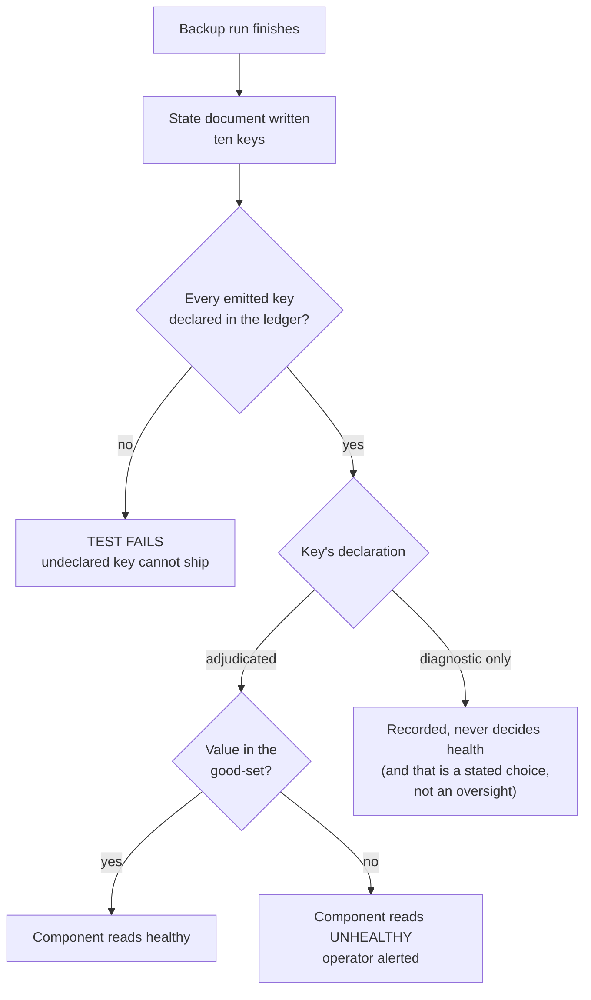

# Mission Specification: Backup Pointer Key Ledger

**Mission Branch**: `feat/934-pointer-key-ledger`
**Created**: 2026-08-30
**Status**: Draft
**Input**: kentonium3/kg-automation#934 (body + the 2026-08-30 scope-decision comment), plus the
already-reviewed structural rule and adjudication table in `docs/design/office4-backup.md` v0.2.

## Problem

The nightly backup records ten facts about each run into a small state document that every health
surface reads. **Six of those ten are written and then ignored.** One of the six is the weekly
integrity verdict: the backup verifies its own repository once a week, records whether that
verification passed, and no health path consults the answer. A repository that has been *proven*
corrupt therefore reports healthy everywhere, and the operator learns the truth at restore time —
the one moment the backup is needed and can no longer be re-taken.

The narrow reading of this problem is "one field lacks a reader". That reading is what produced the
problem. An earlier mission on this same component wrote a constraint forbidding unread fields,
applied it to the field it was adding, and did not sweep the field already sitting there unread.
The constraint was enforced by review, and review forgot. This mission replaces the remembering
with a rule that cannot be forgotten.

### The generative rule

> **Every key emitted into the backup's state document is either (a) adjudicated, with an explicit
> definition of what "good" means for it, or (b) declared as kept for diagnosis only. A test
> enumerates the keys the producer *actually emits* and fails if any key is in neither list.**

One mechanism. It decides the integrity verdict, it decides the five other currently-inert keys, and
it decides the next key anybody adds — without anyone having to remember. The same mechanism is
built once and used by both machines that run backups, so the rule cannot drift apart between them.

The failure this retires is the middle branch being absent: today an emitted key that nobody
adjudicated simply falls through to healthy, silently and by default.

## User Scenarios & Testing *(mandatory)*

### User Story 1 - A repository proven corrupt stops reporting healthy (Priority: P1)

The backup verifies its own repository on a weekly cycle. When that verification fails, the operator
is told, promptly, through the same surface that already reports every other component's health.
Today the verification runs, the answer is recorded, and the answer is discarded.

**Why this priority**: This is the reported defect, and its cost is unbounded. The single backup
repository is the only copy; there is no off-site second copy. A corruption discovered late is
permanent data loss rather than an inconvenience.

**Independent Test**: Present a state document carrying a failed integrity verdict to the health
evaluation and confirm the component reads unhealthy with evidence naming the integrity verdict.
Delivers value on its own, with nothing else in this mission built.

**Acceptance Scenarios**:

1. **Given** a state document whose integrity verdict is `false` and whose every other signal is
   good — a fresh timestamp, a successful backup, a successful retention pass — **When** health is
   evaluated, **Then** the backup component reads **unhealthy** and the evidence names the integrity
   verdict as the cause.
2. **Given** a state document whose integrity verdict is `null` because the check does not run on
   this day of the week, **When** health is evaluated, **Then** the component reads **healthy** —
   "not checked" is never treated as "checked and failed".
3. **Given** a state document whose integrity verdict is `true`, **When** health is evaluated,
   **Then** the component reads **healthy**.

---

### User Story 2 - No emitted field can be silently inert (Priority: P1)

Any key the backup writes about itself is, by the act of writing it, a claim someone might rely on.
This story makes that claim explicit: each key is either load-bearing for health with a stated
good-set, or explicitly marked as recorded-for-diagnosis. There is no third, accidental category.

**Why this priority**: This is the difference between fixing one instance and closing the class.
Story 1 alone would leave five keys still inert and the next added key inert by default — the exact
state that produced this mission. It is independently valuable even if no individual key's
adjudication changed, because it converts a review-enforced constraint into a mechanically enforced
one.

**Independent Test**: Add a key to the producer's emitted document without declaring it, and confirm
the test suite fails and names the undeclared key. Remove the key, and confirm the suite passes.

**Acceptance Scenarios**:

1. **Given** the producer emits a key that appears in neither the adjudicated list nor the
   diagnosis-only list, **When** the test suite runs, **Then** it **fails** and the failure names the
   undeclared key.
2. **Given** every emitted key is declared in exactly one of the two lists, **When** the test suite
   runs, **Then** it passes.
3. **Given** a key is declared but the producer has stopped emitting it, **When** the test suite
   runs, **Then** it fails and names the stale declaration, so the ledger cannot rot into fiction in
   the other direction either.
4. **Given** the test, **When** it determines which keys exist, **Then** it derives them from a real
   execution of the producer — never from a list maintained by hand, which is the failure mode being
   retired.

---

### User Story 3 - A wiped repository stops reading healthy (Priority: P2)

A repository that has been destroyed and re-created from empty produces one snapshot with a fresh
timestamp, a successful backup result, and a successful retention result. Every existing signal
reads green while the entire backup history is gone.

**Why this priority**: A real and silent total-loss condition, closable from a fact the backup
already records, with no change to the backup itself. Lower than P1 only because it is not the
reported defect.

**Independent Test**: Present a state document reporting a single snapshot and confirm the component
reads unhealthy; present one reporting several and confirm it reads healthy.

**Acceptance Scenarios**:

1. **Given** a state document reporting exactly one snapshot in the repository, **When** health is
   evaluated, **Then** the component reads **unhealthy**.
2. **Given** a state document reporting two or more snapshots, **When** health is evaluated, **Then**
   the snapshot count does not by itself make the component unhealthy.

---

### User Story 4 - A skewed clock cannot pin the backup "fresh" forever (Priority: P2)

Staleness is judged by how old the recorded backup time is. If that time is in the future, the
computed age is negative, never exceeds any limit, and the component reads fresh indefinitely —
including long after backups have stopped entirely.

**Why this priority**: A latent hole in the existing freshness rule rather than a new capability, and
it costs one bound to close. It matters more for the second machine — a desktop in a local timezone —
than for the first, but the rule belongs in the shared contract, not in one host's copy of it.

**Independent Test**: Present a state document whose backup time is implausibly far in the future and
confirm the component does not read fresh.

**Acceptance Scenarios**:

1. **Given** a state document whose recorded backup time is beyond the tolerated margin in the
   future, **When** freshness is evaluated, **Then** the component does **not** read fresh and the
   evidence names the future-dated time.
2. **Given** a recorded backup time within the normal recent past, **When** freshness is evaluated,
   **Then** it reads fresh exactly as it does today.

---

### User Story 5 - The second machine inherits the rule rather than copying it (Priority: P3)

The second machine's backup is designed and awaiting build. It must be able to declare its own
ledger — its own keys, its own good-sets, its own staleness budget — and get the same enforcement,
without reimplementing the rule.

**Why this priority**: Deferred value: it pays off when the second backup is built, not now. It is
nevertheless the reason this mission exists in its current shape rather than as a one-field patch,
so it constrains the design from the start.

**Independent Test**: Declare a second, differently-shaped ledger for a fictitious producer in a test
and confirm the same enforcement applies to it with no change to the mechanism.

**Acceptance Scenarios**:

1. **Given** a second producer with a different key set and different good-sets, **When** it declares
   a ledger, **Then** the same enforcement applies with no modification to the shared mechanism.
2. **Given** the shared mechanism, **When** the second machine's backup is later built, **Then** it
   supplies only its ledger — no second copy of the adjudication or enforcement logic exists.

### Edge Cases

- **The check did not run.** Six days in seven the integrity verdict is absent-by-design. This must
  read healthy. A truthiness test would read the absent verdict as failure and cry wolf six days a
  week until it was ignored or removed.
- **A value of an unexpected type.** A verdict that is neither the expected true/false nor the
  "not run" marker — a string, a number — must not slip through a type guard into healthy by
  default. The absence of a decision is the bug being fixed; it must not reappear as a silent
  type-guard skip.
- **A key declared but no longer emitted.** The ledger must not be allowed to describe a producer
  that has moved on, or it becomes documentation rather than enforcement.
- **A brand-new repository.** Its first run legitimately reports one snapshot and will read
  unhealthy under Story 3. This is accepted as correct: a repository with one snapshot has no history
  to restore from, so the signal is true rather than false. It self-clears on the second run.
- **Two different producers with genuinely different key sets.** The contract must not assume the two
  machines emit the same keys; they do not, and forcing them to would couple two independent backups.
- **A producer that cannot be executed under test.** Most other components that emit similar
  documents have no way to be run deterministically in a test, and some emit from a language-model
  step. For those, an enforcement test could only compare against a hand-maintained list — which is
  the defect, not the fix. They are out of scope here and routed to a follow-up.

## Requirements *(mandatory)*

### Functional Requirements

| ID | Title | User Story | Priority | Status |
|----|-------|------------|----------|--------|
| FR-001 | Integrity verdict decides health | As the operator, I want a failed repository-integrity verdict to make the backup component unhealthy, so that a repository proven corrupt cannot report healthy. | High | Open |
| FR-002 | "Not checked" stays healthy | As the operator, I want an absent integrity verdict on the days the check does not run to read healthy, so that the signal does not cry wolf six days a week and get ignored. | High | Open |
| FR-003 | Every emitted key is declared | As a maintainer, I want every key the backup emits to be declared either adjudicated-with-a-good-set or diagnosis-only, so that no key can be load-bearing by accident or inert by oversight. | High | Open |
| FR-004 | Enforcement derives keys from real emission | As a maintainer, I want the enforcing test to determine the key set by actually running the producer, so that the check cannot degrade into asserting a hand-maintained list. | High | Open |
| FR-005 | Undeclared key fails the suite | As a maintainer, I want an undeclared emitted key to fail the test suite and be named in the failure, so that the omission is caught before it ships rather than by a later reviewer. | High | Open |
| FR-006 | Stale declaration fails the suite | As a maintainer, I want a declared key the producer no longer emits to fail the suite, so that the ledger cannot rot into fiction. | Medium | Open |
| FR-007 | Single-snapshot repository is unhealthy | As the operator, I want a repository reporting only one snapshot to read unhealthy, so that a wiped-and-recreated repository cannot report green with its history gone. | Medium | Open |
| FR-008 | Future-dated backup time is not fresh | As the operator, I want a backup time implausibly in the future to not read fresh, so that a clock skew cannot pin the component fresh indefinitely. | Medium | Open |
| FR-009 | Diagnosis-only keys are explicitly declared | As a maintainer, I want the keys kept purely for diagnosis to be named as such, so that their not deciding health is a recorded decision rather than an omission. | Medium | Open |
| FR-010 | Contract is reusable by a second producer | As a maintainer, I want a second backup to obtain the same enforcement by declaring only its own ledger, so that the rule against unenforced duplication is not itself duplicated. | Medium | Open |
| FR-011 | Adoption path for remaining components is recorded | As a maintainer, I want the other components that emit similar documents to have a written adoption path and a tracked follow-up, so that their exclusion is a scheduled decision rather than a silent gap. | Low | Open |

### Non-Functional Requirements

| ID | Title | Requirement | Category | Priority | Status |
|----|-------|-------------|----------|----------|--------|
| NFR-001 | Detection latency | A failed integrity verdict present in the state document is reflected as an unhealthy component within 20 minutes of that document being written (the health runner evaluates every 15 minutes). | Reliability | High | Open |
| NFR-002 | Deterministic and offline | Every test added by this mission passes with no network access, no live host access, and no dependency on the current date or day of week; repeated runs give identical results. | Reliability | High | Open |
| NFR-003 | No regression | The existing test suite remains green, with no reduction in the number of passing tests. | Reliability | High | Open |
| NFR-004 | Evidence names the cause | Every unhealthy verdict introduced by this mission carries evidence naming the specific key and value responsible, so an operator can act without reading source. | Observability | Medium | Open |
| NFR-005 | No new false positives | Across the seven distinct daily state-document shapes the backup produces in a normal week — six without an integrity check, one with a passing check — the component reads healthy in all seven. | Reliability | High | Open |

### Constraints

| ID | Title | Constraint | Category | Priority | Status |
|----|-------|------------|----------|----------|--------|
| C-001 | Producer is not modified | The backup script itself is not changed. Every rule adopted here reads a key the producer already emits, so no live backup behaviour changes and no producer deploy is required. | Technical | High | Open |
| C-002 | No deploy manifest required | The change reaches the target machine through the existing checkout-and-pull path used by the health runner; it introduces no queued deploy manifest. | Technical | Medium | Open |
| C-003 | Existing good-sets preserved and kept separate | The backup-result and retention-result good-sets keep their current, deliberately different definitions and are not merged. Merging them is a named prior regression, not a tidy-up. | Technical | High | Open |
| C-004 | Absent is not failure | Any adjudication must distinguish "not run" from "ran and failed". A rule that cannot tell those apart is rejected, regardless of how simple it is. | Technical | High | Open |
| C-005 | Enforcement scope limited to backup producers | Only the backup state documents are enforced by this mission. The other components emitting similar documents are explicitly out of scope and routed to a follow-up. | Technical | High | Open |
| C-006 | Change-control tier | Tier 2 — this changes a health signal that gates operator awareness of backup integrity. A current backup must be confirmed before the change is applied. | Regulatory | High | Open |
| C-007 | Second machine's ledger is not authored here | The second machine's ledger is not written in this mission. Its producer does not exist yet, so the enforcing test could not verify the declaration, and an unverifiable declaration is the same defect class being retired. | Technical | Medium | Open |

### Key Entities

- **State document**: the small record a backup run writes about itself, read by health surfaces. It
  carries the run's outcome, timing, size and integrity facts. It is the only interface between the
  backup and everything that judges it.
- **Ledger**: the per-producer declaration naming every key that producer emits, and placing each in
  exactly one of two categories — adjudicated, or diagnosis-only.
- **Adjudicated key**: a key with an explicit good-set. Values inside the set leave health unchanged;
  values outside it make the component unhealthy.
- **Diagnosis-only key**: a key recorded deliberately for human investigation and explicitly excluded
  from deciding health. Its exclusion is a decision on the record, not an omission.
- **Good-set**: the explicit statement of acceptable values for one adjudicated key, including how
  that key expresses "not applicable" where relevant.

## Success Criteria *(mandatory)*

### Measurable Outcomes

- **SC-001**: A backup repository whose integrity verification has failed is reported as unhealthy
  within 20 minutes of the verdict being recorded. Currently: never reported.
- **SC-002**: Zero keys emitted by a covered backup are undeclared. Currently six of ten are
  undeclared and inert.
- **SC-003**: Introducing a new undeclared key into a covered backup's output causes a test failure
  that names the key, in 100% of attempts. Currently such a key is accepted silently and remains
  inert indefinitely.
- **SC-004**: Across a full normal week of backup outcomes — six days without an integrity check and
  one with a passing check — the component reports healthy on all seven days, with zero false alerts.
- **SC-005**: A repository reduced to a single snapshot is reported unhealthy on the first health
  evaluation after that state is recorded. Currently reported healthy.
- **SC-006**: A second backup on a different machine can obtain the full contract by supplying only
  its own ledger, with zero lines of adjudication or enforcement logic duplicated.

## Assumptions

- **A1**: The single-snapshot rule carries no "established repository" qualifier. A repository holding
  one snapshot has no history to restore from, so reporting it unhealthy is correct rather than a
  false positive, and it self-clears on the next run.
- **A2**: The second machine's ledger is authored by its own mission, against the mechanism this one
  builds. See C-007 for why it is not authored here.
- **A3**: The backup-result and retention-result good-sets are carried over exactly as they stand
  today, including their deliberate difference from one another (C-003).
- **A4**: The change reaches the target machine by the existing pull-based checkout path, with no
  queued deploy manifest, following the established precedent for changes of this shape.
- **A5**: The document's own schema-version key is diagnosis-only. It describes the document's shape
  rather than the backup's condition.
- **A6**: The health runner's own liveness is already covered by its existing self-observation, so
  this mission adds no separate watcher for it on the first machine. The second machine's design
  addresses its own equivalent.
