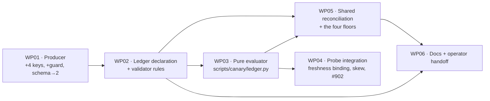

# Work Packages: Backup Pointer Key Ledger

**Mission**: `pointer-key-ledger-01M189P6` · **Branch**: `feat/934-pointer-key-ledger`
**Spec**: [spec.md](spec.md) (v2) · **Plan**: [plan.md](plan.md) (v2) · **Contract**: [contracts/key-ledger.md](contracts/key-ledger.md) (v2)
**Generated**: 2026-08-30T03:54:28Z

## Shape of the work

Six work packages, 33 subtasks. The sequence is forced by one fact: **the ledger declares what the
producer emits**, so the producer must emit its final key set before the declaration can be written,
and the declaration must exist before anything can evaluate or reconcile against it.

**Parallel opportunity**: once WP02 lands, **WP03 and WP05 can run concurrently** — WP05's shared
helper and its floors are test-side and depend only on the declaration's shape, while WP03 is pure
evaluation logic. WP04 must follow WP03.

**MVP scope**: WP01 → WP02 → WP03 → WP04. That sequence delivers a working, enforced adjudication of
every declared key. WP05 hardens the mechanism against being decorative and WP06 hands over the
install — neither is optional for mission completion, but they are not on the critical path to a
working health signal.

**A note on why WP03 is a new module.** The predicate evaluator lives in a new
`scripts/canary/ledger.py` rather than growing `probes.py`. Three reasons: it keeps WP03 and WP04
ownership disjoint so they can be reviewed independently; it makes the evaluator unit-testable in
isolation, which NFR-006 (totality — it must never raise) genuinely requires; and it keeps the
`probes.py` diff small and legible around the #902 trap described in WP04, which is the single most
dangerous edit in this mission.

## Subtask Index

*Reference table only — completion is recorded via `spec-kitty agent tasks mark-status`, never by
editing this table. `[P]` marks parallel-safe items.*

| ID | Description | WP | Parallel |
|---|---|---|---|
| T001 | Extend the emission harness: stub `df` and `restic stats`; pin the current 10-key baseline | WP01 | |
| T002 | Emit `last_integrity_check_utc`, carried forward via read-before-write | WP01 | |
| T003 | Emit `files_processed` from `restic stats --mode files-by-contents --json` | WP01 | [P] |
| T004 | Emit `source_roots_present` by comparing snapshot `.paths[]` to configured roots | WP01 | [P] |
| T005 | Emit `repo_fs_free_bytes` from `df -B1 --output=avail` | WP01 | [P] |
| T006 | Guard `snapshot_count_json` against empty; bump `schema_version` to 2 | WP01 | |
| T007 | Tests for the validator's ledger structural rules (8 rules, incl. harness existence) | WP02 | |
| T008 | Implement the structural rules, gated on `entry.get("health_check")` | WP02 | |
| T009 | Author `restic-backup`'s `key_ledger` — 10 adjudicated, 4 diagnostic, harness path | WP02 | |
| T010 | Reduce `health_check.expected` prose to point at the ledger | WP02 | |
| T011 | Rewrite the prose-binding test from prose→substring to prose→ledger | WP02 | |
| T012 | Tests: `good_values` type identity in all four bool/number directions | WP03 | |
| T013 | Tests: absence is unconditionally unhealthy; unmeasured `minimum` → unknown | WP03 | |
| T014 | Tests: totality — hostile and malformed values never raise | WP03 | |
| T015 | Implement `scripts/canary/ledger.py` predicate evaluation | WP03 | |
| T016 | Implement first-run suppression for `snapshot_count` (FR-019) | WP03 | |
| T017 | Tests: the declared `freshness` key is the anchor, not candidate-list order | WP04 | |
| T018 | Tests: future-dating boundary at 5 min, across naive / offset / `Z` forms | WP04 | |
| T019 | Lift the snapshot-timestamp rule out of the `restic_exit_code` branch | WP04 | |
| T020 | Wire the ledger evaluator into `_probe_freshness`; ledger authoritative | WP04 | |
| T021 | Bind freshness resolution to the declared key | WP04 | |
| T022 | Implement the 5-minute future-skew guard | WP04 | |
| T023 | Re-assert every #902/FR-009 scenario **with the real ledger attached** (SC-007) | WP04 | |
| T024 | Tests: undeclared key fails; stale declaration fails | WP05 | |
| T025 | Tests: empty component selection fails; a deleted ledger fails | WP05 | |
| T026 | Tests: harness must prove a document was produced, parsed, non-empty | WP05 | |
| T027 | Implement `tests/canary/ledger_reconcile.py`, the shared helper | WP05 | |
| T028 | Reconcile `restic-backup` through the helper; assert early-exit verdicts | WP05 | |
| T029 | Fictitious-producer reuse test — both shared helpers unchanged (SC-006) | WP05 | |
| T030 | Runbook: ledger as contract, the drift caveat, the operator install | WP06 | |
| T031 | Navigation docs per `signal-to-doc-map.json` | WP06 | [P] |
| T032 | Operator handoff: exact install command, Tier-2 pre-flight, convergence check | WP06 | |
| T033 | Mission close-out: rebaseline record, live-verification record, issue comments | WP06 | |

---

## WP01 — Producer: make the four conditions expressible

**Priority**: P1 · **Prompt**: [tasks/WP01-producer-new-keys.md](tasks/WP01-producer-new-keys.md) · **~380 lines**
**Depends on**: none

**Goal**: Add the four keys that make the catastrophic conditions *sayable at all*, fix the unguarded
output, and bump the schema. Until this lands, three of the four legs cannot be closed by any amount
of adjudication — the document simply does not carry the facts.

**Independent test**: Run the producer under stubs and assert it emits fourteen keys, that
`last_integrity_check_utc` survives a run where the check does not execute, and that
`snapshot_count` is `null` rather than absent-or-malformed when the count query fails.

**Included subtasks**: T001, T002, T003, T004, T005, T006

**Risks**: This is a live Tier-2 backup script and the highest-risk edit in the mission. The
read-before-write for `last_integrity_check_utc` must tolerate a missing or corrupt prior document
without aborting the run — a backup that fails because its *health bookkeeping* failed would be a
self-inflicted outage far worse than the bug being fixed.

---

## WP02 — Ledger declaration and structural validation

**Priority**: P1 · **Prompt**: [tasks/WP02-ledger-declaration.md](tasks/WP02-ledger-declaration.md) · **~340 lines**
**Depends on**: WP01

**Goal**: Define `key_ledger` as validated data, declare `restic-backup`'s, and make a malformed,
self-contradictory, or unreconciled ledger impossible to merge.

**Independent test**: The validator rejects each of the eight structural violations and accepts a
ledger-free component unchanged.

**Included subtasks**: T007, T008, T009, T010, T011

**Risks**: The validator is a **blocking** Docs-CI gate — a rule that is too broad blocks unrelated
work across the whole repo. Two specific traps are called out in the prompt: gate on
`entry.get("health_check")` rather than on `"key_ledger" in entry` (the validator walks every nested
dict, so per-key predicate objects are each yielded as an entry), and treat a key appearing in both
lists as a hard error rather than resolving it by precedence.

---

## WP03 — Pure ledger evaluator

**Priority**: P1 · **Prompt**: [tasks/WP03-ledger-evaluator.md](tasks/WP03-ledger-evaluator.md) · **~360 lines**
**Depends on**: WP02

**Goal**: A new `scripts/canary/ledger.py` that adjudicates a document against a declaration —
generically, totally, and with no component name anywhere in it.

**Independent test**: Predicate semantics hold across all four bool/number collision directions,
absence is unhealthy for every predicate form, an unmeasured count reads unknown, and no input shape
causes a raise.

**Included subtasks**: T012, T013, T014, T015, T016

**Risks**: Three fail-open shapes, each of which reintroduces the mission's own defect — a type guard
that skips unexpected values into healthy; the host language's symmetric bool/number equality; and an
exception, which upstream converts into `unknown`, which does not alert on first sight. The last is
why totality is a correctness requirement rather than hygiene.

---

## WP04 — Probe integration, freshness binding, and the #902 trap

**Priority**: P1 · **Prompt**: [tasks/WP04-probe-integration.md](tasks/WP04-probe-integration.md) · **~450 lines**
**Depends on**: WP03

**Goal**: Wire the evaluator into the probe, make the declared freshness key genuinely authoritative,
add the future-skew bound, and do all of it **without deleting the #902 snapshot-timestamp guard**.

**Independent test**: The FR-009 regression scenarios pass with the real ledger attached — not only in
the ledger-free configuration where they pass today.

**Included subtasks**: T017, T018, T019, T020, T021, T022, T023

**Risks**: **The single most dangerous edit in the mission.** The legacy chain is organised per
rule-block, not per key: the snapshot-timestamp parseability guard is nested inside
`if "restic_exit_code" in pointer:`. Suppressing that branch because the ledger declares
`restic_exit_code` deletes the guard and reopens #902/FR-009 — and every existing regression test for
it builds its config without a ledger, so all of them stay green while the ledgered component
regresses. T019 exists specifically to defuse this, and T023 exists to prove it stayed defused.

---

## WP05 — Shared reconciliation and its floors

**Priority**: P1 · **Prompt**: [tasks/WP05-shared-reconciliation.md](tasks/WP05-shared-reconciliation.md) · **~400 lines**
**Depends on**: WP02, WP03

**Goal**: The mechanism's teeth. Derive the emitted key set by executing the producer, reconcile in
both directions, and make it impossible for the contract to pass while enforcing nothing.

**Independent test**: Each of four sabotage cases goes red — an undeclared key, a stale declaration, a
deleted ledger, and an empty component selection.

**Included subtasks**: T024, T025, T026, T027, T028, T029

**Risks**: A weak version of this WP certifies the contract while enforcing nothing, which is worse
than not having it. The four floors are not optional. Note especially that an empty parametrization is
a green suite with zero assertions — a shape with five documented instances in this repo in a single
day.

---

## WP06 — Documentation, drift caveat, and operator handoff

**Priority**: P2 · **Prompt**: [tasks/WP06-docs-and-handoff.md](tasks/WP06-docs-and-handoff.md) · **~280 lines**
**Depends on**: WP02, WP05

**Goal**: Record the contract where an operator will look, state the caveat that bounds its guarantee,
and hand over the install that only the operator can perform.

**Independent test**: A reader of the runbook can state what the ledger guarantees, what voids that
guarantee, and how to install the producer — without reading source.

**Included subtasks**: T030, T031, T032, T033

**Risks**: The guarantee is easy to overstate here in exactly the way the spec had to be corrected for.
The runbook must say that the ledger binds the **repo copy**, and that its guarantee about live
behaviour is void while `backup-script-drift` reports the copies diverged.
